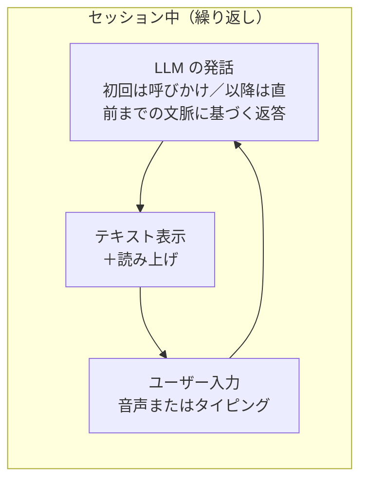
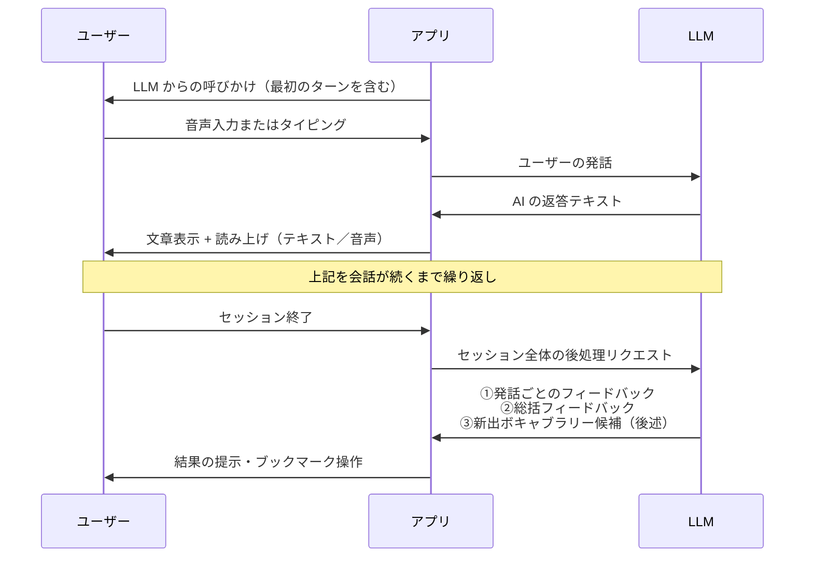
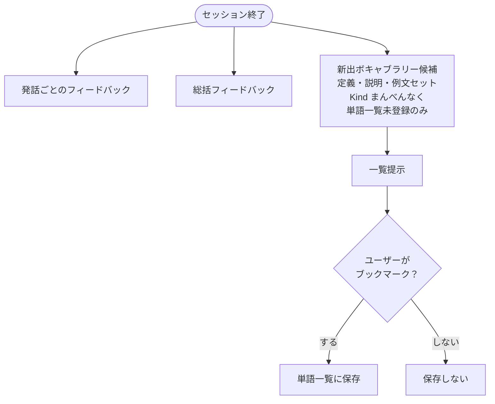
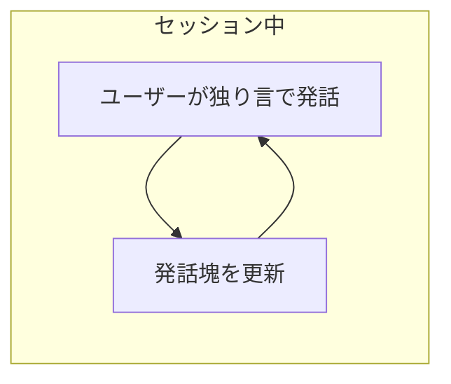
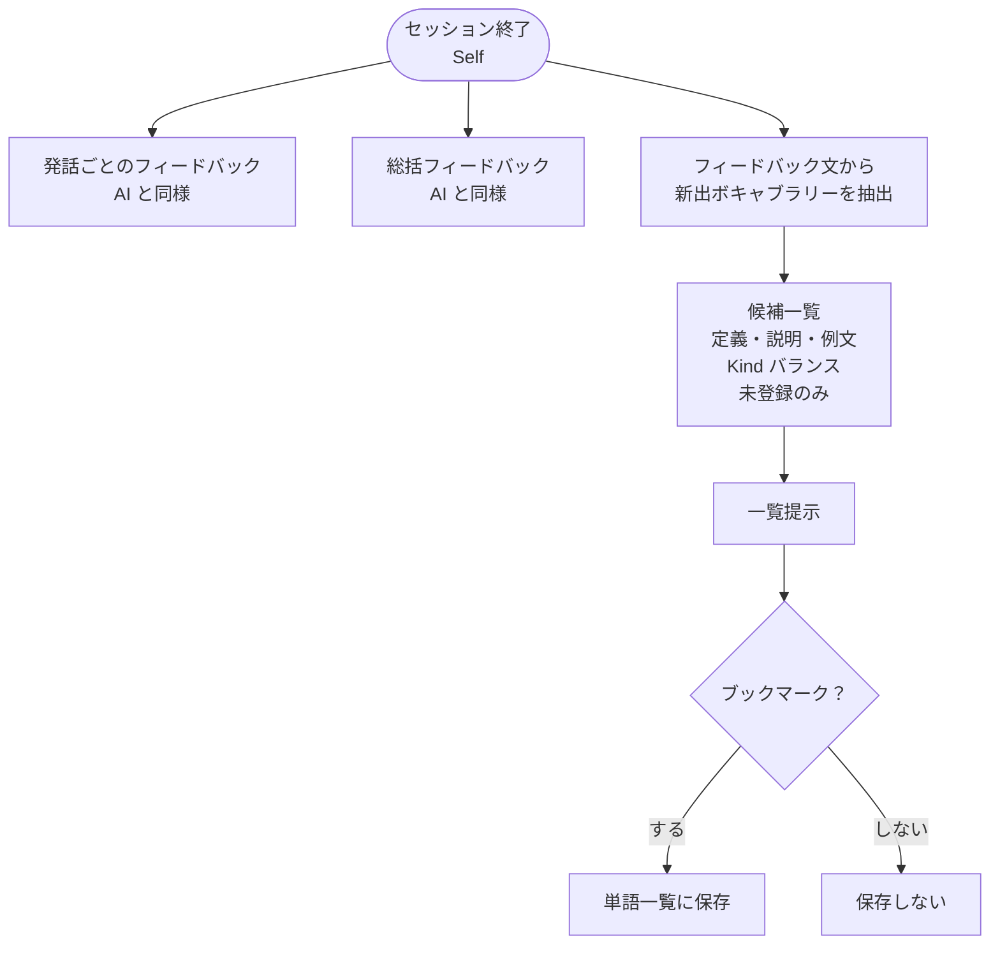
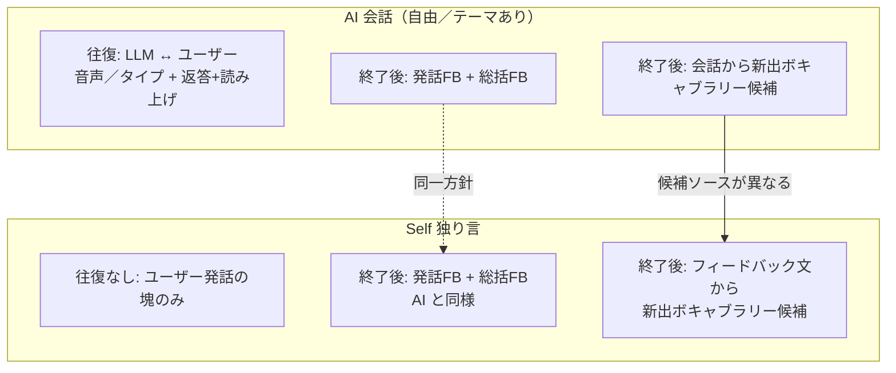

# Conversation 機能フロー（AI／Self）

[← README に戻る](../README.md)

仕様の骨子は [機能一覧](features.md) の Conversation 行を参照。自由テーマ・テーマありの **AI** モードでは本節のメインループは同一とする。

---

## 1. AI 会話（自由テーマ／テーマあり共通）

往復中は **相手役の発話（LLM）** があり、セッション終了後に **フィードバック系**がまとめて処理される。

### セッション終了後の出力（AI モード）

| 種類 | 内容 |
|------|------|
| **発話ごとのフィードバック** | 各ユーザ発話ごとに、文法チェック、「こう言い換えられるとよい」等の別表現の提案など。 |
| **総括フィードバック** | セッション全体の講評。現時点では例：**文法の正しさ**、**使われているボキャブラリーの多さ** 等。今後項目を追加可能。 |
| **新出ボキャブラリー候補** | ユーザーの**単語一覧に未登録**の語・表現を候補化。各候補は **定義 + 説明 + 例文** をセットで返す。**件数は可能な限り多く**。 **Kind**（Verb / Adjective / Adverb / Noun / Phrasing / Interjection）が**偏りなく**出るようにする。 |

### 永続化のルール（候補 → 単語帳）

- ユーザーが **ブックマーク（単語帳への追加）** した候補のみ、DB／ローカルの単語一覧に保存する。
- **ブックマークしない候補**は保存しない（揮発でよい）。

---

## 2. Self（独り言）モード

セッション中は **LLM からの会話レスポンスはない**。ユーザーが途切れるまで **発話の塊**を更新し続ける。

### セッション終了後（Self モード）

- **発話ごとのフィードバック** … **AI モードと同様**の粒度・意図（文法・言い換え例など）。
- **総括フィードバック** … **AI モードと同様**（文法の傾向、ボキャブラリーの多さ等）。
- **新出ボキャブラリー候補** … **ユーザーフィードバックの文面の中で使われた新語・新表現**をピックアップして候補化（独白本文から直接の自動抽出は主としない）。  
  候補の **定義・説明・例文セット**、**件数は可能な限り多く**、**Kind のまんべんなさ**、**ブックマークしたものだけ永続化**は **AI モードと同じルール**。

---

## 3. AI と Self の対応関係（要約）

---

## 4. ローカル LLM の切替（セッション中を含む）

推論に使うモデルは [ローカル LLM の選定](local-llm.md) のとおり、**既定（軽量の Gemma 3）**と**追加ダウンロードしたモデル（例：Qwen）**を**ユーザーが選べる**。

| 項目 | 方針 |
|------|------|
| **切替タイミング** | **設定**から変更できるほか、**会話セッションの途中でも**「現在のセッションで使うモデル」を切り替えられる。 |
| **文脈** | 切替後も**これまでの発話履歴（ユーザー／AI のテキスト）**は**そのスレッド上にそのまま保持**する。次の LLM 呼び出し以降は**新しく選択したモデル**で、**保存済みの履歴をコンテキストとして**推論する（モデルが受け取れる長さの上限は実装でクリップする）。 |
| **Self モード** | セッション中は LLM 応答がないが、**終了後のフィードバック／候補生成**に使うモデルも同様に**切替可能**とする（**終了処理の直前**までに選ばれているモデルを用いる想定）。 |
| **セッション終了後の一括処理** | 原則、**セッション終了リクエスト時点で有効だったモデル**で、発話ごとのフィードバック・総括・ボキャブラリ候補を生成する。必要なら実装で「終了直前に確認ダイアログ」等を挟む。 |

**注意**：モデルが変わると**応答スタイルや厳しさ**が変わるため、**同一スレッド内でターンごとに「誰が話したか」は履歴で一意**にし、表示上は必要なら「この返答以降は別モデル」といった区切りを薄く示す選択肢あり（UI は未確定）。

---

## 補足（実装・設計メモ）

- **学習言語と説明言語**：LLM への指示では、ユーザーの**学習言語**（会話の主言語）と、**フィードバックや定義の説明に使う言語**（例：母語）を明示する想定。言語ペアは機能一覧のエントリ（定義2本）と揃える。
- **読み上げ**：LLM 返答に対し、テキストに加え **読み上げ用の出力**（または端末 TTS への入力テキスト）を想定。詳細は音声パイプライン設計で確定。
- **Kind（enum）** の綴りは実装で確定（機能一覧と同じ前提）。
- 本ドキュメントは **画面遷移・ボタン配置の前段**として、**データの流れと責務**に焦点を当てている。
