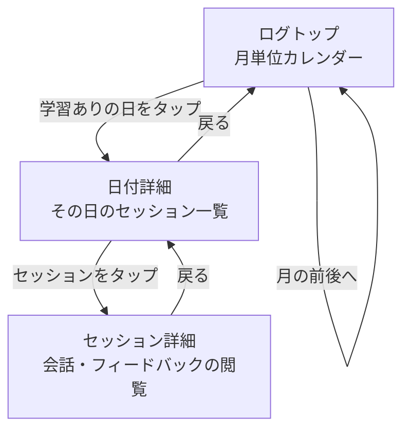
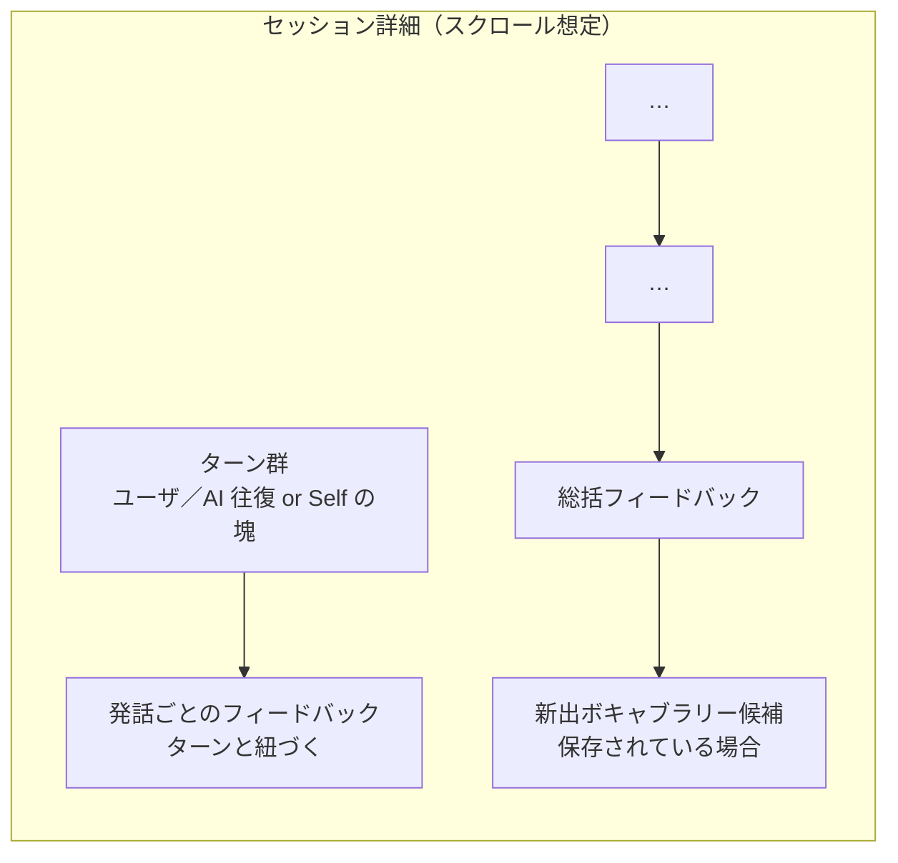
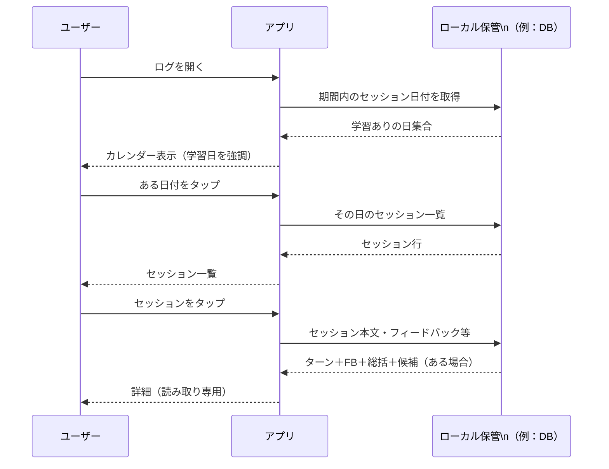

# 学習ログ 機能フロー

[← README に戻る](../README.md)

機能の前提は [機能一覧](features.md) の **ログ** 節を参照。会話セッションの**中身**（ターン構成・終了後の一括処理など）は [Conversation フロー](flow-conversation.md) と**同一の永続化単位**を想定し、本節では**振り返り UI の遷移と見せ方**に焦点を当てる。

---

## 1. 画面遷移（概要）

ユーザーは **ログ** から **日付 → その日のセッション一覧 → セッション詳細（会話＋フィードバック）** の順にドリルダウンする。

- **ログトップ**では、**その月**についてカレンダーを表示する。**学習が記録されている日**のみ、色・ドット・アクセントなどで**視覚的に区別**する（具体的なスタイルは UI 設計で確定）。
- **日付詳細**では、選択した**暦日**に属する**会話セッション**を**時系列一覧**で示す（開始時刻・モード名・要約テキストなどの**副次情報**を載せるかは実装で確定）。
- **セッション詳細**では、当該セッションに紐づく**発言の並び**と、**AI 由来のフィードバック・指摘・提案**を**閲覧のみ**で追えるようにする（本画面での**編集・再実行**は想定しない。必要なら別タスク）。

---

## 2. 暦日とセッションの対応（「その日」の定義）

| 項目 | 方針 |
|------|------|
| **暦日の基準** | 原則、端末（またはユーザー設定）の**ローカルタイムゾーン**で「0:00〜23:59:59」を 1 日とする。 |
| **セッションが属する日** | セッションに**開始日時**（推奨）を保持する場合は、その**暦日**で当日一覧に載せる。**終了が日付をまたぐ**場合も、**開始日の日**に含める形を既定とする（別案：終了日基準は将来の設定で切替可能、などは実装で確定）。 |
| **セッションなしの日** | カレンダー上は**ハイライトしない**。タップした場合は**空の一覧**または**短い案内**を出すかは UX で確定。 |

---

## 3. セッション詳細で閲覧するデータ（Conversation との対応）

[Conversation フロー](flow-conversation.md) でセッション終了後に生成される出力と**整合**させ、学習ログでは**保存済みのもの**を**読み取り専用**で並べる。

| 種類 | ログでの見せ方（想定） |
|------|------------------------|
| **会話ターン（AI モード）** | ユーザ発話 →（必要に応じて）AI 返答 → … の**時系列**。読み上げ用テキストなど**付随メタ**を載せるかは任意。 |
| **会話ターン（Self）** | セッション中の**ユーザー発話の塊**（またはターン相当の区切り）を**時系列**で表示。 |
| **発話ごとのフィードバック** | **どのユーザ発話**に対する指摘・言い換え提案かが**対応関係として追える**配置（例：発話ブロック直下、または折りたたみ）。 |
| **総括フィードバック** | セッション**終了後ブロック**としてまとめて表示（位置は「先頭／末尾」のどちらか。既定は**末尾**想定）。 |
| **新出ボキャブラリー候補** | セッション終了時に**提示された候補一覧**が永続化されている場合は**参照可能**とする。**ブックマーク済みかどうか**の表示はデータがあれば併記（単語一覧への**再ジャンプ**は別導線でよい）。 |

**注意**：上記ブロックの**厳密な順序**（例：候補を総括の前にする等）は、会話画面の「終了後提示」と**見た目を揃える**のが望ましいが、確定は実装フェーズでよい。

---

## 4. 操作シーケンス（参照用）

---

## 5. 補足（実装・設計メモ）

- **データモデル**の正規化（セッション ID、ターン ID、フィードバックの外部キー等）は実装で確定する。本ドキュメントは**画面フローと責務**の合意用。
- **プライバシー／容量**：ログは**端末ローカル**を主とする想定とし、[機能一覧](features.md) の**アカウント・同期**方針が変わった場合は、本フローの「取得元」を揃える。
- **エクスポート**：[機能一覧](features.md) の **PDF 出力**と**データの出所**が重なるため、文言・対象範囲は将来、**一方に寄せる**か**相互リンク**するかを整理する。
- 本ドキュメントは **ボタン配置・精密な UI モック** の前段として、**遷移と表示すべき情報の塊**に焦点を当てている。
