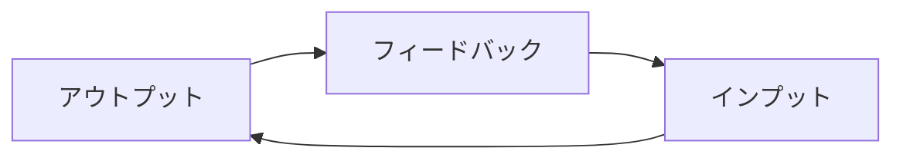

# 実現したい学習サイクル

[← README に戻る](../README.md)

---

## 抽象モデル

- **アウトプット**（話す・書く・使う）。
- **フィードバック**（誤り・「こうした方がよい」）。
- **インプット**（学び直し・吸収・次のアウトプットに向けた準備など）。

## プロダクトとの対応

会話機能（Self／AI）を通じて上記サイクルを回す前提。**学習言語は英語に限定しない。** 詳細は [機能一覧](features.md) の Conversation と備考列を参照。
