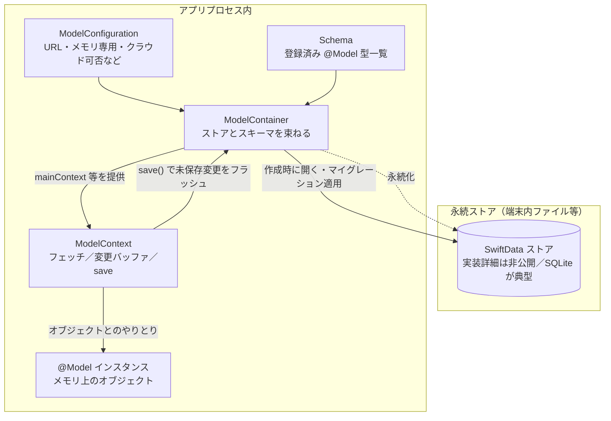
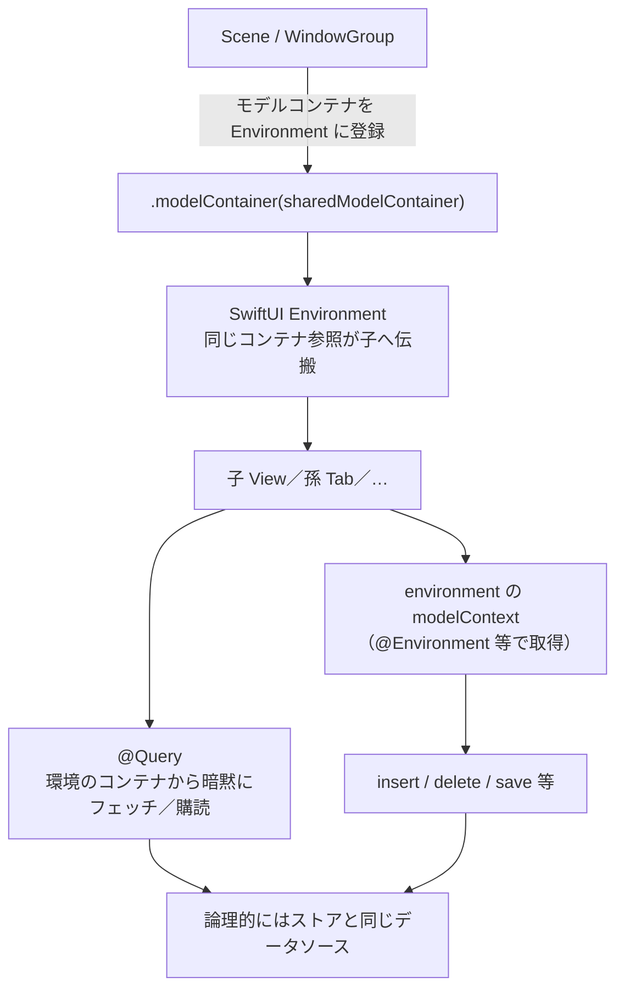

# SwiftData クイックリファレンス

[← README に戻る](../../README.md) ・ スキーマ設計の文脈は [データベース設計-クライアント](データベース設計-クライアント.md)

**目的**：API の位置づけとよく使うパターンを短時間で思い出すためのメモ。公式の網羅仕様は [SwiftData](https://developer.apple.com/documentation/swiftdata) を参照。

---

## 1. 用語の対応（頭の中の地図）

| 概念 | 役割 |
|------|------|
| **`@Model` クラス** | 永続化するレコード型。プロパティがカラム／リレーションに対応。 |
| **`Schema`** | アプリが扱う `@Model` 型の集合。マイグレーションの単位にもなる。 |
| **`ModelContainer`** | スキーマ＋ストアの場所（ファイル or メモリ）をまとめる工場。**1 アプリにつき典型的には 1 本**。 |
| **`ModelContext`** | その場の **読み書きセッション**。フェッチ・挿入・削除・変更の追踪・`save`。**DB のハンドルに近い**が、実体はコンテキストに紐づくオブジェクトグラフと変更バッファ。 |
| **`FetchDescriptor`** | 「どの型を」「どんな条件・ソートで」取るかの指定。 |

**依存関係（簡略）**

```text
ModelContainer  ──提供──▶  ModelContext(main / 追加で作成可)
       │
       └── 複数 ModelConfiguration で URL・メモリ専用などを切り替え可能

@Model インスタンス  ──生きている間──▶  ある ModelContext に関連付けられる
```

### データベース（永続ストア）と `ModelContainer` のつながり（Mermaid）

**データベース**と言っているものの実体は、概ね **ディスク上の SwiftData の永続ストア**（SQLite などのバックエンド）です。**`ModelContainer`** は、そのストアを **どの `Schema` で・どこに開くか**（`ModelConfiguration`）とひも付け、アプリから **共通の入口**になります。**View がストアと直接ファイル I/O でつながるわけではありません**。読み書きは **`ModelContext` 経由**で、コンテナがペルシステンススタックにつなぎます。

#### ストア ↔ コンテナ ↔ コンテキスト



#### `ModelContainer` から SwiftUI の各ビューへ（Environment）



**読みとり**：上段は「**ファイル上のデータ**」「**コンテナ**」「**ひとときの読み書き窓（コンテキスト）**」「**画面上のモデルオブジェクト**」の階層。下段は「**親で一度 `.modelContainer` するだけで、以下のすべての View が同じストア経路を共有**」という SwiftUI の配線。このプロジェクトでは `PeraTalkApp.swift` の `WindowGroup` が上段・下段の境界に相当する。

---

## 2. `@Model` クラス

- **`final class` に `@Model`** を付ける。
- **保存しやすい型**：`String` / `Int` / `Bool` / `Date` / `UUID` / `Data` / 他の `@Model`、それらの **Optional**、配列など（複雑な値型は要件を確認）。
- **初期化子**：プロパティをすべて満たす `init` を通常どおり書ける（マクロが展開する）。

### 属性（例）

```swift
@Attribute(.unique) var remoteId: UUID
```

- `.unique`：一意制約。**マイグレーション**が必要になりうるので設計変更は慎重に。

### リレーションシップ（例）

```swift
@Relationship(deleteRule: .cascade, inverse: \CachedUtterance.session)
var utterances: [CachedUtterance]
```

| `deleteRule` | 意味（要点） |
|--------------|----------------|
| `.nullify` | 相手の参照だけ外す（既定に近い挙動の場面がある） |
| `.cascade` | 親を消したら子も消す |
| `.deny` | 子があると親削除を拒む |

**`inverse`**：双方向の片側を明示。もう片方の `@Relationship` と対になっていること。

---

## 3. アプリ起動：`ModelContainer` と注入

```swift
let schema = Schema([MyModel.self, ...])
let config = ModelConfiguration(schema: schema, isStoredInMemoryOnly: false)
let container = try ModelContainer(for: schema, configurations: [config])

// SwiftUI
WindowGroup { RootView() }
    .modelContainer(container)
```

- **`isStoredInMemoryOnly: true`**：開発用・テスト・プレビュー向け。**ディスクには書かない**。
- **`ModelConfiguration` を複数**：用途別ストア分割など上級パターン。

**本プロジェクトの入口**：`PeraTalkApp.swift`（`Schema` に列挙する型を増やしたらここにも追加）。

---

## 4. `ModelContext` での読み書き

### 取得の典型

- **`container.mainContext`**：メインスレッド用。UI から触るなら基本ここ。
- **`@Environment(\.modelContext)`**：View 階層から取得（`.modelContainer` の子孫）。

### 作成・更新・削除・保存

```swift
context.insert(newObject)
newObject.someProperty = value
try context.delete(object)
try context.save()
```

- **`save()`**：未保存の変更をストアへ反映。**失敗時は `throws`** → 本番コードではハンドリング推奨。
- オブジェクトへの代入・`insert` だけでは **ディスクは確定しない**（保存タイミングの設計が必要）。

### フェッチ

```swift
var d = FetchDescriptor<MyModel>()
d.predicate = #Predicate { $0.tombstone == false }
d.sortBy = [.init(\.updatedAt, order: .reverse)]
let items = try context.fetch(d)

let count = try context.fetchCount(FetchDescriptor<MyModel>())
```

---

## 5. SwiftUI：`@Query` と `#Predicate`

```swift
@Query(
    filter: #Predicate<MyModel> { !$0.tombstone },
    sort: \MyModel.cachedAt,
    order: .reverse
)
private var rows: [MyModel]
```

- **`@Query`**：条件に合う配列が **自動更新**（ストア変更に追従）。
- **`#Predicate`**：**コンパイル時に SwiftData が解釈できる式に制限がある**。複雑すぎるとビルドエラー → フェッチ後に Swift でフィルタする・モデルをフラットにする等で回避。

動的フィルタ（検索文字列など）を `@Query` に渡したい場合は、**別のプリミティブ／ラッパ型**や **クロージャベース API** の利用可否を Xcode のドキュメントで確認すること（OS バージョンで増減）。

---

## 6. マイグレーション（スキーマ変更時）

設計書の方針どおり、このプロジェクトでは **`VersionedSchema` とマイグレーションプラン**で **段階的に**移行する想定。

- プロパティ追加／削除、`@Relationship` の変更、`@Attribute` の変更は **軽視しない**。
- 破壊的変更を避ける、デフォルト値の付与、`SchemaMigrationPlan` でのフェーズ分割を検討。

詳細は [データベース設計-クライアント §1.2](データベース設計-クライアント.md#12-横断ルール) と公式の Migration 関連ドキュメントを参照。

---

## 7. スレッドとコンテキスト

- **`mainContext`**：メインキュー。このコンテキストが触るオブジェクトは **基本的にメインで**。
- バックグラウンドで大量処理する場合は **`ModelContext` を別途作成**し、そのコンテキスト上でフェッチ・保存するパターンを取る（公式のコンカレンシー指針に従う）。
- **あるコンテキストでフェッチしたオブジェクトを、別コンテキストで直接いじる**のは避ける（`PersistentModel` のスレッド整合性）。

---

## 8. プレビュー

- **メモリ専用 `ModelContainer`** を `#Preview` に渡し、`.modelContainer(previewContainer)` で包む。
- 本プロジェクト例：`Core/UI/PreviewSampleData.swift`

---

## 9. 本プロジェクトで辿ると早い場所

| 内容 | ファイル例 |
|------|------------|
| コンテナと `Schema` | `PeraTalkApp.swift` |
| `@Model` 定義 | `Core/Infrastructure/Persistence/Cached*.swift` |
| `@Query` の実例 | `Features/Vocabulary/VocabularyListScreen.swift` |
| `ModelContext` での insert / fetch | `Core/Infrastructure/Persistence/SeedDataLoader.swift` |
| プレビュー用コンテナ | `Core/UI/PreviewSampleData.swift` |

---

## 10. よくある勘違い

1. **`context` は DB ファイルそのものではない**：ストアへのアクセスの **操作面**。
2. **`@Query` と手動 `fetch` は同じストアを見る**が、更新の反映経路とライフサイクルが異なるので、同じ画面で二重管理しない。
3. **`#Predicate` は自由な Swift 式ではない**：落ちたら簡略化が近道。

このメモは実装方針の **SSOT ではない**。永続化ポリシー・ID・削除方針は [データベース設計-クライアント](データベース設計-クライアント.md) を正とする。
