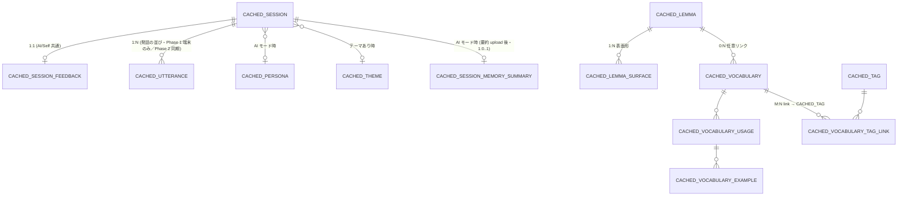

# データベース設計（クライアント側 ／ iOS・SwiftData）

[← README に戻る](../../README.md)

> **Phase 1（[初版スコープ](../ロードマップ/初版スコープ.md)）の iOS 端末ローカルスキーマ**。**端末ローカルにしか存在しないデータ**と、**サーバー（Supabase）のキャッシュ**の両方を扱う。**サーバー側のスキーマ**は [データベース設計-サーバー](データベース設計-サーバー.md) を参照（境界は [§1.1](#11-サーバークライアント境界再掲)）。
>
> 本ドキュメントは**壁打ち用のたたき台**。型・関係・命名は確定前提ではない。

---

## 1. 設計方針

### 1.1 サーバー／クライアント境界（再掲）

[会話 §5](../機能/会話.md#5-データの保持削除長期記憶rag) の表を**端末側の責務**として書き直したもの。**サーバー側の対応列**は [データベース設計-サーバー §1.1](データベース設計-サーバー.md#11-クライアントサーバー境界再掲) と同じ表だが、本書では**端末で持つデータ**に焦点を当てる。**Phase 1（初版）と Phase 2 で同期範囲が変わる**点に注意。

| データ | 端末ローカル（本書の対象・Phase 1） | Supabase（Phase 1） | Phase 2 での変化 |
|--------|--------------------------------------|---------------------|-------------------|
| **セッションメタ**（mode / persona / theme / start / end） | **キャッシュ + 端末発生 → push**（双方向） | 正（`sessions`） | 変化なし |
| **総括フィードバック** | **キャッシュ + 端末発生 → push**（双方向） | 正（`session_feedbacks`） | 変化なし |
| **会話の発話本文**（user/ai の 1 件ずつの発言の時系列） | **正（端末のみ）**。**サーバーには同期しない**（Phase 1） | 載せない | **Phase 2 で双方向同期**（`session_utterances` 新設・サーバーが正） |
| **記憶用セッション要約**（サニタイズ済み・AI モードのみ） | **キャッシュ**（読み取り専用） | 正 | 変化なし |
| **単語・用法・例文・タグ** | **キャッシュ + 編集 → 同期** | 正 | 変化なし |
| **プリセット英語辞典**（レンマ・活用形・IPA） | **端末のみ**（オブジェクトストレージ等のパックを DL → インポート） | **ユーザー RLS 外**。配布専用（[サーバー 辞書パック](データベース設計-サーバー.md#辞書パックstorage-とマニフェスト)） | 変化なし |
| **会話テーマ**（プリセット＋カスタム） | **キャッシュ + 編集 → 同期** | 正 | 変化なし |
| **ペルソナ**（プリセット＋将来のユーザー定義） | **キャッシュ**（Phase 1 は読み取り専用） | 正（マスタ） | 変化なし |
| **アカウント・プロフィール・サブスク** | **キャッシュ**（読み取り専用） | 正 | 変化なし |
| **音声バッファ** | 一時メモリ・短期キャッシュ | × | 変化なし |
| **Self モードの記憶用要約** | （対象外。生成しない） | × | 変化なし |

**設計の意図**：機種変更時に **「カレンダーで学習日が見える」「総括フィードバックが見える」までは Phase 1 で復元できる**。**会話の発話本文の新端末復元は Phase 2 で開放**する。Phase 1 の段階でも、サーバー側に親 `sessions` 行が存在するため、Phase 2 で `session_utterances` を追加するときに親子関係に矛盾が出ない設計。

**新出ボキャブラリ候補スナップショット**は**永続化しない**。セッション終了直後の提示用にメモリ上で保持し、ユーザーがブックマークしたものだけが `CachedVocabulary` として残る。**後から学習ログで候補一覧を再表示したい要望が出たら、その時点で AI に再生成させる**運用とする（[会話 §5](../機能/会話.md#5-データの保持削除長期記憶rag)）。

### 1.2 横断ルール

- **永続化技術**：**SwiftData** を採用。`@Model` クラスベースでスキーマを定義し、変更は **`VersionedSchema`** を用いた段階的マイグレーションで吸収する。**Phase 1 の最低 OS は iOS 26+**（判断理由・運用ポリシーの SSOT は [初版スコープ §対応 OS](../ロードマップ/初版スコープ.md#対応-os)）。
- **ID**：原則 `UUID`（`UUID()` 既定）。サーバー由来データのキャッシュは **サーバー側 `id`（UUID）** をそのまま **`@Attribute(.unique)`** で保持し、ローカル新規作成データは端末で発番する。
- **タイムスタンプ**：`createdAt` / `updatedAt` を `Date`（端末 TZ 非依存。SwiftData は内部 UTC）。**「その日（暦日）」の判定は端末ローカル TZ で行う**（[学習ログ §2](../機能/学習ログ.md#2-その日の定義暦日とセッションの対応)）。
- **削除**：原則**物理削除**。**発話本文の自動削除ポリシーは持たない**（[会話 §5](../機能/会話.md#5-データの保持削除長期記憶rag)）。**ストレージ上限・ユーザー操作による「アプリ内データを消去」**は別途仕様で定める。
- **暗号化（ファイル保護）**：**Phase 1 は `.completeUntilFirstUserAuthentication` を既定**とする。バックグラウンドでの書き込みや音声入力確定後の `CachedUtterance` 保存などを阻みにくくするため、**Phase 1 でストア全体を `.complete` に固定しない**。トレードオフとして、**ユーザーが一度端末をアンロックした後は、画面ロック中でもデータファイルへのアクセスがありうる**。より強い要件が出た場合は **別ストア分割や機微ブロックのみ `.complete`** を Threat model とセットで再検討する（音声入力 B 実装着手時の再点検タスクは [§4.1](#41-音声バッファのキャッシュ保留音声入力-b-実装着手時に決定) を参照）。
- **iCloud 同期**：**Phase 1 では使わない**（端末間のデータ同期は **サーバー（Supabase）経由**で行う方針に統一。これにより将来の Android / Web 展開時もデータの引き継ぎ経路が同一になる）。スキーマは将来の CloudKit 連携を阻害しないよう、**循環参照や外部参照型を避ける**設計は引き続き保つ。
- **キャッシュとローカル正データの区別**：エンティティ名で**接頭辞 `Cached` を付ける**ことで「**サーバーが正（クロスデバイスで揃える対象）**」を表す。**双方向同期（端末発生 → push、別端末で pull）も含まれる**点に注意。「クライアントで生成 → サーバーに push」の流れでも、**他端末から見たときの正はサーバー**であり、その意味で `Cached*` を一貫して用いる。**例外**：**プリセット英語辞典**（`CachedLemma` / `CachedLemmaUsage` / `CachedLemmaSurface` / `CachedDictionaryPackMeta`）は **Supabase のユーザー行ではなく**、**端末内の読み取り専用マスタ**として `Cached` 接頭辞を流用している（[§3.7.1](#371-プリセット英語辞典端末ローカル同期対象外)）。**Phase 1 で `Cached*` 化されない端末ローカル限定エンティティは存在しない**（Phase 1 の `CachedUtterance` は **サーバーが正だが Phase 1 では同期しない例外**として扱う。詳細は §1.3）。

### 1.3 同期戦略

#### 同期の方向

| データカテゴリ | 同期方向（Phase 1） | 真の値 | Phase 2 での変化 |
|----------------|---------------------|--------|-------------------|
| **セッションメタ・総括** | **双方向**（端末発生 → push、別端末で pull） | サーバー | 変化なし |
| **会話の発話本文** | **同期しない**（端末のみで保持） | **端末**（Phase 1 のみの例外） | **双方向**（サーバーが正に切り替わる） |
| 単語・タグ・テーマ（カスタム） | **双方向**（端末編集 → push、サーバー差分 → pull） | サーバー | 変化なし |
| ペルソナ・テーマ（プリセット）・記憶用要約・サブスク・プロフィール | **片方向**（pull のみ） | サーバー | 変化なし |

> **`CachedUtterance` の扱い**：Phase 1 は **「サーバーが将来の正」だがサーバーへ同期しない**という過渡期の状態。`dirty` / `remoteUpdatedAt` などの同期用カラムは **Phase 1 から持っておく**（Phase 2 で `session_utterances` テーブルへ push する経路を後付けで有効化できるよう）。Phase 1 では値は常に「未同期」で固定される。

#### 起動時 / フォアグラウンド復帰時のフロー（Phase 1）

```
[起動 / 復帰]
   ├─ updateLastSeenAt()            # profiles.last_seen_at 更新（データ寿命ポリシーで使用）
   ├─ pendingOps.flush()            # オフライン中の編集を push
   ├─ pull(personas, themes, profiles, subscriptions)        # 軽い master 系
   ├─ pull(sessions, sessionFeedbacks)                       # Phase 1 から：カレンダー・学習ログの源泉
   ├─ pull(vocabulary*, tags)                                # 差分（lastFetchedAt 以降）
   └─ pull(sessionMemorySummaries)                           # 任意・必要時のみ
```

> **Phase 2 では**：`pull(session_utterances)` を**遅延ロード**（セッション詳細を開いたタイミング）で追加。起動時の一括 pull には含めない（量が多いため）。

- 失敗時は**指数バックオフでリトライ**（バックオフ状態は `SyncMeta` に集約。[§3.14](#314-syncmeta--同期メタカテゴリごと-1-行)）。次回起動時 / フォアグラウンド復帰時に再試行する。
- ネットワーク不通時は**ローカルキャッシュで描画**を続行し、編集は **行の `dirty = true` / `tombstone = true`** だけで表現する（**専用の編集キューは持たない**）。
- **新規ユーザー／機種変更直後の初回起動**：全 `Cached*` が空の状態でも UI が破綻しないことを実装要件とする。`SCR-CONV-START`（ペルソナ選択）の初期描画は **アプリバンドル同梱の personas seed JSON**（プリセット 6 体）で埋め、`pull(personas)` 完了でサーバー値に置換する（[§3.6](#36-cachedpersona--ペルソナのキャッシュプリセット中心)）。**themes プリセットは同梱せず**サーバー pull のみで描画する（Self／自由テーマで会話開始できるため）。学習ログ・単語帳・設定は**画面ごとにスケルトン表示 → 実データ差し替え**で進める（画面側の取り扱いは [画面一覧 §4](../機能/画面一覧.md)）。

#### push 対象の判別ルール

**専用キュー（`PendingSyncOperation`）を持たず、行の状態だけで何を送るかを決める**。push スキャン時、各 `Cached*` 行を以下のルールで分類：

| 行の状態 | 送るリクエスト |
|----------|----------------|
| `remoteId == nil`（端末新規発番待ち）の行は出さない方針 → 採用しない | — |
| `remoteId != nil` ／ `dirty == true` ／ `tombstone == false` ／ サーバー未到達（`remoteUpdatedAt == nil`） | **CREATE**（INSERT） |
| `remoteId != nil` ／ `dirty == true` ／ `tombstone == false` ／ `remoteUpdatedAt != nil` | **UPDATE** |
| `remoteId != nil` ／ `tombstone == true` ／ `remoteUpdatedAt != nil`（サーバー到達済み） | **DELETE** → 成功後に**ローカル物理削除** |
| `remoteId != nil` ／ `tombstone == true` ／ `remoteUpdatedAt == nil`（サーバー未到達） | サーバー送信不要、**ローカル物理削除のみ** |
| `dirty == false` ／ `tombstone == false` | 送らない |

> **ポイント**：`remoteId` は**端末発番**で、ローカル新規作成時点から値を持つ（[§1.2](#12-横断ルール)）。サーバーに到達したかは **`remoteUpdatedAt` の有無**で判定する。**`payloadJSON` のスナップショットは持たず、push の瞬間に行から最新値をシリアライズする**。

#### push の順序規約

外部キーの依存に合わせて固定順で送る。**順序を間違えると親不在の挿入や子残しの削除が起きる**ため、実装側でこの順序を共通の関数に閉じる。

- **CREATE / UPDATE 順**：`Tag` → `Vocabulary` → `VocabularyUsage` → `VocabularyExample` → `VocabularyTagLink` ／ `Theme`（カスタム）／ `Session` →（Phase 2: `Utterance`）→ `SessionFeedback`
- **DELETE 順**：上記の **逆順**（子から親へ）。ただし**サーバー側で親 DELETE が CASCADE する**エンティティ（`Session` 削除で `SessionFeedback` / `Utterance` が消える）は、**子の DELETE を送らずに親だけ送る**ことで往復を減らす。

#### 複合キー DELETE（`CachedVocabularyTagLink`）

`CachedVocabularyTagLink` は **`remoteId` を持たない**リンク行のため、上の「`remoteId` で判別」とは別扱い。**`dirty` / `tombstone`** と、行に残る **`vocabulary` / `tag` の関連**から `(vocabulary_id, tag_id)` を取り出して DELETE を送る。push 完了後にローカル行を物理削除する。

#### 競合解決

- **既定**：**Last-Write-Wins（行単位 LWW）**。`updated_at` 比較で新しい方を採用。**Phase 1 では例外を設けず、全エンティティで行単位 LWW に統一**する。
- **行単位で組むことで衝突を構造的に減らす**：用法（`vocabulary_usages`）・例文（`vocabulary_examples`）はそれぞれ独立行のため、**「端末 A で 1 件追加」「端末 B で別の 1 件削除」は別行への操作**として両立する。**同じ 1 行が同時に編集されたときだけ**末尾勝ちで割り切る。
- **`CachedSession` / `CachedSessionFeedback`**：基本的に **作成後ほぼ更新されない** ため、LWW で十分。複数端末での同時編集は想定しない。
- **`CachedUtterance`（Phase 2）**：**append-only に近い**ため、競合は同一 `(session_id, sequence_index)` の重複くらい。サーバー側 `UNIQUE` 制約に任せ、衝突時はクライアント側で `sequence_index` をリトライする方針。
- 競合が頻発するなら、Phase 2 以降で**フィールド単位マージ**や CRDT を検討。

#### 削除パス（`tombstone` の運用）

- **対象**：ユーザーが端末から削除できるエンティティ全部に **`tombstone: Bool`**（既定 `false`）を持たせる：`CachedSession` / `CachedVocabulary` / `CachedVocabularyUsage` / `CachedVocabularyExample` / `CachedTag` / `CachedVocabularyTagLink` / `CachedTheme`（カスタムのみ）。
- **手順**：
  1. UI で削除操作 → 該当行に **`tombstone = true`** を立てる（**物理削除しない**）。
  2. クエリは **`tombstone = false`** でフィルタするのが基本（UI からは消えて見える）。
  3. オンライン時に push スキャナが `tombstone = true` の行を拾い、サーバーへ DELETE を送る。**完了したらローカル行を物理削除**。失敗時は `SyncMeta` の指数バックオフで再試行。
  4. **サーバー未到達**（`remoteUpdatedAt == nil`）の場合は送信不要で**そのままローカル物理削除**。
- **`CachedSessionFeedback` / `CachedUtterance`** は単独削除 UI を持たない方針なので **`tombstone` を持たない**。`CachedSession.tombstone` の伝搬（SwiftData の `.cascade`）と、サーバー側 `sessions` 行の DELETE による CASCADE で連動して消える。
- **`CachedVocabularyTagLink`** は `remoteId` を持たないため、DELETE は行の `vocabulary` / `tag` 関連から **`(vocabulary_id, tag_id)` の複合キー**を組み立てて送る（サーバー表 `vocabulary_tag_links` と対応）。
- **`CachedTheme`** は **`tombstone`（ユーザーがカスタムテーマを削除）と `isActive`（サーバー由来のプリセット非表示用ソフトフラグ）** が **別役割**。プリセット行で `tombstone = true` を立てない（プリセットは UI で削除させない）。

### 1.4 ローカルデータ削除フロー

| トリガ | 消す対象 | 残すもの |
|--------|----------|----------|
| **アカウント削除** | 全エンティティ（`Cached*` 全部）+ サーバー側 CASCADE 連鎖（[サーバー §1.3](データベース設計-サーバー.md#13-アカウント削除フロー)） | なし（クリーンスタート） |
| **設定 > アプリ内データを消去** | 全 `Cached*`（次回起動時にサーバーから再 pull で戻る。Phase 1 の `CachedUtterance` は**サーバーに無いため戻らず消える**点を UI で説明） | なし（実質再ログイン相当） |
| **ペルソナ（ユーザー定義）削除** | サーバー側の CASCADE と同期して、`CachedPersona` と紐づく `CachedSessionMemorySummary` を削除 | 該当ペルソナと無関係なデータ |
| **個別セッション削除**（UI で実装する場合） | `CachedSession.tombstone = true` を立てる → 次回 push スキャンで DELETE 送信 → 完了後にローカル物理削除（紐づく `CachedSessionFeedback` / `CachedUtterance` は SwiftData の CASCADE で物理削除）。サーバー側も `sessions` 行を delete → CASCADE 連鎖 | 同セッションが生成した記憶用要約は**そのまま残す**運用（誤操作で記憶が飛ぶのを避けるため。要約は別フローで削除） |
| **単語・用法・例文・タグの削除** | 対象行に `tombstone = true` を立てる → 次回 push スキャンで DELETE 送信 → 完了後に物理削除（[§1.3 削除パス](#13-同期戦略)） | 親が同じ他の用法・例文・タグ |
| **カスタムテーマ削除** | `CachedTheme.tombstone = true`（カスタムのみ）→ 次回 push スキャンで DELETE 送信 → 物理削除 | プリセットテーマ（`isPreset = true` は削除しない） |
| **長期非ログインによる自動削除**（[サーバー §1.4](データベース設計-サーバー.md#14-データ寿命ポリシー長期非ログイン時の自動削除)） | サーバー側の段階的削除に追随して、次回 pull 時に **`CachedUtterance` 等が存在しない状態が反映される** | サーバーに残る `sessions` メタ・`session_feedbacks` 等はそのまま pull され、カレンダー・総括の連続性は保たれる |

---

## 2. ER 概観



> 編集キュー（`PendingSyncOperation`）は持たず、**push 待ちは各 `Cached*` 行の `dirty` / `tombstone` だけで表現**する（[§1.3 push 対象の判別ルール](#13-同期戦略)）。同期メタ（差分 since・全体バックオフ）は `SyncMeta` に集約。

主要エンティティ群（**ユーザー所有データの `Cached*` は「サーバーが正のキャッシュ」**を表す点で命名を一貫させる。プリセット辞典の [`§3.7.1`](#371-プリセット英語辞典端末ローカル同期対象外) は例外）：

- **Phase 1 から双方向同期**：`CachedSession` / `CachedSessionFeedback` / `CachedVocabulary` / `CachedVocabularyUsage` / `CachedVocabularyExample` / `CachedTag` / `CachedVocabularyTagLink` / `CachedTheme`（カスタム）
- **Phase 1 は片方向 pull のみ**：`CachedProfile` / `CachedSubscription` / `CachedPersona` / `CachedTheme`（プリセット）/ `CachedSessionMemorySummary`
- **Phase 1 は端末のみ・Phase 2 で同期開始**：`CachedUtterance`
- **端末ローカル専用（読み取り専用マスタ・push/pull 対象外）**：`CachedLemma` / `CachedLemmaUsage` / `CachedLemmaSurface` / `CachedDictionaryPackMeta`（辞書パック適用メタ）
- **同期管理（端末のみ）**：`SyncMeta`（**編集キューは持たず、各行の `dirty` / `tombstone` で push 対象を表現**）

---

## 3. エンティティ定義

> SwiftData の `@Model` クラスとして表現する想定。型は Swift 表記（`UUID` / `Date` / `String` / `Int` / `Bool` / `[X]`）。**NN（NotNull）** 列は **non-optional**。

### 3.1 `CachedSession` — 学習ログの源（**Phase 1 から双方向同期**）

[学習ログ §1](../機能/学習ログ.md) の **「カレンダー → 日付 → セッション一覧」の元データ**。`mode` で Self / AI 自由テーマ / AI テーマありを区別する。**Phase 1 から `sessions`（[サーバー §3.11](データベース設計-サーバー.md#311-sessions--セッションメタ学習ログのカレンダー一覧の元データ)）と双方向同期**する。

| プロパティ | 型 | NN | 説明 |
|----------|----|----|------|
| `remoteId` | `UUID` | ✓ | **端末発番**。`@Attribute(.unique)`。サーバー側 `sessions.id` と同値 |
| `mode` | `String` | ✓ | `self` / `ai_free` / `ai_themed` |
| `personaId` | `UUID?` |  | `CachedPersona.remoteId` への参照（Self は nil） |
| `themeId` | `UUID?` |  | `CachedTheme.remoteId` への参照（テーマあり時のみ） |
| `startedAt` | `Date` | ✓ | セッション開始時刻 |
| `endedAt` | `Date?` |  | セッション終了時刻（途中保存もあり得るので任意） |
| `language` | `String` | ✓ | `en` 既定 |
| `remoteSummaryId` | `UUID?` |  | サニタイズ要約をサーバーへ upload 完了後に紐づける `session_memory_summaries.id`。Self モードは常に nil |
| `dirty` | `Bool` | ✓ | push 待ちフラグ |
| `tombstone` | `Bool` | ✓ | ローカル削除フラグ（push 完了で物理削除） |
| `remoteUpdatedAt` | `Date?` |  | サーバー側 `updated_at`（pull で更新） |
| `cachedAt` | `Date` | ✓ | 端末で取得／作成した時刻 |
| `createdAt` | `Date` | ✓ |  |
| `updatedAt` | `Date` | ✓ |  |

- **関係**：`utterances: [CachedUtterance]`（1:N、deleteRule = `.cascade`）／`feedback: CachedSessionFeedback?`（1:1、`.cascade`）。
- **インデックス（SwiftData の `#Index`）**：`[startedAt]`（カレンダー描画用）／`[mode, startedAt]`／`[remoteUpdatedAt]`（差分同期）。
- **暦日判定**：`startedAt` を**端末ローカル TZ で `Calendar.startOfDay(for:)`** したものを「その日」とする。
- **同期**：作成時に `remoteId` を端末発番し、**そのままサーバーへ INSERT**。以降は LWW で双方向同期。

### 3.2 `CachedUtterance` — セッション内の発話 1 件（**Phase 1 は端末のみ／Phase 2 で双方向同期**）

[会話 §5](../機能/会話.md#5-データの保持削除長期記憶rag) の境界表で **Phase 2 から `session_utterances` テーブルへ同期**するエンティティ（**ユーザーまたは AI の発言を 1 行に相当**）。**Phase 1 は端末のみで保持し、サーバーへ push しない**。Phase 2 で同期経路を追加するため、**Phase 1 から `dirty` / `remoteUpdatedAt` の同期用カラムを持っておく**（Phase 1 では `dirty = true` のまま固定）。

| プロパティ | 型 | NN | 説明 |
|----------|----|----|------|
| `remoteId` | `UUID` | ✓ | **端末発番**。`@Attribute(.unique)`。Phase 2 で `session_utterances.id` と同値になる |
| `session` | `CachedSession` | ✓ | 親セッション（`@Relationship(inverse: \CachedSession.utterances)`） |
| `role` | `String` | ✓ | `user` / `ai`（Self では基本 `user` のみ） |
| `text` | `String` | ✓ | 発話テキスト（音声入力でも文字起こし結果を保存） |
| `occurredAt` | `Date` | ✓ |  |
| `sequenceIndex` | `Int` | ✓ | セッション内連番（並び順の安定化） |
| `inputModality` | `String?` |  | `text` / `voice_b`（[音声入力フェーズ](音声入力フェーズ.md) と整合）。任意 |
| `dirty` | `Bool` | ✓ | push 待ちフラグ（Phase 1 では常時 true、Phase 2 で push 完了時に false） |
| `remoteUpdatedAt` | `Date?` |  | Phase 2 で使用 |
| `createdAt` | `Date` | ✓ |  |

- **インデックス**：`[session, sequenceIndex]`。
- **暗号化**：[§1.2 横断ルール](#12-横断ルール) のファイル保護（`.completeUntilFirstUserAuthentication` 既定）に従う。
- **Phase 2 への移行**：Phase 1 で蓄積された `CachedUtterance` は、Phase 2 リリース時にバックフィルバッチで一括 push する想定（**過去の会話履歴も新端末で読めるようにするため**）。バックフィルの起動タイミング・進捗 UI・競合時の挙動・中断耐性は Phase 2 着手時に詰める。
- **Phase 1 期間中の機種変更ギャップ（構造的制約）**：Phase 1 は本エンティティをサーバーへ push しないため、**Phase 2 リリース前に旧端末を紛失・破損・売却・データ消去すると、その期間中の発話本文は永久に失われる**。Phase 2 リリース後は、**旧端末を一度起動するだけでバックフィルが走り**新端末でも閲覧できるようになる。ユーザー告知は [設定とアカウント](../機能/設定とアカウント.md) の「サインアウト」「アプリ内データを消去」確認ダイアログで行う（[会話 §5](../機能/会話.md#5-データの保持削除長期記憶rag) と整合）。

### 3.3 `CachedSessionFeedback` — 総括フィードバック（**Phase 1 から双方向同期**）

[会話 §2](../機能/会話.md#2-ai-会話のフロー自由テーマテーマあり共通) の評価軸（文法・ボキャブラリ／表現力・苦手領域）を構造化して保持する。**LLM の生出力**も `rawText` として残し、表示はパース後の構造化フィールドを優先する。**Phase 1 から `session_feedbacks`（[サーバー §3.12](データベース設計-サーバー.md#312-session_feedbacks--総括フィードバック端末で生成サーバーに同期)）と双方向同期**。

| プロパティ | 型 | NN | 説明 |
|----------|----|----|------|
| `remoteId` | `UUID` | ✓ | **端末発番**。`@Attribute(.unique)` |
| `session` | `CachedSession` | ✓ | 1:1 親セッション |
| `grammarStrengthText` | `String?` |  | 文法の良かった面 |
| `grammarWeaknessText` | `String?` |  | 文法の苦手面 |
| `vocabularyStrengthText` | `String?` |  | 表現力の良かった面 |
| `vocabularyWeaknessText` | `String?` |  | 表現力の苦手面 |
| `rawText` | `String?` |  | LLM の生出力（パース失敗時のフォールバック表示用） |
| `generatedAt` | `Date` | ✓ |  |
| `dirty` | `Bool` | ✓ |  |
| `remoteUpdatedAt` | `Date?` |  |  |
| `cachedAt` | `Date` | ✓ |  |

### 3.4 `CachedProfile` — プロフィールのキャッシュ

[サーバー §3.1](データベース設計-サーバー.md#31-profiles--アプリ用ユーザー情報) の `profiles` の写し。**読み取り専用**で、編集は専用画面 → API 経由で行う（編集後に `updatedAt` を見て pull 更新）。

| プロパティ | 型 | NN | 説明 |
|----------|----|----|------|
| `remoteId` | `UUID` | ✓ | `@Attribute(.unique)`。`profiles.id` |
| `displayName` | `String?` |  |  |
| `auxiliaryLanguage` | `String` | ✓ |  |
| `appearanceTheme` | `String?` |  |  |
| `remoteUpdatedAt` | `Date` | ✓ | サーバーの `updated_at` |
| `cachedAt` | `Date` | ✓ | 端末で取得した時刻 |

### 3.5 `CachedSubscription` — サブスク状態のキャッシュ

[サーバー §3.2](データベース設計-サーバー.md#32-subscriptions--プラン状態app-store-server-notifications-v2-を主経路) の `subscriptions` の写し。**読み取り専用**。**真の値の更新は S2S → サーバー → pull**。

| プロパティ | 型 | NN | 説明 |
|----------|----|----|------|
| `remoteId` | `UUID` | ✓ | `@Attribute(.unique)` |
| `plan` | `String` | ✓ | `free` / `plus` / `pro` |
| `status` | `String` | ✓ | `active` / `in_grace` / `canceled` / `expired` / `revoked` |
| `currentPeriodEnd` | `Date?` |  |  |
| `remoteUpdatedAt` | `Date` | ✓ |  |
| `cachedAt` | `Date` | ✓ |  |

### 3.6 `CachedPersona` — ペルソナのキャッシュ（プリセット中心）

[サーバー §3.4](データベース設計-サーバー.md#34-personas--会話パートナーのペルソナプリセット将来のユーザー定義記憶の分離キー) の `personas` の写し。Phase 1 は**プリセット 6 行**を保持。`voiceIdentifiers` は seed では空のため、**端末側で `locale` + `gender` から `AVSpeechSynthesisVoice.speechVoices()` の中から選ぶ**実装ロジックを別途持つ（[会話-ペルソナとTTS §4](../機能/会話-ペルソナとTTS.md#4-定義の置き場所)）。

**バンドル同梱 seed**：オフライン・機種変更直後の初回起動で `SCR-CONV-START` を描画できるよう、**プリセット 6 体の `CachedPersona` 相当の seed JSON をアプリバンドルに同梱**する。フィールドは `slug` / `displayName` / `locale` / `gender` / `voiceIdentifiersJSON` / `promptPersona` / `avatarURL` / `isPreset=true` / `isActive=true` を埋め、`remoteUpdatedAt` は同梱日時で初期化する（pull 完了で容易に上書きされる値）。**`isActive=false` を立てたプリセットを同梱版が一瞬見せる**可能性は許容（pull 完了で即上書き）。

| プロパティ | 型 | NN | 説明 |
|----------|----|----|------|
| `remoteId` | `UUID` | ✓ | `@Attribute(.unique)` |
| `slug` | `String` | ✓ | 安定 ID（例：`us-male-ethan`） |
| `displayName` | `String` | ✓ |  |
| `locale` | `String` | ✓ | `en-US` / `en-GB` / `en-AU` |
| `gender` | `String?` |  | `male` / `female` / `other` |
| `voiceIdentifiersJSON` | `String?` |  | サーバー由来の優先リスト（任意・通常は nil） |
| `promptPersona` | `String?` |  | プロンプトに載せる口調メモ |
| `avatarURL` | `String?` |  |  |
| `isPreset` | `Bool` | ✓ |  |
| `isActive` | `Bool` | ✓ |  |
| `remoteUpdatedAt` | `Date` | ✓ |  |
| `cachedAt` | `Date` | ✓ |  |

### 3.7 `CachedTheme` — 会話テーマのキャッシュ（プリセット＋カスタム）

| プロパティ | 型 | NN | 説明 |
|----------|----|----|------|
| `remoteId` | `UUID` | ✓ |  |
| `name` | `String` | ✓ |  |
| `themeDescription` | `String?` |  | プロンプトに載せる説明 |
| `isPreset` | `Bool` | ✓ |  |
| `isActive` | `Bool` | ✓ | サーバー由来の表示可否（プリセット非表示用ソフトフラグ）。**ユーザー削除とは別軸** |
| `dirty` | `Bool` | ✓ | カスタム編集後 push 待ちなら true |
| `tombstone` | `Bool` | ✓ | ローカル削除フラグ（push 完了で物理削除）。**カスタムテーマのみで使用**（プリセットは true にしない） |
| `remoteUpdatedAt` | `Date` | ✓ |  |
| `cachedAt` | `Date` | ✓ |  |

### 3.7.1 プリセット英語辞典（端末ローカル・**同期対象外**）

**サーバーのユーザー行とは別系統**で、[辞書パック（Storage とマニフェスト）](データベース設計-サーバー.md#辞書パックstorage-とマニフェスト) をダウンロードして SwiftData に投入する。**`dirty` / `tombstone` / `remoteId` は持たない**。表面形の列挙はドメイン enum `LemmaSurfaceFormKind` の **rawValue**（例: `verb_base`, `adj_superlative`, `adv_comparative`, `lemma_base` 等／[単語帳 §1.1](../機能/単語帳.md#11-kind品詞一覧) と整合）を `CachedLemmaSurface.formKindRaw` に保存。

- **同梱インポート**（開発〜本格化の増分）: **`dictionary_scaffold_pack.json` が単一ソース（SSOT）**。インポータはこれのみを適用する。`dictionary_sample_pack.json` はスキーマ例の参照用。ペイロードは **`lemmas[].usages[]`** を含む（[単語帳 §1.1](../機能/単語帳.md#11-kind品詞一覧)）。
- **`CachedVocabulary` へのリンク**：`SeedDataService` とプレビューは、`DictionaryScaffoldLemmaLinking`（`StableLemmaId` は JSON と一致）で `CachedLemma` をフェッチして結線し、Swift 側ではレマ行を複製しない。
- **複数品詞の見出し**：`allocate` のように **同一 `CachedLemma`** に **`CachedLemmaUsage` が複数**（例: `verb` と `adjective`）載り、各用法に **対応する `surfaces` のみ**をぶら下げる。**別 `stable_lemma_id` を増やさない**。UI は用法ごとに活用ブロックを出す。

#### `CachedLemma`

| プロパティ | 型 | NN | 説明 |
|----------|----|----|------|
| `stableLemmaId` | `UUID` | ✓ | `@Attribute(.unique)`。辞書パック全体で不変（世代をまたいで固定） |
| `lemmaText` | `String` | ✓ | 代表スペル（動詞原形・名詞単数などはデータ仕様） |
| `languageCode` | `String` | ✓ | 例: `en` |

- **関係**：`usages: [CachedLemmaUsage]`（`.cascade`）／`linkedVocabularyEntries: [CachedVocabulary]`（inverse: `CachedVocabulary.lemma`。**nullify**）。

#### `CachedLemmaUsage`

| プロパティ | 型 | NN | 説明 |
|----------|----|----|------|
| `kind` | `String` | ✓ | `VocabularyKind.rawValue`。同一レマ内で重複しない |
| `definitionTarget` | `String?` |  | ターゲット言語側の短い定義（パックの `definition_target`） |
| `definitionAux` | `String?` |  | 補助言語側の短い定義（パックの `definition_aux`） |
| `ipa` | `String?` |  | 用法単位の IPA（省略時は表面形から UI が補う場合あり） |
| `studyHeadword` | `String?` |  | **パック適用後に決まる代表的英語綴り**。パック JSON の **`study_headword` が優先**。無ければ Import 時に `surfaces` 規則で自動設定。この値が **非空なら読み側は `adj_positive` 等の推論よりこちらを単一ソース**とみなしてよい |
| `position` | `Int` | ✓ | 並び順（マイ単語帳の用法並びの種と整合） |
| `lemma` | `CachedLemma` | ✓ | 親 |

- **関係**：`surfaces: [CachedLemmaSurface]`（`.cascade`）。

#### `CachedLemmaSurface`

| プロパティ | 型 | NN | 説明 |
|----------|----|----|------|
| `usage` | `CachedLemmaUsage` | ✓ | 親 |
| `text` | `String` | ✓ | 照合・カウント用表面形 |
| `formKindRaw` | `String` | ✓ | `LemmaSurfaceFormKind` の rawValue |
| `ipa` | `String?` |  | 任意 |

#### `CachedDictionaryPackMeta`

直近適用済みパックのメタ（**`SyncMeta` とは別**。差分 pull の since 用途がないため）。

| プロパティ | 型 | NN | 説明 |
|----------|----|----|------|
| `packKey` | `String` | ✓ | `@Attribute(.unique)`。例: `en_lemmas` |
| `installedVersion` | `String` | ✓ | マニフェスト／ペイロードの論理バージョン |
| `installedContentSHA256` | `String?` |  | 適用済みペイロード SHA256 hex |
| `installedAt` | `Date` | ✓ |  |

### 3.8 `CachedVocabulary` — **ユーザー単語帳**のキャッシュ

[サーバー §3.5](データベース設計-サーバー.md#35-vocabulary--単語単一テーブル) の `vocabulary` の写し。**ユーザーが登録・編集する「マイ単語帳」**。**双方向同期**（編集すると `dirty = true` で push キューに乗る）。プリセット辞典のエントリを参照する場合に **`CachedLemma` へ任意リンク**（`lemma`）。

| プロパティ | 型 | NN | 説明 |
|----------|----|----|------|
| `remoteId` | `UUID` | ✓ | `@Attribute(.unique)` |
| `headword` | `String` | ✓ | サーバー同期用の見出し（カスタム語・リンク語いずれも保持） |
| `language` | `String` | ✓ | `en` 既定 |
| `lemma` | `CachedLemma?` |  | **プリセットに紐付けたときのみ**。inverse は `CachedLemma.linkedVocabularyEntries`。**結線があるとき**、用法行の **定義（`definitionTarget` / `definitionAux`）はユーザー編集の対象外**とする（アプリはオーバーライドを許可しない。表示は辞典／パック方針に従い、[単語帳 §1](../機能/単語帳.md) 参照）。 |
| `notes` | `String?` |  |  |
| `source` | `String?` |  | `manual` / `conversation_candidate` |
| `dirty` | `Bool` | ✓ | push 待ちフラグ |
| `tombstone` | `Bool` | ✓ | ローカル削除フラグ（push 完了で物理削除） |
| `remoteUpdatedAt` | `Date` | ✓ |  |
| `cachedAt` | `Date` | ✓ |  |

- **関係**：`usages: [CachedVocabularyUsage]`（`.cascade`）／`vocabularyTagLinks: [CachedVocabularyTagLink]`（`.cascade`）。サーバー側の対応表は **`vocabulary_tag_links`**（リンク行、[サーバー §3.9](データベース設計-サーバー.md#39-vocabulary_tag_links--単語--タグのリンクmn)）。
- **インデックス**：`[headword]`（前方一致検索 / アルファベット順）／`[remoteUpdatedAt]`（差分同期）／`[cachedAt]`（描画順）。

### 3.9 `CachedVocabularyUsage` — 用法のキャッシュ

| プロパティ | 型 | NN | 説明 |
|----------|----|----|------|
| `remoteId` | `UUID` | ✓ |  |
| `vocabulary` | `CachedVocabulary` | ✓ |  |
| `kind` | `String` | ✓ |  |
| `definitionTarget` | `String?` |  | 親 `CachedVocabulary` が **`lemma` 結線あり**のときは、**ユーザー originating の更新は想定しない**（表示用コピーが残る場合も、UI からの定義編集は行わない。[単語帳 §1](../機能/単語帳.md)）。 |
| `definitionAux` | `String?` |  | 同上。 |
| `ipa` | `String?` |  | **オンデバイス Apple Intelligence 生成**または辞典 surface。再生成可（[単語帳 §3](../機能/単語帳.md#3-発音ipa)） |
| `studyHeadword` | `String?` |  | **例文・学習用の代表的英語綴り**（親 `CachedVocabulary.headword` と異なり得る）。空／省略時は親見出しにフォールバック（または辞典シード経由で補完済みの値）。同期は [サーバー §3.6](データベース設計-サーバー.md#36-vocabulary_usages--用法品詞タブ単位) `study_headword` と対応 |
| `position` | `Int` | ✓ |  |
| `dirty` | `Bool` | ✓ |  |
| `tombstone` | `Bool` | ✓ | ローカル削除フラグ（push 完了で物理削除）。用法タブを単独で削除した場合に使用（親 `CachedVocabulary` を削除した場合は CASCADE で物理削除） |
| `remoteUpdatedAt` | `Date` | ✓ |  |

### 3.10 `CachedVocabularyExample` — 例文のキャッシュ

| プロパティ | 型 | NN | 説明 |
|----------|----|----|------|
| `remoteId` | `UUID` | ✓ |  |
| `usage` | `CachedVocabularyUsage` | ✓ |  |
| `sentenceTarget` | `String` | ✓ |  |
| `translationAux` | `String?` |  |  |
| `position` | `Int` | ✓ |  |
| `dirty` | `Bool` | ✓ |  |
| `tombstone` | `Bool` | ✓ | ローカル削除フラグ（push 完了で物理削除）。例文を 1 件削除した場合に使用 |
| `remoteUpdatedAt` | `Date` | ✓ |  |

- **5 件上限**：[サーバー §3.7](データベース設計-サーバー.md#37-vocabulary_examples--例文用法ごと目安最大-5-件) と整合し、**端末側 UI で「6 件目以降は追加不可」とする**（DB 側に CHECK は無い方針）。

### 3.11 `CachedTag` — タグのキャッシュ

| プロパティ | 型 | NN | 説明 |
|----------|----|----|------|
| `remoteId` | `UUID` | ✓ |  |
| `name` | `String` | ✓ |  |
| `dirty` | `Bool` | ✓ |  |
| `tombstone` | `Bool` | ✓ | ローカル削除フラグ（push 完了で物理削除）。タグ自体を削除した場合に使用 |
| `remoteUpdatedAt` | `Date` | ✓ |  |

- **インデックス**：`[name]`（同名チェックの前段）。

### 3.12 `CachedVocabularyTagLink` — 単語 × タグのリンク（M:N）のキャッシュ

**サーバー表 `vocabulary_tag_links` の端末側写し**。**タグ本体（`CachedTag`）ではなく**、「その単語にそのタグを付けた」という**リンク行 1 件**。

本エンティティは **`remoteId` を持たず**、複合キー `(vocabulary, tag)` で一意。**タグの付け外し**は本行の作成・削除に対応する。**「単語からタグを外す」操作も `tombstone = true` で行を残し、push 完了後に物理削除**する（[§1.3 同期戦略](#13-同期戦略) と同じ運用）。

| プロパティ | 型 | NN | 説明 |
|----------|----|----|------|
| `vocabulary` | `CachedVocabulary` | ✓ |  |
| `tag` | `CachedTag` | ✓ |  |
| `remoteCreatedAt` | `Date` | ✓ |  |
| `dirty` | `Bool` | ✓ |  |
| `tombstone` | `Bool` | ✓ | ローカル削除フラグ（push 完了で物理削除）。タグ外し時に使用。サーバー表 `vocabulary_tag_links` に対し `(vocabulary_id, tag_id)` 複合キーで DELETE を送る |

### 3.13 `CachedSessionMemorySummary` — 記憶用要約のキャッシュ（任意）

[サーバー §3.13](データベース設計-サーバー.md#313-session_memory_summaries--記憶用セッション要約サニタイズ済みrag-ソース) の `session_memory_summaries` の写し。**読み取り専用**（端末から編集しない）。**初版は必須でない**（学習ログのセッション詳細で要約も見せたい場合のみ pull）。

サーバーでは **`session_id` に UNIQUE** が付き **セッションと要約は 1:1**。端末側では **`CachedSession.remoteSummaryId` と本行の `remoteId` が対**になり、逆方向の特定のために **`sessionRemoteId` をサーバーの `session_memory_summaries.session_id` と同値で保持**する（`CachedSession.remoteId` と一致）。

| プロパティ | 型 | NN | 説明 |
|----------|----|----|------|
| `remoteId` | `UUID` | ✓ | `session_memory_summaries.id` と同値 |
| `sessionRemoteId` | `UUID` | ✓ | `session_memory_summaries.session_id` と同値（＝親 `CachedSession.remoteId`） |
| `personaId` | `UUID` | ✓ |  |
| `themeId` | `UUID?` |  |  |
| `mode` | `String` | ✓ |  |
| `occurredAt` | `Date` | ✓ |  |
| `endedAt` | `Date?` |  |  |
| `topicsJSON` | `String?` |  | jsonb をそのまま保存 |
| `factsJSON` | `String?` |  |  |
| `phrasesJSON` | `String?` |  |  |
| `openThreadsJSON` | `String?` |  |  |
| `remoteCreatedAt` | `Date` | ✓ |  |
| `cachedAt` | `Date` | ✓ |  |

### 3.14 `SyncMeta` — 同期メタ（カテゴリごと 1 行）

差分同期で「**前回どこまで pull したか**」を覚える。**push 失敗時のバックオフもここに集約**する（行ごとに `attemptCount` を持たない）。

| プロパティ | 型 | NN | 説明 |
|----------|----|----|------|
| `category` | `String` | ✓ | `@Attribute(.unique)`。例：`vocabulary` / `tags` / `themes` / `personas` / `summaries` / `sessions` / `session_feedbacks` |
| `lastFetchedRemoteUpdatedAt` | `Date?` |  | サーバー側 `updated_at` の最大値（次回 pull の since） |
| `lastFetchedAt` | `Date?` |  | 端末で取得した時刻 |
| `lastPushedAt` | `Date?` |  | 直近 push 成功時刻 |
| `lastAttemptFailedAt` | `Date?` |  | 直近 push / pull の失敗時刻 |
| `attemptCount` | `Int` | ✓ | 連続失敗回数（成功で 0 リセット）。指数バックオフの算定に使用 |
| `nextAttemptAt` | `Date?` |  | バックオフでの次回試行時刻（これより前は送らない） |
| `lastError` | `String?` |  | 直近失敗の理由（リトライ判定の参考） |

- **運用**：失敗が単発の行に依存することはあるが、Phase 1 では**カテゴリ単位の粗い粒度**で十分。詳細な行単位エラーは `lastError` に最後の 1 件を残す。
- **`SyncMeta.nextAttemptAt > now()` のときは push スキャナがそのカテゴリをスキップ**する。
- **辞書パック**：適用済みバージョン・ハッシュは **`CachedDictionaryPackMeta`** に保持する（本テーブルに無理に載せない）。

---

## 4. 保留中の論点

設計の分岐点のうち、**Phase 1 の DB 設計着手前には決め切らない**論点をここに残す。決定済みの論点は本書 §1〜§3 および関連ドキュメントに反映済みのため、本節からは削除している（議論経緯を辿りたい場合は git 履歴を参照）。

### 4.1 音声バッファのキャッシュ（保留：音声入力 B 実装着手時に決定）

- **方針**：Phase 1 のスコープは [音声入力フェーズ](音声入力フェーズ.md) の **A（テキスト）／ B（ターン制）** に限定されており、**常時マイク・割り込み（C）は対象外**。そのためリングバッファ等の前置きは**現時点で先取りしない**。
- **決めない理由**：保持の単位（メモリ完結／一時ファイル）と保護レベル（[§1.2](#12-横断ルール) のファイル保護との整合）は、**採用する音声 API（`AVAudioEngine` でストリーム ASR ／ `AVAudioRecorder` で一時ファイル経由 ほか）に強く依存**する。フレームワーク選定前に確定させると手戻りになる。
- **暫定の最低ライン**（実装時の制約として残す）：
  - **ターン確定（ASR 完了）後は必ず破棄**する。`CachedUtterance.text` が確定後の正データであり、音声を残す業務上の理由はない。
  - **永続ストアには保存しない**（SwiftData の `Cached*` には音声フィールドを置かない）。
  - 一時ファイル化する場合は **`tmp/` 配下**に置き、**`URLFileProtection` を `.completeUntilFirstUserAuthentication` 以上**に設定する。
- **決定タイミング**：[音声入力フェーズ](音声入力フェーズ.md) の B 実装着手時に、フレームワーク選定とセットで本書 §1.1 の境界表「音声バッファ」行を具体化する。
- **連動して再確認する論点**（[§1.2](#12-横断ルール) 暗号化）：音声入力の実装詳細が固まった後、SwiftData ストアのファイル保護を **`.completeUntilFirstUserAuthentication` のまま**でよいか（ロック中も物理的に読めないことを必須要件にしないか）を再点検する。必須になった場合は **ストア分割**や **機微データのみ `.complete`** へ見直す。

---

## 5. 設計確定後の仕様書同期 TODO

DB 設計の議論で**仕様書側と齟齬が出た／更新が必要になった**箇所をここに溜めておく欄。**設計確定後にまとめて差分を作る**。

- [x] **[学習ログ](../機能/学習ログ.md)**：「データの所在」記述を本書のエンティティ名で具体化（`CachedSession` / `CachedUtterance` / `CachedSessionFeedback`）。**候補スナップショットは永続化しない**方針に揃え、再表示要望時は AI 再生成で対応する旨を明記。
- [x] **[会話](../機能/会話.md) §5**：境界表で **セッションメタ・総括は Phase 1 から Supabase**／**発話本文は Phase 2** に更新。**候補スナップショットは永続化しない**（一覧再表示は AI 再生成）方針を反映。
- [x] **[設定とアカウント](../機能/設定とアカウント.md)**：「アプリ内データを消去」の挙動を §1.4 と整合（次回起動時に `Cached*` がサーバーから再 pull される旨）。
- [x] **命名規約**：全 `Cached*` の **`serverId` → `remoteId`／`serverUpdatedAt` → `remoteUpdatedAt`／`serverCreatedAt` → `remoteCreatedAt`／`serverSummaryId` → `remoteSummaryId`** に統一（「サーバー全体の ID」と誤読されるのを避けるため）。`SyncMeta` / `PendingSyncOperation` 内の同等カラム（`lastFetchedRemoteUpdatedAt` / `entityRemoteId`）も同時に揃える。
- [x] **`CachedSession.bundleId` 削除**：Phase 1 では「過去セッションの続きから再開」する UX を持たないため、束ねキーを物理列として持たない。サーバー側 `sessions.bundle_id` も同時に削除。将来この UX を入れる際は `previousSessionId` で再導入する。
- [x] **`PendingSyncOperation` 撤廃**：編集キューを廃し、**各 `Cached*` 行の `dirty` / `tombstone` で push 対象を表現**する一本化に変更（[§1.3](#13-同期戦略)）。`SyncMeta` にバックオフ用フィールド（`attemptCount` / `nextAttemptAt` 等）を集約。`lastFetchedRemoteUpdatedAt` / `entityRemoteId` といったキュー用カラム名はもう登場しない。
- [x] **単語×タグのリンク**：サーバー表 **`vocabulary_tag_links`**／クライアント **`CachedVocabularyTagLink`**／`CachedVocabulary.vocabularyTagLinks`。**セッションと発話**は親子関係のみで `_link` サフィックスは付けない方針（ユーザー指示）。
- [x] **[単語帳](../機能/単語帳.md)**：§6 補足に「多端末で同じ単語を編集したときの挙動」節を追加（**全エンティティ行単位 LWW**。同じ 1 行を同時に編集すると最後に保存した端末の内容が反映される旨）。[§1.3 競合解決](#13-同期戦略) の決定に対応。
- [x] **最低 iOS バージョン**：README ／ [ビジョンと目的](../概要/ビジョンと目的.md) ／ [初版スコープ](../ロードマップ/初版スコープ.md) に **「Phase 1 は iOS 26+」** を明記。[単語帳](../機能/単語帳.md) §3／§5 の Apple Intelligence フォールバック記述は、ハード非対応端末（iOS 26 サポートだが A17 Pro/M1 未満）に向けた最小限の記載へ縮約。[§1.2 横断ルール](#12-横断ルール) の決定に対応。
- [x] **初回起動 UX**：[画面一覧](../機能/画面一覧.md) §4 と [会話-ペルソナとTTS](../機能/会話-ペルソナとTTS.md) §4 に「**personas プリセット 6 体はバンドル同梱の seed JSON で初期描画**し、初回 pull 完了でサーバー値に上書き」「**themes は同梱せず**、Self／自由テーマで起動可能」を反映。スケルトン表示の方針も画面一覧に追記。
- [x] **Phase 1 機種変更ギャップ告知**：[設定とアカウント](../機能/設定とアカウント.md) の「サインアウト」「アプリ内データを消去」の確認ダイアログに、Phase 1 の発話本文が端末ローカルのみで、**旧端末を Phase 2 まで保持しないと過去発話を失う**旨を明記。[会話 §5](../機能/会話.md#5-データの保持削除長期記憶rag) にも構造的制約として追記。

---

## 6. 関連ドキュメント

- [データベース設計-サーバー](データベース設計-サーバー.md) — Supabase（Postgres）スキーマ。本書のキャッシュ元。
- [会話](../機能/会話.md) — 発話／総括／候補／要約の責務とサーバー境界。
- [学習ログ](../機能/学習ログ.md) — Phase 1 でメタ・総括をサーバー同期、暦日定義。
- [単語帳](../機能/単語帳.md) — 単語・用法・例文・タグ・IPA の編集ルール。
- [会話-ペルソナとTTS](../機能/会話-ペルソナとTTS.md) — voice 解決ロジック（`locale + gender`）。
- [LLM-API方針](LLM-API方針.md) — クラウド／オンデバイスの役割分担。
- [画面一覧](../機能/画面一覧.md) — 画面と DB 操作の発火点の対応。
