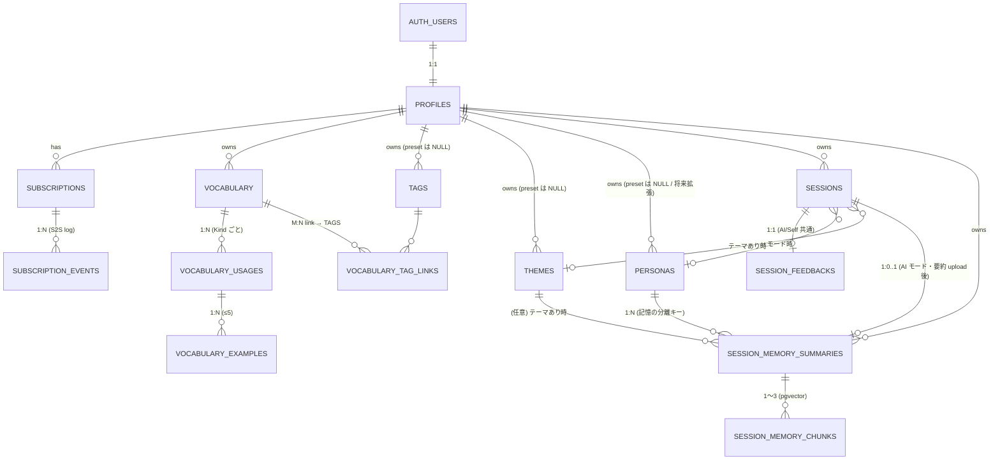

# データベース設計（サーバー側 ／ Supabase）

[← README に戻る](../../README.md)

> **Phase 1（[初版スコープ](../ロードマップ/初版スコープ.md)）の Supabase（Postgres）スキーマ**。**サーバーに載せるデータ**だけを扱う。**端末ローカルのスキーマ**は [データベース設計-クライアント](データベース設計-クライアント.md) を参照（境界は [§1.1](#11-クライアントサーバー境界再掲)）。
>
> 仕様の正は各機能ドキュメント、特に [会話 §5](../機能/会話.md#5-データの保持削除長期記憶rag)・[単語帳](../機能/単語帳.md)・[学習ログ](../機能/学習ログ.md)・[コンセプト-人間らしい記憶](../概要/コンセプト-人間らしい記憶.md)・[インフラ-Supabase](インフラ-Supabase.md)・[LLM-API方針](LLM-API方針.md) とする。

---

## 1. 設計方針

### 1.1 クライアント／サーバー境界（再掲）

[会話 §5](../機能/会話.md#5-データの保持削除長期記憶rag) の表を Supabase 側の責務として書き直したもの。**Phase 1（初版）と Phase 2 で載せる範囲が変わる**点に注意（境界の根拠は [会話 §5](../機能/会話.md#5-データの保持削除長期記憶rag)）。

| データ | 端末ローカル | Supabase（Phase 1） | Supabase（Phase 2） |
|--------|--------------|---------------------|---------------------|
| **セッションメタ**（開始日時・終了日時・モード・ペルソナ・テーマ等） | キャッシュ可 | **載せる**（`sessions`） | 同左 |
| **総括フィードバック** | キャッシュ可 | **載せる**（`session_feedbacks`） | 同左 |
| 会話の発話本文（ユーザー発話・AI 返答の時系列・`session_utterances` 行の集合） | 保持 | **載せない**（端末のみ） | **載せる**（`session_utterances`） |
| 新出ボキャブラリ候補のスナップショット | **永続化しない**（メモリのみ・ブックマーク確定分は `vocabulary` へ） | **載せない** | **載せない**（再表示要望時は AI 再生成で対応） |
| **記憶用セッション要約**（サニタイズ済み・**AI モードのみ**） | キャッシュ可 | **載せる（RAG ソース）** | 同左 |
| **記憶用要約のベクトル**（pgvector） | — | **載せる** | 同左 |
| **単語・用法・例文・タグ** | キャッシュ可 | **載せる** | 同左 |
| **会話テーマ（プリセット＋カスタム）** | キャッシュ可 | **載せる** | 同左 |
| **ペルソナ**（プリセット＋将来のユーザー定義） | キャッシュ可 | **載せる（マスタ）** | 同左 |
| **アカウント・プロフィール・サブスク** | — | **載せる** | 同左 |
| **App Store サブスク通知ログ**（S2S 生イベント） | — | **載せる**（監査・冪等処理用） | 同左 |
| 音声ファイル | 一時バッファのみ | **載せない** | 同左 |
| **Self モードの記憶用要約** | （生成しない／そもそも対象外） | **載せない** | 同左 |

**設計の意図**：機種変更時に **「学習日のカレンダーハイライト」と「総括フィードバックの再閲覧」は新端末でも復元できる**ことを Phase 1 から保証する。**会話の発話本文を新端末で復元する**ユーザー体験は Phase 2 で開放する（「昔の英語を読み返したい」「AI が長期スパンで英語力を判定する」用途への布石）。Phase 2 では本表の発話本文行が「**載せる**」に変わるが、Phase 1 のスキーマがそのまま拡張できるよう、Phase 1 から `sessions` を中心に置く。

**候補スナップショット**は **DB に永続化しない方針**。セッション終了直後の提示用にメモリのみで扱い、ユーザーがブックマークしたものだけが `vocabulary` テーブルに残る。後から学習ログのセッション詳細で候補一覧を再表示したい要望が出たら、その時点で AI に再生成させる運用とする（コスト・複雑さに対して機能価値が低いと判断）。

### 1.2 横断ルール

- **マルチテナント分離**：すべてのユーザーデータテーブルで **Row Level Security（RLS）** を有効化し、`user_id = auth.uid()` を基本ポリシーとする。
- **ID**：原則 `uuid`（`gen_random_uuid()` 既定）。
- **タイムスタンプ**：`created_at` / `updated_at` を `timestamptz`（UTC 物理保存・既定 `now()`）。`updated_at` はトリガで自動更新。**「その日（暦日）」の判定は端末ローカル TZ で行う**（[学習ログ §2](../機能/学習ログ.md#2-その日の定義暦日とセッションの対応)）。**サーバー側にユーザー TZ 情報は持たない**（サーバー発の通知・暦日集計の要件が出てきたら `profiles.timezone` を追加する余地を残す）。
- **削除**：単語帳・テーマ・ペルソナ・要約は**物理削除**を既定。アカウント削除は **Edge Function を経由（再認証 + 確認モーダル）**して `auth.users` を削除し、**FK `ON DELETE CASCADE` の連鎖**で関連データを一括削除する（→ §1.3）。
- **ペルソナ**：**サーバーマスタ `personas` で管理**。初版は **米英豪 × 男女のプリセット 6 行**を seed する（[会話-ペルソナとTTS §3・§4](../機能/会話-ペルソナとTTS.md)）。スキーマは `user_id` 任意で**ユーザー定義の追加に備える**が、**Phase 1 では UI から作成・編集を解放しない**。記憶（RAG）は本テーブル経由で **`ユーザー × ペルソナ`** に分離する（[コンセプト-人間らしい記憶](../概要/コンセプト-人間らしい記憶.md)）。**Self モードはペルソナを持たないため記憶用要約をサーバーに保存しない**（→ §3.11）。
- **学習言語**：初版は `en` 固定。将来拡張に備え `language TEXT DEFAULT 'en'` を保持するテーブルを設ける（[学習サイクル](../概要/学習サイクル.md)）。
- **Kind（品詞）**：[単語帳 §1.1](../機能/単語帳.md#11-kind品詞一覧) の **`VocabularyKind.rawValue`** と一致（例: `noun`, `verb`, `phrasal_verb`, `idiom`）。旧 `phrasing` は使わない。

### 1.3 アカウント削除フロー

[会話 §5](../機能/会話.md#5-データの保持削除長期記憶rag) の「**サーバー側の要約・ベクトル・単語帳をまとめて消せるようにする**」を担保する経路。**FK の `ON DELETE CASCADE` を主軸**にし、**ユーザー操作は Edge Function を経由**させる（App Store のアカウント削除提供要件にも対応）。

#### 削除経路

```
[アプリ] 設定 > アカウント削除
   └─ 再認証 + 確認モーダル
   └─ Edge Function (service role)
        └─ delete from auth.users where id = $uid;
              ↓ トリガ
        └─ delete from profiles where id = old.id;
              ↓ FK CASCADE で連鎖
        ├─ subscriptions → subscription_events
        ├─ vocabulary → vocabulary_usages → vocabulary_examples / vocabulary_tag_links
        ├─ tags
        ├─ themes              （user_id 一致分のみ。preset 行は user_id IS NULL なので残る）
        ├─ personas            （同上）
        ├─ sessions → session_feedbacks
        │            （Phase 2 で `session_utterances` も同経路で連鎖）
        └─ session_memory_summaries → session_memory_chunks
```

#### 守るべき不変条件

- **すべての所有テーブルで `user_id REFERENCES profiles(id) ON DELETE CASCADE`** を持たせる。テーブル追加時に必ずこの FK を入れるルールにする。
- **プリセット行（`user_id IS NULL`）は残る**ことが大前提（`personas` / `themes`）。
- **再認証**（パスワード／生体認証）→ **確認モーダル**を必ず挟む（誤操作防止）。
- 削除は**物理削除**を既定とし、ソフト削除（猶予期間）は採用しない（Phase 1 ではシンプルさ優先。要件が出たら検討）。

### 1.4 データ寿命ポリシー（長期非ログイン時の自動削除）

**離脱ユーザーのデータを永久保持し続けるとストレージコストが累積する**ため、非ログイン期間に応じてデータを段階的に削除するポリシーを定める。**実装（バッチジョブ・通知メール）は Phase 2 以降**だが、**本ポリシーを実現できるよう Phase 1 から `profiles.last_seen_at` を持っておく**（→ §3.1）。

| 非ログイン期間 | アクション |
|----------------|-----------|
| **6 ヶ月** | 警告メール 1 通目（「久しぶりです／このまま離れるとデータ削除予定」の旨） |
| **11 ヶ月** | 警告メール 2 通目（「あと約 1 ヶ月で発話本文を削除予定」の旨） |
| **12 ヶ月** | **`session_utterances` の発話本文を物理削除**。`sessions` メタ・`session_feedbacks`・単語帳・記憶用要約は残す（戻ってきたユーザーのカレンダー・総括・単語帳の連続性を保つ） |
| **24 ヶ月** | **アカウント全体を物理削除**（§1.3 と同じ CASCADE 経路）。事前通知 1 通を送る |

#### 守るべき不変条件

- `profiles.last_seen_at` は **アプリ起動時／API リクエスト発生時**に更新する想定。「ログイン状態維持中＝アプリを開いていない」だけでは更新されない（つまり**実利用ベース**で寿命を判定する）。
- ポリシーは **プラン共通**（無料／プラス／プロで差を付けない）。**プラン別の保管期間差別化は Phase 2 以降の検討事項**として [収益とサブスク](../運営/収益とサブスク.md) に残す。
- 実装は **Supabase Cron + Edge Function の日次バッチ**を想定。`last_seen_at` を見て対象を抽出し、メール送信または削除を行う。
- **法務観点**：GDPR・個人情報保護法の「目的達成後は遅滞なく削除」原則と整合する。利用規約・プライバシーポリシーに本ポリシーを明記する（実装時に [設定とアカウント](../機能/設定とアカウント.md) と整合）。

---

## 2. ER 概観



> **Phase 2 で追加予定（点線で示す位置付け）**：`SESSIONS ||--o{ SESSION_UTTERANCES`（1:N、発話本文）。

主要テーブル群：

- **アカウント／プラン**：`profiles` / `subscriptions` / `subscription_events`
- **ペルソナ**：`personas`（**記憶の分離キー**）
- **単語帳**：`vocabulary` / `vocabulary_usages` / `vocabulary_examples` / `tags` / `vocabulary_tag_links`
- **会話テーマ**：`themes`
- **セッションメタ／総括**（Phase 1 から）：`sessions` / `session_feedbacks`
- **記憶（RAG）**：`session_memory_summaries` / `session_memory_chunks`
- **会話の発話本文**（**Phase 2** で追加）：`session_utterances`

---

## 3. テーブル定義

### 3.1 `profiles` — アプリ用ユーザー情報

`auth.users` と 1:1。アプリ独自の表示名・好みを持つ。

| 列 | 型 | NN | 既定 | 説明 |
|----|----|----|----|----|
| `id` | `uuid` | ✓ | — | PK。`auth.users.id` と FK |
| `display_name` | `text` |  |  | 表示名 |
| `auxiliary_language` | `text` | ✓ | `'ja'` | 補助語（定義 2 本のうち補助側） |
| `appearance_theme` | `text` |  |  | アクセント色など（実装で確定） |
| `last_seen_at` | `timestamptz` |  |  | **アプリ起動時／API リクエスト発生時**に更新する想定。§1.4 のデータ寿命ポリシーで使用。**Phase 1 では値の更新だけ実装し、自動削除バッチは Phase 2 以降** |
| `created_at` | `timestamptz` | ✓ | `now()` |  |
| `updated_at` | `timestamptz` | ✓ | `now()` |  |

- **RLS**：`auth.uid() = id`（select / update / delete）。insert は登録トリガで作成。
- **削除**：`auth.users` 削除時に CASCADE。
- **`last_seen_at` の更新**：API リクエスト時にミドルウェアで更新する案／クライアントが起動時に明示的に PATCH する案、いずれも可。**書き込み頻度が多すぎると `updated_at` トリガとの衝突や無駄な WAL 増加を招く**ため、実装時に **数分〜1 時間程度のスロットリング**を入れる。

### 3.2 `subscriptions` — プラン状態（**App Store Server Notifications V2 を主経路**）

[設定とアカウント](../機能/設定とアカウント.md)・[収益とサブスク](../運営/収益とサブスク.md) の StoreKit ステータスを保持。**真の値の更新経路は Apple → Edge Function（S2S 通知）**。クライアント検証経路は補助（購入直後の即時反映用）として実装するが、`subscriptions` の最終状態は S2S で確定させる。

| 列 | 型 | NN | 既定 | 説明 |
|----|----|----|----|----|
| `id` | `uuid` | ✓ | `gen_random_uuid()` |  |
| `user_id` | `uuid` | ✓ |  | FK `profiles.id` |
| `plan` | `text` | ✓ | `'free'` | `free` / `plus` / `pro` |
| `status` | `text` | ✓ | `'active'` | `active` / `in_grace` / `canceled` / `expired` / `revoked` |
| `store` | `text` | ✓ | `'apple'` | 初版は Apple のみ |
| `product_id` | `text` |  |  | StoreKit product id |
| `original_transaction_id` | `text` |  |  | StoreKit。Apple 側のサブスク識別キー |
| `current_period_end` | `timestamptz` |  |  | 自動更新の期限。S2S `DID_RENEW` で更新 |
| `last_event_uuid` | `text` |  |  | 直近反映済み S2S 通知の `notificationUUID`（重複処理防止・冪等性キー） |
| `last_event_type` | `text` |  |  | 直近の `notificationType`（例：`DID_RENEW` / `EXPIRED` / `REFUND` / `REVOKE`）。観察用の denormalize |
| `created_at` / `updated_at` | `timestamptz` | ✓ | `now()` |  |

- **インデックス**：`UNIQUE (user_id, store)`（1 ストアあたり 1 行）。`UNIQUE (original_transaction_id) WHERE original_transaction_id IS NOT NULL`（S2S 突合用）。
- **RLS**：本人のみ select。**書き込みは Edge Function（S2S ハンドラ・StoreKit クライアント検証ハンドラ）からのサービスロール**に限定。

### 3.3 `subscription_events` — App Store S2S 通知の生イベントログ

S2S 通知の**生 payload と処理結果を全件保存**しておき、再処理・障害調査・カスタマーサポート対応に使う。`subscriptions` への反映は冪等に行う（同じ `notificationUUID` は二度反映しない）。

| 列 | 型 | NN | 既定 | 説明 |
|----|----|----|----|----|
| `id` | `uuid` | ✓ | `gen_random_uuid()` |  |
| `subscription_id` | `uuid` |  |  | FK `subscriptions.id`（CASCADE）。突合不能なものはここを NULL のまま保存 |
| `notification_uuid` | `text` | ✓ |  | Apple 通知 UUID（**冪等性キー**） |
| `notification_type` | `text` | ✓ |  | `SUBSCRIBED` / `DID_RENEW` / `EXPIRED` / `REFUND` / `REVOKE` ほか |
| `subtype` | `text` |  |  | Apple の `subtype`（`INITIAL_BUY` / `VOLUNTARY` 等） |
| `original_transaction_id` | `text` |  |  | 突合用 |
| `signed_payload_jws` | `text` | ✓ |  | Apple から送られた **JWS の生文字列**（検証済みの originator）|
| `decoded_payload` | `jsonb` | ✓ |  | 検証後にデコードした構造化 payload |
| `applied` | `boolean` | ✓ | `false` | `subscriptions` への反映を完了したか |
| `applied_at` | `timestamptz` |  |  |  |
| `received_at` | `timestamptz` | ✓ | `now()` |  |

- **インデックス**：`UNIQUE (notification_uuid)`、`(subscription_id, received_at desc)`。
- **RLS**：**ユーザーには直接公開しない**（サービスロールのみ select / insert / update）。サポート画面が必要になった場合は、ユーザー所有分のみを見せる別経路（管理 RPC）を用意する。
- **保持期間**：監査要件に応じて**最低 1 年**は残す前提（仕様で別途決め）。古いものはアーカイブ／削除運用。

### 3.4 `personas` — 会話パートナーのペルソナ（**プリセット＋将来のユーザー定義**・**記憶の分離キー**）

[会話-ペルソナとTTS §3・§4](../機能/会話-ペルソナとTTS.md) と [コンセプト-人間らしい記憶](../概要/コンセプト-人間らしい記憶.md) を実体化したマスタ。Phase 1 は **米英豪 × 男女のプリセット 6 行**を seed する。スキーマは `user_id` 任意で**ユーザー定義の追加に備える**が、**Phase 1 では UI から作成・編集を解放しない**。

| 列 | 型 | NN | 既定 | 説明 |
|----|----|----|----|----|
| `id` | `uuid` | ✓ | `gen_random_uuid()` |  |
| `user_id` | `uuid` |  |  | プリセットは NULL／ユーザー定義（将来）は所有者 |
| `is_preset` | `boolean` | ✓ | `false` |  |
| `slug` | `text` | ✓ |  | 安定 ID（例：`us-male-ethan`、[会話-ペルソナとTTS §3](../機能/会話-ペルソナとTTS.md) に 6 名分の例を掲載）。表示名と独立に永続 |
| `display_name` | `text` | ✓ |  | 表示名（変更可） |
| `locale` | `text` | ✓ |  | `en-US` / `en-GB` / `en-AU` ほか |
| `gender` | `text` |  |  | `male` / `female` / `other` |
| `voice_identifiers` | `jsonb` |  |  | プラットフォーム別の優先リスト（任意）。**seed では空**にし、端末側で `locale` + `gender` を元に解決する運用を既定とする（OS アップデート耐性が高いため）。必要になった時のみ `{"ios":["com.apple.voice.compact.en-US.Samantha"]}` 等で上書き |
| `prompt_persona` | `text` |  |  | LLM プロンプトに載せる口調・人格メモ（任意） |
| `avatar_url` | `text` |  |  | 将来 UI 用 |
| `is_active` | `boolean` | ✓ | `true` | プリセットの非表示用 soft flag（リリースなしで隠せる） |
| `created_at` / `updated_at` | `timestamptz` | ✓ | `now()` |  |

- **制約**：
  - プリセット：`UNIQUE (slug) WHERE is_preset = true`（部分インデックス）
  - ユーザー定義：`UNIQUE (user_id, slug) WHERE is_preset = false`
  - `is_preset = true` の行は `user_id IS NULL`、`is_preset = false` の行は `user_id IS NOT NULL` を CHECK 制約で担保
- **RLS**：`is_preset = true OR user_id = auth.uid()`（read）。プリセットの write は**サービスロール（マイグレーション・管理経路）のみ**、ユーザー定義の write は自分のみ。
- **削除**：
  - **ユーザー定義**を削除すると、紐づく `session_memory_summaries`（→ `chunks`）は **CASCADE で全消去**＝「このパートナーとの会話を全部忘れる」運用。**取り消し不能なため、UI では確認モーダルを必ず挟む**（「この AI 友だちとの記憶も全部消えます」と明示）。
  - **プリセット**は通常削除しない。`is_active = false` で UI から隠す（**ユーザー個別の非表示は持たない**＝個別に隠したい要件は将来「ユーザー定義ペルソナの作成解放」と合わせて検討）。

### 3.5 `vocabulary` — 単語（**単一テーブル**）

[単語帳 §1](../機能/単語帳.md#1-仕様中分類)：「**単語の持ち方**は単一テーブル（**分割なし**）」。1 行＝**1 つの見出し語**を表す。

| 列 | 型 | NN | 既定 | 説明 |
|----|----|----|----|----|
| `id` | `uuid` | ✓ | `gen_random_uuid()` |  |
| `user_id` | `uuid` | ✓ |  | FK `profiles.id` |
| `headword` | `text` | ✓ |  | 見出し語（初版は英語） |
| `language` | `text` | ✓ | `'en'` | 学習言語 |
| `notes` | `text` |  |  | 任意のメモ |
| `source` | `text` |  |  | `manual` / `conversation_candidate` |
| `created_at` / `updated_at` | `timestamptz` | ✓ | `now()` |  |

- **インデックス**：`(user_id, created_at desc)` / `(user_id, lower(headword))`。
  - `SCR-VOC-LIST` の **登録日順 / アルファベット順 / 見出し語の前方一致検索**を吸収。
  - **部分一致検索**を高速にしたい場合は **`pg_trgm` GIN インデックス**の追加を検討（実装フェーズで判断）。
  - **タグ別 / 未タグ絞り込み / Kind 別**は `vocabulary_tag_links`／`vocabulary_usages` を結合して対応（個別テーブルのインデックスがあるため追加は不要）。
- **RLS**：`auth.uid() = user_id`。
- **`source`**：候補→ブックマークで作成された行を区別したい場合の分類用。**`manual` / `conversation_candidate` の 2 値**で固定（モード別を細分しない）。**ローカル限定の `session_local_id` は持たない**（端末側のみで完結するため）。**いつ会話で覚えた単語か**は、`vocabulary.created_at` と端末側の学習ログを突合すれば出せるため、サーバー側に余分なメタを持たせない。
- **Phase 2（任意）**：列 **`preset_lemma_stable_id uuid`**（NULL 可）。端末の `CachedLemma.stableLemmaId` と同値とし、**プリセット辞典からマイ単語帳に紐付けた行**を機種またぎで揃える。初版は未導入でよい（[クライアント §3.8](データベース設計-クライアント.md#38-cachedvocabulary---ユーザー単語帳のキャッシュ) と同時検討）。

### 辞書パック（Storage とマニフェスト）

ユーザー `vocabulary` 行とは別系統。**13万級のレンマ＋活用形は Postgres に載せず**、オブジェクトストレージ（Supabase Storage / CDN 相当）に **immutable なバージョン付きオブジェクト**を置く想定。**RLS でユーザー行を護る対象には含めない**（公開読取 or 短命の署名 URL）。

**マニフェスト JSON（例・静的または BFF が返す）**：

| キー（例・snake_case） | 型 | 説明 |
|------------------------|----|------|
| `pack_key` | string | 例: `en_lemmas`（`CachedDictionaryPackMeta.packKey` と対応） |
| `pack_version` | string | 論理バージョン |
| `sha256` | string | ペイロードバイナリの SHA256 hex（省略可だが本番推奨） |
| `pack_download_url` | string (URL) | ペイロード取得先 |

**ペイロード JSON**（`.json` または圧縮後の中身。クライアントの `DictionaryPackImportService` と整合）：

| キー | 説明 |
|------|------|
| `pack_key` / `pack_version` / `sha256` | マニフェストと揃える（ペイロード側 `sha256` は自己検証用・任意） |
| `lemmas` | 配列。要素は `stable_lemma_id`（UUID）, `lemma`, `pos`, `language?`, `surfaces[]` |
| `surfaces[]` | `text`, `form_kind`（`LemmaSurfaceFormKind` と同値: `verb_*` / `adj_*` / `noun_*` / `adv_*` / `lemma_base` 等）, `ipa?` |

### 3.6 `vocabulary_usages` — 用法（品詞タブ単位）

[単語帳 §1・§4](../機能/単語帳.md)：例文は**用法ごと**に複数。**定義 2 本（学習対象言語・補助語）と IPA は用法単位**で保持する案。**列名はロールベース**にし、実言語は `vocabulary.language` と `profiles.auxiliary_language` で表現する（学習言語の将来拡張に備える）。

| 列 | 型 | NN | 既定 | 説明 |
|----|----|----|----|----|
| `id` | `uuid` | ✓ | `gen_random_uuid()` |  |
| `vocabulary_id` | `uuid` | ✓ |  | FK `vocabulary.id`（CASCADE） |
| `kind` | `text` | ✓ |  | Kind enum（§1.2） |
| `definition_target` | `text` |  |  | 学習対象言語での定義（実言語は `vocabulary.language`。既定：英語） |
| `definition_aux` | `text` |  |  | 補助語での定義（実言語は `profiles.auxiliary_language`。既定：日本語） |
| `ipa` | `text` |  |  | **オンデバイス生成（Apple Intelligence）**・読み取り専用（[単語帳 §3](../機能/単語帳.md#3-発音ipa)、[LLM-API方針](../アーキテクチャ/LLM-API方針.md)）。**サーバー側で生成しない・キャッシュも持たない**。`vocabulary_usages.ipa` には端末生成結果を保存して同期する |
| `position` | `integer` | ✓ | `0` | タブ並び順 |
| `created_at` / `updated_at` | `timestamptz` | ✓ | `now()` |  |

- **制約**：`UNIQUE (vocabulary_id, kind)` … 同じ単語に同じ Kind の用法を**複数持たせない**。
- **インデックス**：`(vocabulary_id, position)`。
- **RLS**：`exists (vocabulary の owner = auth.uid())` で透過。

### 3.7 `vocabulary_examples` — 例文（用法ごと、**目安最大 5 件**）

[単語帳 §4](../機能/単語帳.md#4-例文複数登録)。

| 列 | 型 | NN | 既定 | 説明 |
|----|----|----|----|----|
| `id` | `uuid` | ✓ | `gen_random_uuid()` |  |
| `usage_id` | `uuid` | ✓ |  | FK `vocabulary_usages.id`（CASCADE） |
| `sentence_target` | `text` | ✓ |  | 学習対象言語の例文（実言語は `vocabulary.language`。既定：英文） |
| `translation_aux` | `text` |  |  | 補助語訳（実言語は `profiles.auxiliary_language`。既定：和訳） |
| `position` | `integer` | ✓ | `0` |  |
| `created_at` / `updated_at` | `timestamptz` | ✓ | `now()` |  |

- **5 件上限**：**アプリ側のみで制御**（DB トリガ・CHECK は置かない）。仕様の「**目安**」表現に合わせてハード制約にしない。別経路（手動 SQL 等）から 6 件目を入れる余地は残すが、**Edge Function／BFF 経由を必須とする運用**で実質的に塞ぐ。
- **インデックス**：`(usage_id, position)`。

### 3.8 `tags` — タグ定義（**ユーザーが任意で命名／フォルダ的役割も兼ねる**）

[単語帳 §1](../機能/単語帳.md#1-仕様中分類) のタグ付け。**プリセットは持たず**、ユーザーが任意で命名する。**新規ユーザーの初期状態はタグ 0 件**（必要になったときに本人が作る）。**本設計ではフォルダテーブルを置かず**、ブックマーク後の整理（旧「複数フォルダ」相当）も**ユーザー命名のタグで代替**する。

| 列 | 型 | NN | 既定 | 説明 |
|----|----|----|----|----|
| `id` | `uuid` | ✓ | `gen_random_uuid()` |  |
| `user_id` | `uuid` | ✓ |  | FK `profiles.id` |
| `name` | `text` | ✓ |  | ユーザーが命名（重複は同一ユーザー内で禁止） |
| `created_at` / `updated_at` | `timestamptz` | ✓ | `now()` |  |

- **制約**：`UNIQUE (user_id, name)`。
- **RLS**：`auth.uid() = user_id`（select / insert / update / delete）。

### 3.9 `vocabulary_tag_links` — 単語 × タグのリンク（M:N）

`vocabulary` と `tags` を結ぶ**中間テーブル**。**タグ定義そのものではなく**、「その単語にそのタグを付けた」という**リンク行 1 件**を表す。

| 列 | 型 | NN |
|----|----|----|
| `vocabulary_id` | `uuid` | ✓ |
| `tag_id` | `uuid` | ✓ |
| `created_at` | `timestamptz` | ✓ |

- **PK**：`(vocabulary_id, tag_id)`。
- **FK**：`vocabulary_id` → `vocabulary.id`（ON DELETE CASCADE）、`tag_id` → `tags.id`（ON DELETE CASCADE）。
- **RLS**：両 FK 先の所有者が `auth.uid()` であることを満たす行のみ（vocabulary／tags 経由で透過）。

### 3.10 `themes` — 会話テーマ（**プリセット＋カスタム**）

[会話 §1](../機能/会話.md#1-仕様モード一覧)：「**プリセット＋カスタムテーマ**（自分で定義）」。**プリセット行は `personas` と同じく DB マスタとして seed**（マイグレーション or 管理経路から書き込み）。リリースなしで `is_active = false` 化できる。

| 列 | 型 | NN | 既定 | 説明 |
|----|----|----|----|----|
| `id` | `uuid` | ✓ | `gen_random_uuid()` |  |
| `user_id` | `uuid` |  |  | プリセットは NULL／カスタムは所有者 |
| `name` | `text` | ✓ |  |  |
| `description` | `text` |  |  | プロンプトに載せる説明 |
| `is_preset` | `boolean` | ✓ | `false` |  |
| `is_active` | `boolean` | ✓ | `true` | プリセットの非表示用 soft flag（リリースなしで隠せる） |
| `created_at` / `updated_at` | `timestamptz` | ✓ | `now()` |  |

- **制約**：
  - プリセット：`UNIQUE (name) WHERE is_preset = true`
  - カスタム：`UNIQUE (user_id, name) WHERE is_preset = false`
  - `is_preset = true` の行は `user_id IS NULL`、`is_preset = false` の行は `user_id IS NOT NULL` を CHECK 制約で担保
- **RLS**：`is_preset = true OR user_id = auth.uid()`（read）。プリセットの write は**サービスロール（マイグレーション・管理経路）のみ**、カスタムの write は自分のみ。

### 3.11 `sessions` — セッションメタ（**学習ログのカレンダー・一覧の元データ**）

[学習ログ §1](../機能/学習ログ.md) の **「カレンダー → 日付 → セッション一覧」の元データ**。`mode` で Self / AI 自由テーマ / AI テーマありを区別する。**機種変更時にカレンダー・セッション一覧を新端末で復元できるよう、Phase 1 からサーバーに保存する**（[会話 §5](../機能/会話.md#5-データの保持削除長期記憶rag) と整合）。**発話本文は Phase 2 で同じ親 `sessions` の子テーブル `session_utterances` として追加**する。

| 列 | 型 | NN | 既定 | 説明 |
|----|----|----|----|----|
| `id` | `uuid` | ✓ | `gen_random_uuid()` | **端末発番**（`uuid_v4`）を許容。クライアントが事前採番してから push する運用で、サーバー側の trip 後でも ID が一意になる |
| `user_id` | `uuid` | ✓ |  | FK `profiles.id`（CASCADE） |
| `mode` | `text` | ✓ |  | `self` / `ai_free` / `ai_themed` |
| `persona_id` | `uuid` |  |  | FK `personas.id`（SET NULL）。Self モードは NULL |
| `theme_id` | `uuid` |  |  | FK `themes.id`（SET NULL）。テーマあり時のみ |
| `started_at` | `timestamptz` | ✓ |  | セッション開始時刻（端末側時刻）。**暦日の判定は端末ローカル TZ で行う**（[学習ログ §2](../機能/学習ログ.md#2-その日の定義暦日とセッションの対応)） |
| `ended_at` | `timestamptz` |  |  | セッション終了時刻。途中保存もあり得るので任意 |
| `language` | `text` | ✓ | `'en'` | 学習言語 |
| `created_at` / `updated_at` | `timestamptz` | ✓ | `now()` |  |

- **インデックス**：
  - `(user_id, started_at DESC)` — カレンダー描画と日付別一覧の主クエリ。
  - `(user_id, mode, started_at DESC)` — モード別フィルタ。
- **RLS**：`auth.uid() = user_id`。
- **同期**：クライアント側の `CachedSession`（[データベース設計-クライアント §3](データベース設計-クライアント.md#3-エンティティ定義)）と双方向同期。**作成・更新は基本的にクライアント発生**で、サーバーから別端末に pull される。
- **削除連鎖**：`profiles → sessions → session_feedbacks` および Phase 2 で追加される `session_utterances` まで CASCADE。

### 3.12 `session_feedbacks` — 総括フィードバック（端末で生成・**サーバーに同期**）

[会話 §2](../機能/会話.md#2-ai-会話のフロー自由テーマテーマあり共通) の評価軸（文法・ボキャブラリ／表現力・苦手領域）を構造化して保持する。**LLM の生出力**も `raw_text` として残し、表示はパース後の構造化フィールドを優先する。**機種変更時に学習ログのセッション詳細で総括が見えるよう、Phase 1 からサーバーに同期する**。

| 列 | 型 | NN | 既定 | 説明 |
|----|----|----|----|----|
| `id` | `uuid` | ✓ | `gen_random_uuid()` |  |
| `session_id` | `uuid` | ✓ |  | FK `sessions.id`（CASCADE）。**`UNIQUE (session_id)` で 1:1** |
| `user_id` | `uuid` | ✓ |  | FK `profiles.id`（CASCADE）。RLS フィルタ高速化のため非正規化 |
| `grammar_strength_text` | `text` |  |  | 文法の良かった面 |
| `grammar_weakness_text` | `text` |  |  | 文法の苦手面 |
| `vocabulary_strength_text` | `text` |  |  | 表現力の良かった面 |
| `vocabulary_weakness_text` | `text` |  |  | 表現力の苦手面 |
| `raw_text` | `text` |  |  | LLM の生出力（パース失敗時のフォールバック表示用） |
| `generated_at` | `timestamptz` | ✓ |  | 端末で生成した時刻 |
| `created_at` / `updated_at` | `timestamptz` | ✓ | `now()` |  |

- **制約**：`UNIQUE (session_id)`。
- **RLS**：`auth.uid() = user_id`。
- **同期**：クライアント側の `CachedSessionFeedback` と双方向同期（編集はほぼ発生しないため LWW で十分）。

### 3.13 `session_memory_summaries` — 記憶用セッション要約（サニタイズ済み・**RAG ソース**）

[会話 §5](../機能/会話.md#5-データの保持削除長期記憶rag)・[コンセプト-人間らしい記憶](../概要/コンセプト-人間らしい記憶.md)。**RAG retrieve 用の本文**を保持する（Phase 2 で `session_utterances` がサーバーに載るが、本テーブルは引き続き「**サニタイズ済みの記憶本文**」として、RAG の入力源を明確に切り分ける役割を担う）。

> **総括フィードバック（学習向け講評）とは別物。** 総括は `session_feedbacks` で別管理（§3.12）。本テーブルに入るのは「あとから検索される**パートナーとの共有メモ**」としての**記憶用要約**で、`session_memory_chunks` の embedding 入力もこの本文（または意味のまとまりで 2〜3 分割したチャンク）に限定する。**評価的な講評文を混ぜないことで RAG のノイズを下げる方針**（[コンセプト-人間らしい記憶](../概要/コンセプト-人間らしい記憶.md)）。同一の LLM 呼び出しで総括と記憶用を**兼用するか別出力にするか**は実装判断（[会話 §5](../機能/会話.md#5-データの保持削除長期記憶rag)）。

| 列 | 型 | NN | 既定 | 説明 |
|----|----|----|----|----|
| `id` | `uuid` | ✓ | `gen_random_uuid()` |  |
| `session_id` | `uuid` | ✓ |  | FK `sessions.id`（CASCADE）。**`UNIQUE (session_id)` で 1:1** |
| `user_id` | `uuid` | ✓ |  | FK `profiles.id`（CASCADE）。RLS フィルタ高速化のため非正規化 |
| `persona_id` | `uuid` | ✓ |  | FK `personas.id`（**CASCADE**）。**`ユーザー × ペルソナ` の記憶分離キー** |
| `mode` | `text` | ✓ |  | `ai_free` / `ai_themed`（**Self は本テーブルに保存しない**） |
| `theme_id` | `uuid` |  |  | FK `themes.id`（テーマあり時のみ。SET NULL） |
| `occurred_at` | `timestamptz` | ✓ |  | セッション開始日時（`sessions.started_at` と一致するよう同期）。**暦日の判定は端末ローカル TZ で行う**。RAG retrieve 結果のソート用に本テーブルにも保持 |
| `ended_at` | `timestamptz` |  |  | セッション終了日時（`sessions.ended_at` と一致） |
| `language` | `text` | ✓ | `'en'` |  |
| `topics` | `jsonb` |  |  | スキーマ案：`text[]` |
| `facts` | `jsonb` |  |  | ユーザーが伝えた事実・決めたこと |
| `phrases` | `jsonb` |  |  | 練習・出てきた英語フレーズ |
| `open_threads` | `jsonb` |  |  | 次に続きそうな論点 |
| `raw_summary` | `text` |  |  | スキーマ化前の原文（任意・デバッグ用） |
| `sanitization_version` | `text` |  |  | サニタイズパイプラインのバージョン |
| `created_at` | `timestamptz` | ✓ | `now()` |  |

- **制約**：`UNIQUE (session_id)`（1 セッションにつき要約は 1 本）。
- **インデックス**：
  - `(user_id, persona_id, occurred_at DESC)` — 「ペルソナ × ユーザー」での履歴 retrieve 前段。
  - `(user_id, occurred_at DESC)` — 横断参照。
- **整合性**：トリガで `personas.user_id` が **NULL（プリセット）か `summaries.user_id` と一致**することを担保（プリセットは全員参照可、ユーザー定義は所有者のみが書き込めるため）。`session_id` の `mode` が `ai_free` / `ai_themed` のいずれかであることもトリガで担保（Self モードのセッションには本行を作らない）。**さらに `sessions.persona_id` と本行の `persona_id` が一致すること**をトリガまたは Edge Function で担保する（**セッションが指すパートナーと、記憶の分離キーがずれないようにする**）。
- **RLS**：`auth.uid() = user_id`。
- **書き込み経路**：クライアントから直接 INSERT させず、**Edge Function（または BFF）** が **ルールベースサニタイズ → LLM 要約 → 保存直前再スキャン**を経て INSERT する（[会話 §5](../機能/会話.md#5-データの保持削除長期記憶rag) のパイプライン）。サーバーに `session_utterances` が載る Phase 2 でも、**RAG ベクトル化対象は引き続き要約本文のみ**（発話原文をそのまま埋め込まない）方針は維持する。
- **`session_memory_summaries` と `session_memory_chunks` の分担**：
  - **Summaries（本テーブル）**：サーバー側の **記憶本文の正**。**ユーザーがセッション履歴から要約を閲覧する** UI を載せる場合も、**このテーブルが表示の源泉**とする。`session_memory_chunks` はこの行から **派生生成**する。
  - **Chunks**：**類似度検索（RAG retrieve）用**。埋め込み入力テキストとベクトルを保持する。**通常はチャンク行をユーザーに見せない**。retrieve で候補の `summary_id` を得たうえで、プロンプトなどには親の要約やそこから組んだテキストを載せる流れが自然。
- **Self モード**：[会話 §5](../機能/会話.md#5-データの保持削除長期記憶rag) のとおりサーバー側に記憶を持たせない。本テーブルには **AI モード（`ai_free` / `ai_themed`）のみ**が記録される。Self モードのセッションメタ自体は `sessions` に載るので、**カレンダー・一覧の復元には影響しない**（記憶用要約だけが Self モードでは生成・保存されない）。

### 3.14 `session_memory_chunks` — 要約のベクトル（**1 セッションあたり 1〜3 行**）

[会話 §5](../機能/会話.md#5-データの保持削除長期記憶rag)：「原則 セッションあたり 1 ベクトル。要約が長く単一埋め込みに不向きなときのみ、意味のまとまりで 2〜3 チャンクに分割」。

**ユーザー閲覧の対象外**：検索インデックスとして使う（§3.11「分担」のとおり）。画面で見せる記憶本文は `session_memory_summaries` 側とする。

| 列 | 型 | NN | 既定 | 説明 |
|----|----|----|----|----|
| `id` | `uuid` | ✓ | `gen_random_uuid()` |  |
| `summary_id` | `uuid` | ✓ |  | FK `session_memory_summaries.id`（CASCADE） |
| `user_id` | `uuid` | ✓ |  | **非正規化**（RLS / 検索フィルタ高速化） |
| `persona_id` | `uuid` | ✓ |  | **非正規化**（`ユーザー × ペルソナ` 検索の前段フィルタ用） |
| `chunk_index` | `integer` | ✓ | `0` |  |
| `content` | `text` | ✓ |  | 埋め込み入力テキスト |
| `embedding` | `vector(768)` |  |  | 既定モデル **`text-embedding-004`（Google・768 次元・安定版）**。次元はモデル変更時にスキーマ変更＋全ベクトル再生成が必要 |
| `embedding_model` | `text` | ✓ | `'text-embedding-004'` | 監査と将来の再埋め込み判定用に記録 |
| `created_at` | `timestamptz` | ✓ | `now()` |  |

- **拡張**：`create extension if not exists vector;`
- **インデックス**：
  - `(user_id, persona_id)`（メタフィルタ）
  - `embedding` に対する **HNSW**（pgvector ≥ 0.5）または **IVFFlat**（要 `lists` チューニング）。
- **RLS**：`auth.uid() = user_id`。
- **整合性**：`summary` 側の `user_id` / `persona_id` 変更時にトリガで反映（実運用では UPDATE しない前提）。

---

## 4. 残課題 / 壁打ちしたい論点

設計の分岐点として、特にここの判断が後段に影響しやすい。

**現時点で未決着の残課題なし**（壁打ちで全て解消・本書 §1〜§3 に反映済み）。新たな論点が出たら本節に追記する。

---

## 5. Phase 2 で追加予定のテーブル（参考スケッチ）

[会話 §5](../機能/会話.md#5-データの保持削除長期記憶rag) と §1.1 の境界表で **Phase 2 から「載せる」に変わるデータ**の受け皿。**実装は Phase 2 だが、Phase 1 のスキーマを後付けで拡張する形で素直に追加できる**ことを示すためのスケッチ。

### 5.1 `session_utterances`（Phase 2） — セッション内の発話 1 件（ユーザー／AI）

Postgres では **`session_utterances`** とする（英語の **utterance**＝発話 1 単位。抽象的な *turn* より対象が読み取りやすい）。

| 列 | 型 | NN | 既定 | 説明 |
|----|----|----|----|----|
| `id` | `uuid` | ✓ | `gen_random_uuid()` |  |
| `session_id` | `uuid` | ✓ |  | FK `sessions.id`（CASCADE） |
| `user_id` | `uuid` | ✓ |  | FK `profiles.id`（CASCADE）。RLS フィルタ高速化のため非正規化 |
| `role` | `text` | ✓ |  | `user` / `ai` |
| `text` | `text` | ✓ |  | 発話テキスト（音声入力でも文字起こし結果を保存） |
| `occurred_at` | `timestamptz` | ✓ |  |  |
| `sequence_index` | `integer` | ✓ |  | セッション内連番（並び順の安定化） |
| `input_modality` | `text` |  |  | `text` / `voice_b` |
| `created_at` | `timestamptz` | ✓ | `now()` |  |

- **インデックス**：`(session_id, sequence_index)`、`(session_id, created_at)`（差分同期）。
- **同期**：**append-only** に近い性格。**セッション終了時にバルク push**。読み込みは **セッション詳細を開いたタイミングで遅延 pull**（カレンダー・一覧の描画には不要）。
- **データ寿命ポリシー**：§1.4 の **12 ヶ月非ログインで物理削除**対象（親 `sessions` 行は残す）。

> **候補スナップショットは保持しない**：[会話 §5](../機能/会話.md#5-データの保持削除長期記憶rag) のとおり、新出ボキャブラリ候補は **DB に永続化しない**方針。セッション終了直後の提示用にメモリのみで扱い、ユーザーがブックマーク確定したものだけが `vocabulary` テーブルに残る。後から学習ログのセッション詳細で候補一覧を再表示したい要望が出たら、その時点で AI に再生成させる運用とする。

---

## 6. 設計確定後の仕様書同期 TODO

DB 設計の議論で**仕様書側と齟齬が出た／更新が必要になった**箇所をここに溜めておく欄。**設計確定後の同期作業はすべて反映済み**。今後新たな差分が出たら本節に追記する。

- [x] **[単語帳](../機能/単語帳.md) §1**：「ブックマーク：フォルダで整理（複数フォルダ）」を「**タグで整理（プリセットなし・ユーザー命名・複数同時付与可）**」に書き換え。
- [x] **[単語帳](../機能/単語帳.md) §2**：「候補 → 永続化」フロー図とテキストでフォルダへの保存記述があれば、タグ付け（任意）に置き換え。
- [x] **[画面一覧](../機能/画面一覧.md) `SCR-VOC-LIST`**：「載る機能」と説明から**フォルダ関連の表現を除去**。タグ別フィルタ／Kind フィルタ／未タグ絞り込み／見出し語検索／登録日・アルファベット順並べ替えの**UI 軸**を反映。
- [x] **[機能一覧](../機能/機能一覧.md)** の `VOC-BOOKMARK` 行：「フォルダで整理」記述をブックマーク = 単語帳保存（タグで整理）に直す。
- [x] **[会話-ペルソナとTTS](../機能/会話-ペルソナとTTS.md) §4**：「初回リリース：アプリ内定義／将来：DB マスター化」を「**初版から DB マスタ。ただし UI からのカスタム作成は将来解放**」に更新。
- [x] **[LLM-API方針](LLM-API方針.md)**：埋め込みモデルとして **`text-embedding-004`（768 次元）を既定**にする旨を 0 章 or 0/1 章付近に追記（クラウド LLM の生成系モデル一覧と並べて記載）。
- [x] **[収益とサブスク](../運営/収益とサブスク.md)**：「**App Store Server Notifications V2 を主経路**にし、クライアント検証は補助」「`subscription_events` で生通知を全件保管」する運用を反映。
- [x] **[インフラ-Supabase](インフラ-Supabase.md)**：`subscription_events`（JWS 生 payload を含む）の容量見積もりを追記。Apple 通知の保持期間（最低 1 年想定）を確認。
- [x] **[会話](../機能/会話.md) §5**：境界表で **セッションメタ・総括フィードバックを Phase 1 から Supabase に載せる**／**発話本文は Phase 2 で載せる**／**候補スナップショットは永続化しない**へ更新。「**発話本文はサーバーに載せない（Phase 1）**」を撤回し、プライバシー方針を「最小化」から「保護しつつ保管」へ書き換え。
- [x] **[学習ログ](../機能/学習ログ.md) §1・§4**：「**発話・総括・セッション一覧はローカルが正**」を撤回。Phase 1 でメタ・総括は新端末でも復元できる旨を反映。
- [x] **[設定とアカウント](../機能/設定とアカウント.md) §1**：「会話の発話本文・総括は端末ローカルが正」記述を Phase 1／Phase 2 の境界に合わせて更新。**長期非ログイン時の自動削除**（§1.4）を Phase 2 以降の機能としてユーザーへ説明する旨を追記。
- [x] **[インフラ-Supabase](インフラ-Supabase.md) §1**：容量試算に `sessions` メタ・`session_feedbacks` を反映し、**Phase 2 の `session_utterances` 増分**の見積もりレンジを併記。
- [x] **[収益とサブスク](../運営/収益とサブスク.md)**：**プラン別の保管期間差別化を Phase 2 残課題として記載**。
- [x] **[初版スコープ](../ロードマップ/初版スコープ.md)**：Phase 1 のサーバー化範囲（メタ・総括）／Phase 2 へ送る範囲（発話本文・データ寿命ポリシー実装）を追記。**候補スナップショットは永続化しない**方針も反映。
- [x] **`sessions.bundle_id` 削除**：Phase 1 では「過去セッションの続きから再開」する UX を持たないため、束ねキーを物理列として持たない。クライアント側 `CachedSession.bundleId` も同時に削除。将来この UX を入れる際は `previous_session_id` で再導入する。
- [x] **`vocabulary_tag_links`**：`vocabulary_tags` を **`vocabulary_tag_links` にリネーム**。単語×タグの **リンク行（中間テーブル）**であることが名前から分かるようにする（クライアント側 **`CachedVocabularyTagLink`** と対応）。

---

## 7. 関連ドキュメント

- [インフラ-Supabase](インフラ-Supabase.md) — 容量・料金の単一試算ソース。
- [LLM-API方針](LLM-API方針.md) — クラウド Gemini ／ Apple Intelligence の役割分担、構造化出力。
- [会話](../機能/会話.md) — 発話／総括／候補／要約の責務とサーバー境界。
- [単語帳](../機能/単語帳.md) — 単一テーブル方針・用法・例文・IPA・AI 一括ドラフト。
- [学習ログ](../機能/学習ログ.md) — Phase 1 でメタ・総括をサーバー同期、暦日定義。
- [コンセプト-人間らしい記憶](../概要/コンセプト-人間らしい記憶.md) — `ユーザー × ペルソナ` 単位の RAG 分離・要約スキーマの観点。
- [画面一覧](../機能/画面一覧.md) — 画面と機能 ID の対応（DB 操作の発火点の参照）。
- [UI-ボタンとチップの区分](../機能/UI-ボタンとチップの区分.md) — ベタ塗りボタン＝DB 反映の境界。
