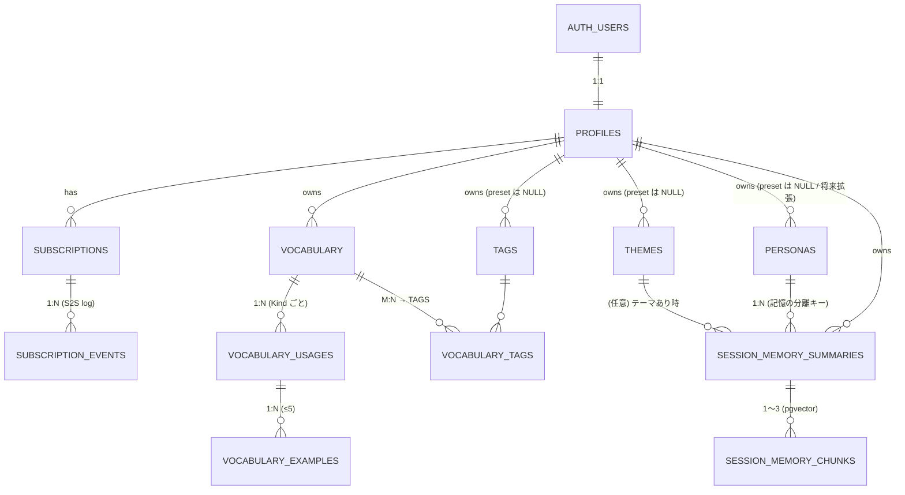

# データベース設計（ラフ案）

[← README に戻る](../../README.md)

> **Phase 1（[初版スコープ](../ロードマップ/初版スコープ.md)）の Supabase（Postgres）スキーマのドラフト**。仕様の正は各機能ドキュメント、特に [会話 §5](../機能/会話.md#5-データの保持削除長期記憶rag)・[単語帳](../機能/単語帳.md)・[学習ログ](../機能/学習ログ.md)・[コンセプト-人間らしい記憶](../概要/コンセプト-人間らしい記憶.md)・[インフラ-Supabase](インフラ-Supabase.md)・[LLM-API方針](LLM-API方針.md) とする。
>
> 本ドキュメントは**壁打ち用のたたき台**。型・制約・命名は確定前提ではない。

---

## 1. 設計方針

### 1.1 クライアント／サーバー境界（再掲）

[会話 §5](../機能/会話.md#5-データの保持削除長期記憶rag) の表を Supabase 側の責務として書き直したもの。

| データ | 端末ローカル | Supabase（本書の対象） |
|--------|--------------|------------------------|
| 会話ターン本文（ユーザー発話・AI 返答の時系列） | 保持 | **載せない** |
| 総括フィードバック | 保持 | **載せない** |
| セッションメタ（開始日時・モード・ペルソナ・テーマ・束ね ID 等） | 保持 | **載せない** |
| 新出ボキャブラリ候補のスナップショット | 任意で保持 | **載せない**（初版） |
| **記憶用セッション要約**（サニタイズ済み・**AI モードのみ**） | キャッシュ可 | **載せる（RAG ソース）** |
| **記憶用要約のベクトル**（pgvector） | — | **載せる** |
| **単語・用法・例文・タグ** | キャッシュ可 | **載せる** |
| **会話テーマ（プリセット＋カスタム）** | キャッシュ可 | **載せる** |
| **ペルソナ**（プリセット＋将来のユーザー定義） | キャッシュ可 | **載せる（マスタ）** |
| **アカウント・プロフィール・サブスク** | — | **載せる** |
| **App Store サブスク通知ログ**（S2S 生イベント） | — | **載せる**（監査・冪等処理用） |
| 音声ファイル | 一時バッファのみ | **載せない** |
| **Self モードの記憶用要約** | （生成しない／そもそも対象外） | **載せない** |

### 1.2 横断ルール

- **マルチテナント分離**：すべてのユーザーデータテーブルで **Row Level Security（RLS）** を有効化し、`user_id = auth.uid()` を基本ポリシーとする。
- **ID**：原則 `uuid`（`gen_random_uuid()` 既定）。
- **タイムスタンプ**：`created_at` / `updated_at` を `timestamptz`（UTC 物理保存・既定 `now()`）。`updated_at` はトリガで自動更新。**「その日（暦日）」の判定は端末ローカル TZ で行う**（[学習ログ §2](../機能/学習ログ.md#2-その日の定義暦日とセッションの対応)）。**サーバー側にユーザー TZ 情報は持たない**（サーバー発の通知・暦日集計の要件が出てきたら `profiles.timezone` を追加する余地を残す）。
- **削除**：単語帳・テーマ・ペルソナ・要約は**物理削除**を既定。アカウント削除は **Edge Function を経由（再認証 + 確認モーダル）**して `auth.users` を削除し、**FK `ON DELETE CASCADE` の連鎖**で関連データを一括削除する（→ §1.3）。
- **ペルソナ**：**サーバーマスタ `personas` で管理**。初版は **米英豪 × 男女のプリセット 6 行**を seed する（[会話-ペルソナとTTS §3・§4](../機能/会話-ペルソナとTTS.md)）。スキーマは `user_id` 任意で**ユーザー定義の追加に備える**が、**Phase 1 では UI から作成・編集を解放しない**。記憶（RAG）は本テーブル経由で **`ユーザー × ペルソナ`** に分離する（[コンセプト-人間らしい記憶](../概要/コンセプト-人間らしい記憶.md)）。**Self モードはペルソナを持たないため記憶用要約をサーバーに保存しない**（→ §3.11）。
- **学習言語**：初版は `en` 固定。将来拡張に備え `language TEXT DEFAULT 'en'` を保持するテーブルを設ける（[学習サイクル](../概要/学習サイクル.md)）。
- **Kind（品詞）**：`Verb / Adjective / Adverb / Noun / Phrasing / Interjection`。コード上の綴りは [単語帳](../機能/単語帳.md) §1 と揃える（実装で最終確定）。

### 1.3 アカウント削除フロー

[会話 §5](../機能/会話.md#5-データの保持削除長期記憶rag) の「**サーバー側の要約・ベクトル・単語帳をまとめて消せるようにする**」を担保する経路。**FK の `ON DELETE CASCADE` を主軸**にし、**ユーザー操作は Edge Function を経由**させる（App Store のアカウント削除提供要件にも対応）。

#### 削除経路

```
[アプリ] 設定 > アカウント削除
   └─ 再認証 + 確認モーダル
   └─ Edge Function (service role)
        └─ delete from auth.users where id = $uid;
              ↓ トリガ
        └─ delete from profiles where id = old.id;
              ↓ FK CASCADE で連鎖
        ├─ subscriptions → subscription_events
        ├─ vocabulary → vocabulary_usages → vocabulary_examples / vocabulary_tags
        ├─ tags
        ├─ themes              （user_id 一致分のみ。preset 行は user_id IS NULL なので残る）
        ├─ personas            （同上）
        └─ session_memory_summaries → session_memory_chunks
```

#### 守るべき不変条件

- **すべての所有テーブルで `user_id REFERENCES profiles(id) ON DELETE CASCADE`** を持たせる。テーブル追加時に必ずこの FK を入れるルールにする。
- **プリセット行（`user_id IS NULL`）は残る**ことが大前提（`personas` / `themes`）。
- **再認証**（パスワード／生体認証）→ **確認モーダル**を必ず挟む（誤操作防止）。
- 削除は**物理削除**を既定とし、ソフト削除（猶予期間）は採用しない（Phase 1 ではシンプルさ優先。要件が出たら検討）。

---

## 2. ER 概観



主要テーブル群：

- **アカウント／プラン**：`profiles` / `subscriptions` / `subscription_events`
- **ペルソナ**：`personas`（**記憶の分離キー**）
- **単語帳**：`vocabulary` / `vocabulary_usages` / `vocabulary_examples` / `tags` / `vocabulary_tags`
- **会話テーマ**：`themes`
- **記憶（RAG）**：`session_memory_summaries` / `session_memory_chunks`

---

## 3. テーブル定義

### 3.1 `profiles` — アプリ用ユーザー情報

`auth.users` と 1:1。アプリ独自の表示名・好みを持つ。

| 列 | 型 | NN | 既定 | 説明 |
|----|----|----|----|----|
| `id` | `uuid` | ✓ | — | PK。`auth.users.id` と FK |
| `display_name` | `text` |  |  | 表示名 |
| `auxiliary_language` | `text` | ✓ | `'ja'` | 補助語（定義 2 本のうち補助側） |
| `appearance_theme` | `text` |  |  | アクセント色など（実装で確定） |
| `created_at` | `timestamptz` | ✓ | `now()` |  |
| `updated_at` | `timestamptz` | ✓ | `now()` |  |

- **RLS**：`auth.uid() = id`（select / update / delete）。insert は登録トリガで作成。
- **削除**：`auth.users` 削除時に CASCADE。

### 3.2 `subscriptions` — プラン状態（**App Store Server Notifications V2 を主経路**）

[設定とアカウント](../機能/設定とアカウント.md)・[収益とサブスク](../運営/収益とサブスク.md) の StoreKit ステータスを保持。**真の値の更新経路は Apple → Edge Function（S2S 通知）**。クライアント検証経路は補助（購入直後の即時反映用）として実装するが、`subscriptions` の最終状態は S2S で確定させる。

| 列 | 型 | NN | 既定 | 説明 |
|----|----|----|----|----|
| `id` | `uuid` | ✓ | `gen_random_uuid()` |  |
| `user_id` | `uuid` | ✓ |  | FK `profiles.id` |
| `plan` | `text` | ✓ | `'free'` | `free` / `plus` / `pro` |
| `status` | `text` | ✓ | `'active'` | `active` / `in_grace` / `canceled` / `expired` / `revoked` |
| `store` | `text` | ✓ | `'apple'` | 初版は Apple のみ |
| `product_id` | `text` |  |  | StoreKit product id |
| `original_transaction_id` | `text` |  |  | StoreKit。Apple 側のサブスク識別キー |
| `current_period_end` | `timestamptz` |  |  | 自動更新の期限。S2S `DID_RENEW` で更新 |
| `last_event_uuid` | `text` |  |  | 直近反映済み S2S 通知の `notificationUUID`（重複処理防止・冪等性キー） |
| `last_event_type` | `text` |  |  | 直近の `notificationType`（例：`DID_RENEW` / `EXPIRED` / `REFUND` / `REVOKE`）。観察用の denormalize |
| `created_at` / `updated_at` | `timestamptz` | ✓ | `now()` |  |

- **インデックス**：`UNIQUE (user_id, store)`（1 ストアあたり 1 行）。`UNIQUE (original_transaction_id) WHERE original_transaction_id IS NOT NULL`（S2S 突合用）。
- **RLS**：本人のみ select。**書き込みは Edge Function（S2S ハンドラ・StoreKit クライアント検証ハンドラ）からのサービスロール**に限定。

### 3.3 `subscription_events` — App Store S2S 通知の生イベントログ

S2S 通知の**生 payload と処理結果を全件保存**しておき、再処理・障害調査・カスタマーサポート対応に使う。`subscriptions` への反映は冪等に行う（同じ `notificationUUID` は二度反映しない）。

| 列 | 型 | NN | 既定 | 説明 |
|----|----|----|----|----|
| `id` | `uuid` | ✓ | `gen_random_uuid()` |  |
| `subscription_id` | `uuid` |  |  | FK `subscriptions.id`（CASCADE）。突合不能なものはここを NULL のまま保存 |
| `notification_uuid` | `text` | ✓ |  | Apple 通知 UUID（**冪等性キー**） |
| `notification_type` | `text` | ✓ |  | `SUBSCRIBED` / `DID_RENEW` / `EXPIRED` / `REFUND` / `REVOKE` ほか |
| `subtype` | `text` |  |  | Apple の `subtype`（`INITIAL_BUY` / `VOLUNTARY` 等） |
| `original_transaction_id` | `text` |  |  | 突合用 |
| `signed_payload_jws` | `text` | ✓ |  | Apple から送られた **JWS の生文字列**（検証済みの originator）|
| `decoded_payload` | `jsonb` | ✓ |  | 検証後にデコードした構造化 payload |
| `applied` | `boolean` | ✓ | `false` | `subscriptions` への反映を完了したか |
| `applied_at` | `timestamptz` |  |  |  |
| `received_at` | `timestamptz` | ✓ | `now()` |  |

- **インデックス**：`UNIQUE (notification_uuid)`、`(subscription_id, received_at desc)`。
- **RLS**：**ユーザーには直接公開しない**（サービスロールのみ select / insert / update）。サポート画面が必要になった場合は、ユーザー所有分のみを見せる別経路（管理 RPC）を用意する。
- **保持期間**：監査要件に応じて**最低 1 年**は残す前提（仕様で別途決め）。古いものはアーカイブ／削除運用。

### 3.4 `personas` — 会話パートナーのペルソナ（**プリセット＋将来のユーザー定義**・**記憶の分離キー**）

[会話-ペルソナとTTS §3・§4](../機能/会話-ペルソナとTTS.md) と [コンセプト-人間らしい記憶](../概要/コンセプト-人間らしい記憶.md) を実体化したマスタ。Phase 1 は **米英豪 × 男女のプリセット 6 行**を seed する。スキーマは `user_id` 任意で**ユーザー定義の追加に備える**が、**Phase 1 では UI から作成・編集を解放しない**。

| 列 | 型 | NN | 既定 | 説明 |
|----|----|----|----|----|
| `id` | `uuid` | ✓ | `gen_random_uuid()` |  |
| `user_id` | `uuid` |  |  | プリセットは NULL／ユーザー定義（将来）は所有者 |
| `is_preset` | `boolean` | ✓ | `false` |  |
| `slug` | `text` | ✓ |  | 安定 ID（例：`us-male-bob`）。表示名と独立に永続 |
| `display_name` | `text` | ✓ |  | 表示名（変更可） |
| `locale` | `text` | ✓ |  | `en-US` / `en-GB` / `en-AU` ほか |
| `gender` | `text` |  |  | `male` / `female` / `other` |
| `voice_identifiers` | `jsonb` |  |  | プラットフォーム別の優先リスト（任意）。**seed では空**にし、端末側で `locale` + `gender` を元に解決する運用を既定とする（OS アップデート耐性が高いため）。必要になった時のみ `{"ios":["com.apple.voice.compact.en-US.Samantha"]}` 等で上書き |
| `prompt_persona` | `text` |  |  | LLM プロンプトに載せる口調・人格メモ（任意） |
| `avatar_url` | `text` |  |  | 将来 UI 用 |
| `is_active` | `boolean` | ✓ | `true` | プリセットの非表示用 soft flag（リリースなしで隠せる） |
| `created_at` / `updated_at` | `timestamptz` | ✓ | `now()` |  |

- **制約**：
  - プリセット：`UNIQUE (slug) WHERE is_preset = true`（部分インデックス）
  - ユーザー定義：`UNIQUE (user_id, slug) WHERE is_preset = false`
  - `is_preset = true` の行は `user_id IS NULL`、`is_preset = false` の行は `user_id IS NOT NULL` を CHECK 制約で担保
- **RLS**：`is_preset = true OR user_id = auth.uid()`（read）。プリセットの write は**サービスロール（マイグレーション・管理経路）のみ**、ユーザー定義の write は自分のみ。
- **削除**：
  - **ユーザー定義**を削除すると、紐づく `session_memory_summaries`（→ `chunks`）は **CASCADE で全消去**＝「このパートナーとの会話を全部忘れる」運用。**取り消し不能なため、UI では確認モーダルを必ず挟む**（「この AI 友だちとの記憶も全部消えます」と明示）。
  - **プリセット**は通常削除しない。`is_active = false` で UI から隠す（**ユーザー個別の非表示は持たない**＝個別に隠したい要件は将来「ユーザー定義ペルソナの作成解放」と合わせて検討）。

### 3.5 `vocabulary` — 単語（**単一テーブル**）

[単語帳 §1](../機能/単語帳.md#1-仕様中分類)：「**単語の持ち方**は単一テーブル（**分割なし**）」。1 行＝**1 つの見出し語**を表す。

| 列 | 型 | NN | 既定 | 説明 |
|----|----|----|----|----|
| `id` | `uuid` | ✓ | `gen_random_uuid()` |  |
| `user_id` | `uuid` | ✓ |  | FK `profiles.id` |
| `headword` | `text` | ✓ |  | 見出し語（初版は英語） |
| `language` | `text` | ✓ | `'en'` | 学習言語 |
| `notes` | `text` |  |  | 任意のメモ |
| `source` | `text` |  |  | `manual` / `conversation_candidate` |
| `created_at` / `updated_at` | `timestamptz` | ✓ | `now()` |  |

- **インデックス**：`(user_id, created_at desc)` / `(user_id, lower(headword))`。
  - `SCR-VOC-LIST` の **登録日順 / アルファベット順 / 見出し語の前方一致検索**を吸収。
  - **部分一致検索**を高速にしたい場合は **`pg_trgm` GIN インデックス**の追加を検討（実装フェーズで判断）。
  - **タグ別 / 未タグ絞り込み / Kind 別**は `vocabulary_tags` ／ `vocabulary_usages` への JOIN で対応（個別テーブルのインデックスがあるため追加は不要）。
- **RLS**：`auth.uid() = user_id`。
- **`source`**：候補→ブックマークで作成された行を区別したい場合の分類用。**`manual` / `conversation_candidate` の 2 値**で固定（モード別を細分しない）。**ローカル限定の `session_local_id` は持たない**（端末側のみで完結するため）。**いつ会話で覚えた単語か**は、`vocabulary.created_at` と端末側の学習ログを突合すれば出せるため、サーバー側に余分なメタを持たせない。

### 3.6 `vocabulary_usages` — 用法（品詞タブ単位）

[単語帳 §1・§4](../機能/単語帳.md)：例文は**用法ごと**に複数。**定義 2 本（学習対象言語・補助語）と IPA は用法単位**で保持する案。**列名はロールベース**にし、実言語は `vocabulary.language` と `profiles.auxiliary_language` で表現する（学習言語の将来拡張に備える）。

| 列 | 型 | NN | 既定 | 説明 |
|----|----|----|----|----|
| `id` | `uuid` | ✓ | `gen_random_uuid()` |  |
| `vocabulary_id` | `uuid` | ✓ |  | FK `vocabulary.id`（CASCADE） |
| `kind` | `text` | ✓ |  | Kind enum（§1.2） |
| `definition_target` | `text` |  |  | 学習対象言語での定義（実言語は `vocabulary.language`。既定：英語） |
| `definition_aux` | `text` |  |  | 補助語での定義（実言語は `profiles.auxiliary_language`。既定：日本語） |
| `ipa` | `text` |  |  | **オンデバイス生成（Apple Intelligence）**・読み取り専用（[単語帳 §3](../機能/単語帳.md#3-発音ipa)、[LLM-API方針](../アーキテクチャ/LLM-API方針.md)）。**サーバー側で生成しない・キャッシュも持たない**。`vocabulary_usages.ipa` には端末生成結果を保存して同期する |
| `position` | `integer` | ✓ | `0` | タブ並び順 |
| `created_at` / `updated_at` | `timestamptz` | ✓ | `now()` |  |

- **制約**：`UNIQUE (vocabulary_id, kind)` … 同じ単語に同じ Kind の用法を**複数持たせない**。
- **インデックス**：`(vocabulary_id, position)`。
- **RLS**：`exists (vocabulary の owner = auth.uid())` で透過。

### 3.7 `vocabulary_examples` — 例文（用法ごと、**目安最大 5 件**）

[単語帳 §4](../機能/単語帳.md#4-例文複数登録)。

| 列 | 型 | NN | 既定 | 説明 |
|----|----|----|----|----|
| `id` | `uuid` | ✓ | `gen_random_uuid()` |  |
| `usage_id` | `uuid` | ✓ |  | FK `vocabulary_usages.id`（CASCADE） |
| `sentence_target` | `text` | ✓ |  | 学習対象言語の例文（実言語は `vocabulary.language`。既定：英文） |
| `translation_aux` | `text` |  |  | 補助語訳（実言語は `profiles.auxiliary_language`。既定：和訳） |
| `position` | `integer` | ✓ | `0` |  |
| `created_at` / `updated_at` | `timestamptz` | ✓ | `now()` |  |

- **5 件上限**：**アプリ側のみで制御**（DB トリガ・CHECK は置かない）。仕様の「**目安**」表現に合わせてハード制約にしない。別経路（手動 SQL 等）から 6 件目を入れる余地は残すが、**Edge Function／BFF 経由を必須とする運用**で実質的に塞ぐ。
- **インデックス**：`(usage_id, position)`。

### 3.8 `tags` — タグ定義（**ユーザーが任意で命名／フォルダ的役割も兼ねる**）

[単語帳 §1](../機能/単語帳.md#1-仕様中分類) のタグ付け。**プリセットは持たず**、ユーザーが任意で命名する。**新規ユーザーの初期状態はタグ 0 件**（必要になったときに本人が作る）。**本設計ではフォルダテーブルを置かず**、ブックマーク後の整理（旧「複数フォルダ」相当）も**ユーザー命名のタグで代替**する。

| 列 | 型 | NN | 既定 | 説明 |
|----|----|----|----|----|
| `id` | `uuid` | ✓ | `gen_random_uuid()` |  |
| `user_id` | `uuid` | ✓ |  | FK `profiles.id` |
| `name` | `text` | ✓ |  | ユーザーが命名（重複は同一ユーザー内で禁止） |
| `created_at` / `updated_at` | `timestamptz` | ✓ | `now()` |  |

- **制約**：`UNIQUE (user_id, name)`。
- **RLS**：`auth.uid() = user_id`（select / insert / update / delete）。

### 3.9 `vocabulary_tags` — 単語 × タグ（M:N）

| 列 | 型 | NN |
|----|----|----|
| `vocabulary_id` | `uuid` | ✓ |
| `tag_id` | `uuid` | ✓ |
| `created_at` | `timestamptz` | ✓ |

- **PK**：`(vocabulary_id, tag_id)`。

### 3.10 `themes` — 会話テーマ（**プリセット＋カスタム**）

[会話 §1](../機能/会話.md#1-仕様モード一覧)：「**プリセット＋カスタムテーマ**（自分で定義）」。**プリセット行は `personas` と同じく DB マスタとして seed**（マイグレーション or 管理経路から書き込み）。リリースなしで `is_active = false` 化できる。

| 列 | 型 | NN | 既定 | 説明 |
|----|----|----|----|----|
| `id` | `uuid` | ✓ | `gen_random_uuid()` |  |
| `user_id` | `uuid` |  |  | プリセットは NULL／カスタムは所有者 |
| `name` | `text` | ✓ |  |  |
| `description` | `text` |  |  | プロンプトに載せる説明 |
| `is_preset` | `boolean` | ✓ | `false` |  |
| `is_active` | `boolean` | ✓ | `true` | プリセットの非表示用 soft flag（リリースなしで隠せる） |
| `created_at` / `updated_at` | `timestamptz` | ✓ | `now()` |  |

- **制約**：
  - プリセット：`UNIQUE (name) WHERE is_preset = true`
  - カスタム：`UNIQUE (user_id, name) WHERE is_preset = false`
  - `is_preset = true` の行は `user_id IS NULL`、`is_preset = false` の行は `user_id IS NOT NULL` を CHECK 制約で担保
- **RLS**：`is_preset = true OR user_id = auth.uid()`（read）。プリセットの write は**サービスロール（マイグレーション・管理経路）のみ**、カスタムの write は自分のみ。

### 3.11 `session_memory_summaries` — 記憶用セッション要約（サニタイズ済み・**サーバーに載る唯一の会話由来本文**）

[会話 §5](../機能/会話.md#5-データの保持削除長期記憶rag)・[コンセプト-人間らしい記憶](../概要/コンセプト-人間らしい記憶.md)。**ターン本文は載せない**。

> **総括フィードバック（学習向け講評）とは別物。** 総括は**端末ローカルのみで保持**し、本テーブルには入らない（[会話 §5](../機能/会話.md#5-データの保持削除長期記憶rag)）。本テーブルに入るのは「あとから検索される**パートナーとの共有メモ**」としての**記憶用要約**で、`session_memory_chunks` の embedding 入力もこの本文（または意味のまとまりで 2〜3 分割したチャンク）に限定する。**評価的な講評文を混ぜないことで RAG のノイズを下げる方針**（[コンセプト-人間らしい記憶](../概要/コンセプト-人間らしい記憶.md)）。同一の LLM 呼び出しで総括と記憶用を**兼用するか別出力にするか**は実装判断（[会話 §5](../機能/会話.md#5-データの保持削除長期記憶rag)）。

| 列 | 型 | NN | 既定 | 説明 |
|----|----|----|----|----|
| `id` | `uuid` | ✓ | `gen_random_uuid()` |  |
| `user_id` | `uuid` | ✓ |  | FK `profiles.id` |
| `persona_id` | `uuid` | ✓ |  | FK `personas.id`（**CASCADE**）。**`ユーザー × ペルソナ` の記憶分離キー** |
| `mode` | `text` | ✓ |  | `ai_free` / `ai_themed`（**Self は本テーブルに保存しない**） |
| `theme_id` | `uuid` |  |  | FK `themes.id`（テーマあり時のみ。SET NULL） |
| `occurred_at` | `timestamptz` | ✓ |  | セッション開始日時（端末側時刻）。**暦日の判定は端末ローカル TZ で行う** |
| `ended_at` | `timestamptz` |  |  | セッション終了日時（端末側時刻）。**`ended_at - occurred_at` で会話時間を復元できる**ようにしておくことで、将来の学習ログ同期（AI モード分）でも端末をまたいで時間集計できる |
| `language` | `text` | ✓ | `'en'` |  |
| `topics` | `jsonb` |  |  | スキーマ案：`text[]` |
| `facts` | `jsonb` |  |  | ユーザーが伝えた事実・決めたこと |
| `phrases` | `jsonb` |  |  | 練習・出てきた英語フレーズ |
| `open_threads` | `jsonb` |  |  | 次に続きそうな論点 |
| `raw_summary` | `text` |  |  | スキーマ化前の原文（任意・デバッグ用） |
| `sanitization_version` | `text` |  |  | サニタイズパイプラインのバージョン |
| `created_at` | `timestamptz` | ✓ | `now()` |  |

- **インデックス**：
  - `(user_id, persona_id, occurred_at DESC)` — 「ペルソナ × ユーザー」での履歴 retrieve 前段。
  - `(user_id, occurred_at DESC)` — 横断参照。
- **整合性**：トリガで `personas.user_id` が **NULL（プリセット）か `summaries.user_id` と一致**することを担保（プリセットは全員参照可、ユーザー定義は所有者のみが書き込めるため）。
- **RLS**：`auth.uid() = user_id`。
- **書き込み経路**：クライアントから直接 INSERT させず、**Edge Function（または BFF）** が **ルールベースサニタイズ → LLM 要約 → 保存直前再スキャン**を経て INSERT する（[会話 §5](../機能/会話.md#5-データの保持削除長期記憶rag) のパイプライン）。
- **`session_memory_summaries` と `session_memory_chunks` の分担**：
  - **Summaries（本テーブル）**：サーバー側の記憶本文の **正（ソース・オブ・トゥルース）**。**後からユーザーがセッション履歴から要約を閲覧する** UI を載せる場合も、**このテーブルが表示の源泉**とする（ターン全文は端末のみの方針は変えない）。`session_memory_chunks` はこの行から **派生生成**する。
  - **Chunks**：**類似度検索（RAG retrieve）用**。埋め込み入力テキストとベクトルを保持する。**通常はチャンク行をユーザーに見せない**。retrieve で候補の `summary_id` を得たうえで、プロンプトなどには親の要約やそこから組んだテキストを載せる流れが自然。
- **Self モード**：[会話 §5](../機能/会話.md#5-データの保持削除長期記憶rag) のとおりサーバー側に記憶を持たせない。本テーブルには **AI モード（`ai_free` / `ai_themed`）のみ**が記録される。**セッション履歴で要約を見せる UI** を載せる場合、Self はサーバー行が無いため、**端末ローカルのログ／メタと見せ方を揃える**（クラウド要約ありとなしの期待値をユーザーが誤解しないようにする）。
- **将来の学習ログ同期との関係**：本テーブルは AI モードに限り**セッションメタ（`mode` / `occurred_at` / `ended_at` / `persona_id` / `theme_id`）を兼ねる**。Self / Review モードのログ同期要件が来た時点で**別テーブル `sessions` を増やす**方針（[学習ログ](../機能/学習ログ.md) と整合）。

### 3.12 `session_memory_chunks` — 要約のベクトル（**1 セッションあたり 1〜3 行**）

[会話 §5](../機能/会話.md#5-データの保持削除長期記憶rag)：「原則 セッションあたり 1 ベクトル。要約が長く単一埋め込みに不向きなときのみ、意味のまとまりで 2〜3 チャンクに分割」。

**ユーザー閲覧の対象外**：検索インデックスとして使う（§3.11「分担」のとおり）。画面で見せる記憶本文は `session_memory_summaries` 側とする。

| 列 | 型 | NN | 既定 | 説明 |
|----|----|----|----|----|
| `id` | `uuid` | ✓ | `gen_random_uuid()` |  |
| `summary_id` | `uuid` | ✓ |  | FK `session_memory_summaries.id`（CASCADE） |
| `user_id` | `uuid` | ✓ |  | **非正規化**（RLS / 検索フィルタ高速化） |
| `persona_id` | `uuid` | ✓ |  | **非正規化**（`ユーザー × ペルソナ` 検索の前段フィルタ用） |
| `chunk_index` | `integer` | ✓ | `0` |  |
| `content` | `text` | ✓ |  | 埋め込み入力テキスト |
| `embedding` | `vector(768)` |  |  | 既定モデル **`text-embedding-004`（Google・768 次元・安定版）**。次元はモデル変更時にスキーマ変更＋全ベクトル再生成が必要 |
| `embedding_model` | `text` | ✓ | `'text-embedding-004'` | 監査と将来の再埋め込み判定用に記録 |
| `created_at` | `timestamptz` | ✓ | `now()` |  |

- **拡張**：`create extension if not exists vector;`
- **インデックス**：
  - `(user_id, persona_id)`（メタフィルタ）
  - `embedding` に対する **HNSW**（pgvector ≥ 0.5）または **IVFFlat**（要 `lists` チューニング）。
- **RLS**：`auth.uid() = user_id`。
- **整合性**：`summary` 側の `user_id` / `persona_id` 変更時にトリガで反映（実運用では UPDATE しない前提）。

---

## 4. 残課題 / 壁打ちしたい論点

設計の分岐点として、特にここの判断が後段に影響しやすい。

**現時点で未決着の残課題なし**（壁打ちで全て解消・本書 §1〜§3 に反映済み）。新たな論点が出たら本節に追記する。

---

## 5. 設計確定後の仕様書同期 TODO

DB 設計の議論で**仕様書側と齟齬が出た／更新が必要になった**箇所をここに溜めておく欄。**設計確定後の同期作業はすべて反映済み**。今後新たな差分が出たら本節に追記する。

- [x] **[単語帳](../機能/単語帳.md) §1**：「ブックマーク：フォルダで整理（複数フォルダ）」を「**タグで整理（プリセットなし・ユーザー命名・複数同時付与可）**」に書き換え。
- [x] **[単語帳](../機能/単語帳.md) §2**：「候補 → 永続化」フロー図とテキストでフォルダへの保存記述があれば、タグ付け（任意）に置き換え。
- [x] **[画面一覧](../機能/画面一覧.md) `SCR-VOC-LIST`**：「載る機能」と説明から**フォルダ関連の表現を除去**。タグ別フィルタ／Kind フィルタ／未タグ絞り込み／見出し語検索／登録日・アルファベット順並べ替えの**UI 軸**を反映。
- [x] **[機能一覧](../機能/機能一覧.md)** の `VOC-BOOKMARK` 行：「フォルダで整理」記述をブックマーク = 単語帳保存（タグで整理）に直す。
- [x] **[会話-ペルソナとTTS](../機能/会話-ペルソナとTTS.md) §4**：「初回リリース：アプリ内定義／将来：DB マスター化」を「**初版から DB マスタ。ただし UI からのカスタム作成は将来解放**」に更新。
- [x] **[LLM-API方針](LLM-API方針.md)**：埋め込みモデルとして **`text-embedding-004`（768 次元）を既定**にする旨を 0 章 or 0/1 章付近に追記（クラウド LLM の生成系モデル一覧と並べて記載）。
- [x] **[収益とサブスク](../運営/収益とサブスク.md)**：「**App Store Server Notifications V2 を主経路**にし、クライアント検証は補助」「`subscription_events` で生通知を全件保管」する運用を反映。
- [x] **[インフラ-Supabase](インフラ-Supabase.md)**：`subscription_events`（JWS 生 payload を含む）の容量見積もりを追記。Apple 通知の保持期間（最低 1 年想定）を確認。

---

## 6. 関連ドキュメント

- [インフラ-Supabase](インフラ-Supabase.md) — 容量・料金の単一試算ソース。
- [LLM-API方針](LLM-API方針.md) — クラウド Gemini ／ Apple Intelligence の役割分担、構造化出力。
- [会話](../機能/会話.md) — ターン／総括／候補／要約の責務とサーバー境界。
- [単語帳](../機能/単語帳.md) — 単一テーブル方針・用法・例文・IPA・AI 一括ドラフト。
- [学習ログ](../機能/学習ログ.md) — 端末ローカルが正・暦日定義。
- [コンセプト-人間らしい記憶](../概要/コンセプト-人間らしい記憶.md) — `ユーザー × ペルソナ` 単位の RAG 分離・要約スキーマの観点。
- [画面一覧](../機能/画面一覧.md) — 画面と機能 ID の対応（DB 操作の発火点の参照）。
- [UI-ボタンとチップの区分](../機能/UI-ボタンとチップの区分.md) — ベタ塗りボタン＝DB 反映の境界。
