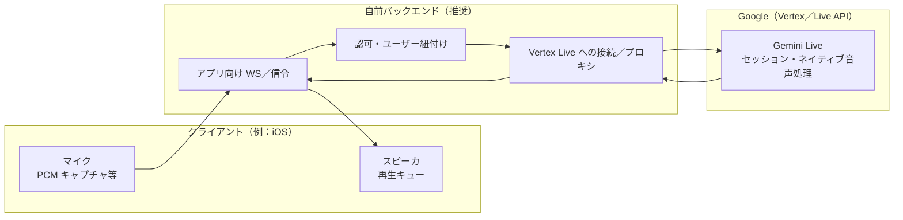

# 将来-リアルタイム音声（C）

[← README に戻る](../../README.md)

**ステータス**

- [音声入力フェーズ](../アーキテクチャ/音声入力フェーズ.md) の **C** に相当する機能。**初期リリースのスコープ外**（[初版スコープ](初版スコープ.md)）。実装フェーズになるまで設計詳細・モデル・単価は変わり得る。

**読み合わせ**

- 今フェーズで実装する **A（テキスト）／B（ターン制音声）** との対比：[音声入力フェーズ](../アーキテクチャ/音声入力フェーズ.md)。
- LLM の一般方針：[LLM-API方針](../アーキテクチャ/LLM-API方針.md)。インフラの大枠：[インフラ-Supabase](../アーキテクチャ/インフラ-Supabase.md)。

---

## 1. B と何が違うか（体験とパイプライン）

| | **B（ターン制音声）** | **C（リアルタイム音声）** |
|---|----------------------|---------------------------|
| 単位 | ユーザーが「一区切り」確定 → そのぶんだけ認識・応答 | **連続ストリーム**に近い入出力。**割り込み（バージイン）** が前提になりやすい |
| ASR と LLM と TTS | 多くは **順序駆動**（ASR → テキスト LLM → TTS／表示） | **ネイティブ音声**モデルでは **音声を直接モデルへ入れ、音声（＋場合によりテキスト）をストリーム返す**構成が中心になりうる |
| 接続 | 短命 HTTP／短い処理が並ぶ | **セッション型の双方向ストリーム**（例：**WebSocket**）が長く開く |

---

## 2. 仕組みのレイヤ（概略）

代表的な構成は **[Google Gemini Live API](https://cloud.google.com/vertex-ai/generative-ai/docs/live-api)**（**Vertex AI** 上／一部は **Gemini Developer API** 側の同等機能）による **Stateful WebSocket セッション**である。ブラウザ・アプリ直下に API キーを置けない運用では、**クライアント → 自前バックエンド → Google** が一般的（[事例説明も公式ブログで言及](https://cloud.google.com/blog/topics/developers-practitioners/how-to-use-gemini-live-api-native-audio-in-vertex-ai)）。

**役割の整理**

1. **クライアント**  
   - 音声を **規定フォーマット**（例：16-bit PCM、サンプルレートはドキュメントで指定されている帯があります）で **小刻みに送信**。  
   - 返ってきた **音声ストリーム**を低遅延で再生。**バージイン**時には再生中止と「発話開始／終了」相当のイベントを送り分けるなど、状態機械が必要。

2. **バックエンド**  
   - **認証トークンの発行**（ユーザーごと／セッションごと）、**接続 の上限・レート制御**、**不正利用対策**。  
   - （実装により）Live との **WebSocket を中継**または **サーバ側のみが Live に接続**し、アプリとは別プロトコルでやりとりする構成もありうる。

3. **Gemini Live（モデル側）**  
   - **双方向セッション**内で音声（と必要ならテキスト・画像等）を処理し、**低遅延の応答**を返す。  
   - **音声活動検知（VAD）**や **自動割り込み**、設定によっては **常時ヒアリング系（Proactive 等）**の挙動を持つモデルがある（機能はモデル／プレビュー状況に依存。公式の Live API／モデル一覧を参照）。

---

## 3. モデル側で「できていること」のイメージ

厳密な内部アーキテクチャは非公開だが、プロダクト上は次のような能力を **1 つのセッション型 API** に束ねていると理解すると実装論点が拾いやすい。

- **音声入力を直接扱う**（テキスト化を別サービスで挟まない構成も選べる）  
- **音声で応答する**（同時に **テキストトランスクリプト**を取る構成も選択肢になっていることがある）  
- **マルチリンガル**：仕様・モデルにより **多言語の切り替え**や **音声の言語コード**などの設定がドキュメント化されている  
- **セッションの継続・再開**：長い会話の **延長・再開** に関する API 機能の説明がある（利用する SDK／経路により差異あり）

モデル ID・利用可能機能は時期で変わるため、[Live API の概要](https://cloud.google.com/vertex-ai/generative-ai/docs/live-api)および **該当モデルのリファレンス**を正とする。

---

## 4. どこに料金がかかるか（Google 側）

料金単位・数値は **公開料金ページの最新版**に従う。ここでは **「何が課金のレバーになりうるか」** を固定する。

**参照（例）**

- [Vertex AI（Generative AI）料金](https://cloud.google.com/vertex-ai/generative-ai/pricing) の **Gemini Live API** に該当する行  
- [Gemini API（Developer）の料金](https://ai.google.dev/gemini-api/docs/pricing) は別経路になる場合があるので、**経路（Vertex と AI Studio をどちらで課金するか）を揃えて読む**

### 4.1 モデル使用量（メイン）

Live／ネイティブ音声では、概ね次のような **粒度** が料金に現れることが多い（名称は表記揺れあり）。

| 区分 | 内容の例 |
|------|-----------|
| **入力テキストトークン** | セッションのシステム指示・ツール結果・送信テキストなど |
| **入力音声トークン** | ユーザーが送った音声の時間長に応じて換算。**「秒あたり何トークン」**といった換算がドキュメントに書かれることがある |
| **出力テキストトークン** | （設定により）モデル側のテキスト |
| **出力音声トークン** | AI 側の音声発話ぶん。**応答が長いほど**増える |

**注意（セッション課金の罠になりやすい点）**

- 公式資料には、Live API で **セッションのコンテキストウィンドウ**に応じて、**過去ターン側のトークンもターンごとに再度課金に関与しうる**旨の説明がある（細則は当該ドキュメントの脚注を読むこと）。長い音声会話では **単純な「テキストチャットの累積」より単価感が頭に出やすい**。

### 4.2 オプション・モードによる追加・変動

- **音声の文字起こし**を明示的に有効にする構成では、生成された **テキストトークンが出力側のテキスト料金に乗る**、といった説明がある。  
- **Proactive／常時リスニング寄りのモード**：**聞いているだけの時間も入力側にカウントされうる**、という種類の注釈がある（設定で回避・調整できる範囲はドキュメントと実験が必要）。

### 4.3 キャパシティ（大量利用時）

- **Provisioned Throughput** など、**レイテンシや同時セッション**を優先するときに、**使用量ではなくキャパ購入型**になる選択肢がある（導入フェーズでのみ論点）。

---

## 5. Google 以外にかかりうるコスト（プラスアルファ）

| 区分 | メモ |
|------|------|
| **プロキシ用バックエンド** | Compute（常時またはスケールアウト）、**アイドル〜長時間でも接続を維持**するサービス選定で費用感が変わる |
| **ネットワーク** | **音声バイナリの出入り**が続くので **Egress** が増えやすい。リージョン配置と CDN の要否も検討対象 |
| **監視・ログ** | メタデータのみに抑えられる設計でも、音声以外の処理ログは積み上がる |
| **Supabase／DB** | 会話ログをテキスト化して保存するなら、[インフラ-Supabase](../アーキテクチャ/インフラ-Supabase.md) に近い増分。**音声ファイルを永続保管**する運用なら Storage・Egress が追加 |
| **パートナー製品（任意）** | WebRTC で簡略化する場合、[Daily／LiveKit／Twilio などとの連携](https://cloud.google.com/blog/topics/developers-practitioners/how-to-use-gemini-live-api-native-audio-in-vertex-ai) がドキュメント上言及されている。ベンダ請求が重なる |

---

## 6. B との比較だけ一言（料金）

- **B が端末 ASR／端末 TTS** であれば、「往復ぶん」の **テキスト LLM トークン**がボトルネックになりやすい一方、  
- **C** はその上に **音声入出力トークン**と **長いセッションのコンテキスト**が乗り、**ユーザーあたり会話時間・同時接続**に対して総額が伸びやすい、という設計上の見立てになる。

詳細シミュレーションは、**実際に選ぶ Live モデルの料金表**と **コンテキスト注釈**を前提に、分単位／セッション単位で試算することが安全である。

---

## 7. 関連ドキュメント

- [音声入力フェーズ](../アーキテクチャ/音声入力フェーズ.md) … A／B／C の定義とスコープ
- [LLM-API方針](../アーキテクチャ/LLM-API方針.md) … テキスト経路の推論／キー管理の前提
- [会話-ペルソナとTTS](../機能/会話-ペルソナとTTS.md) … Persona・端末 TTS と今フェーズの関係
- [将来-キャラ音声](将来-キャラ音声.md) … C とは別線の声質・権利メモ
