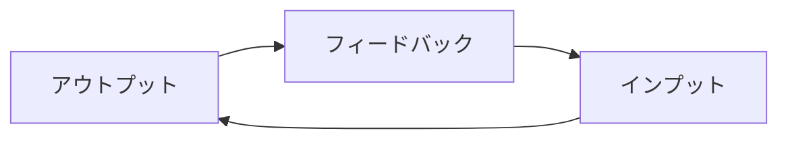

# 学習サイクル

[← README に戻る](../../README.md)

---

## 抽象モデル

- **アウトプット**（話す・書く・使う）。
- **フィードバック**（誤り・「こうした方がよい」）。
- **インプット**（学び直し・吸収・次のアウトプットに向けた準備など）。

## プロダクトとの対応

会話機能（Self／AI）を通じて上記サイクルを回す前提。**初版では学習・会話の主言語を英語に固定**し、多言語対応で増えるプロンプト・評価・UI の負荷を避ける。**将来**、他言語を学習言語として選べるように拡張する場合は、同じサイクルのまま言語パラメータを増やす想定。詳細は [会話](../機能/会話.md) を参照。
