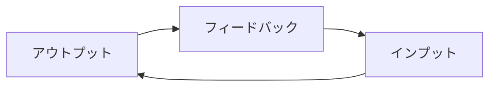

# 学習サイクル

[← README に戻る](../../README.md)

---

## 抽象モデル

- **アウトプット**（話す・書く・使う）。
- **フィードバック**（誤り・「こうした方がよい」）。
- **インプット**（学び直し・吸収・次のアウトプットに向けた準備など）。

## プロダクトとの対応

会話機能（Self／AI）を通じて上記サイクルを回す前提。特に**アウトプットを主役**にし、ユーザーには会話の中で**どんどん英語を産み出す**体験をしてもらう設計に寄せる。

**想定ユーザー**は [ビジョンと目的](ビジョンと目的.md) のとおり**英語の中上級者**が中心である。会話にすぐ参加できる読み・語彙の下地を据えたうえで、表現の幅と文としての運用力を伸ばすことにリソースを寄せる。

**初版では学習・会話の主言語を英語に固定**し、多言語対応で増えるプロンプト・評価・UI の負荷を避ける。**将来**、他言語を学習言語として選べるように拡張する場合は、同じサイクルのまま言語パラメータを増やす想定。詳細は [会話](../機能/会話.md) を参照。

---

## 理論的な裏付け（要約）

中上級で起きやすい**能動語彙の固定化（プラトー）**に対し、**記録→想起（見返し）→会話で再使用**のループは **retrieval（想起練習）** の原則に沿う。音読のように**発話・記述を通じた反復**とも積み重ねやすい。プロダクト上の位置づけと「刺さる」理由の文章は [ビジョンと目的](ビジョンと目的.md) の「中上級者の課題と、本アプリが『刺さる』理由」を正とする。
