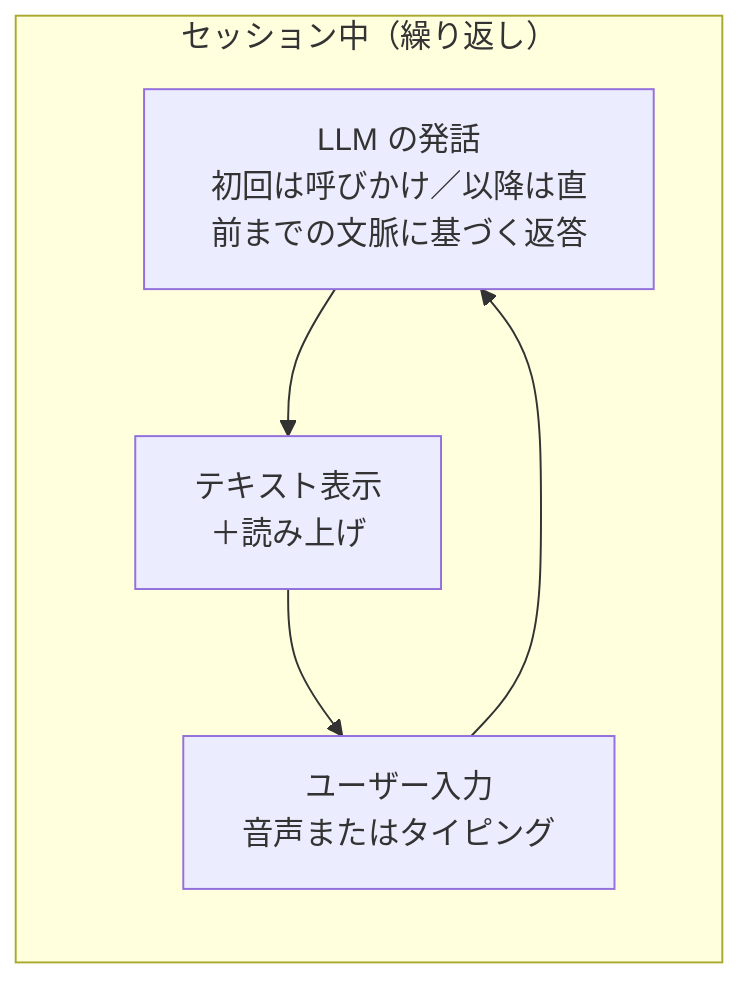
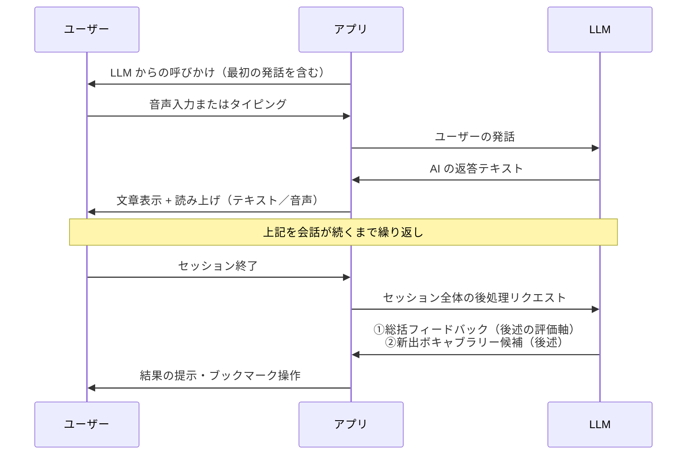
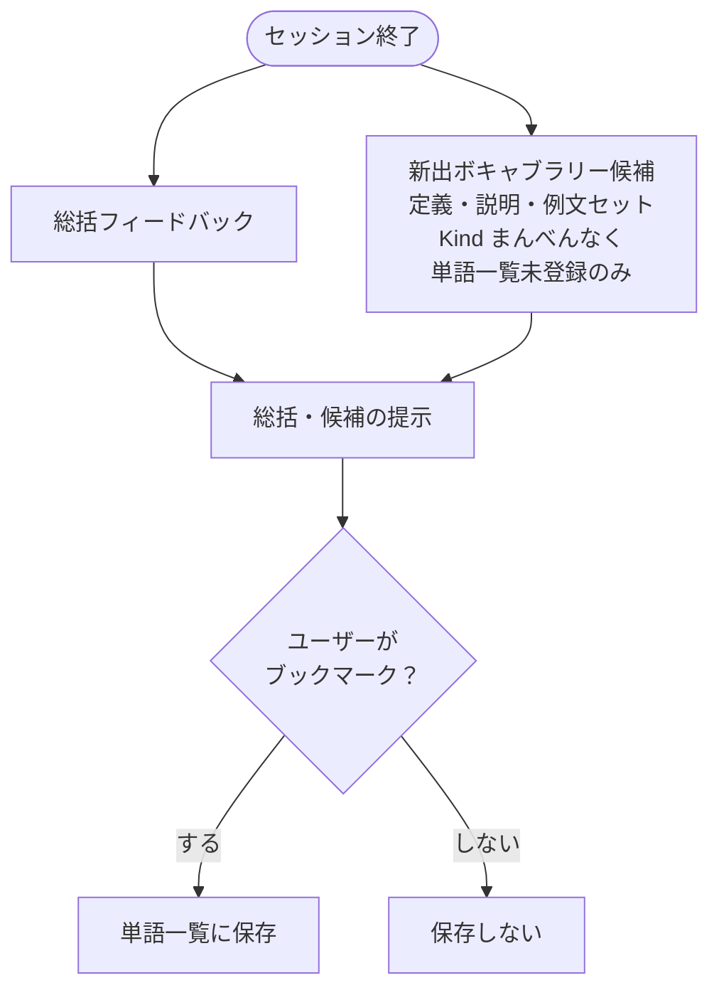
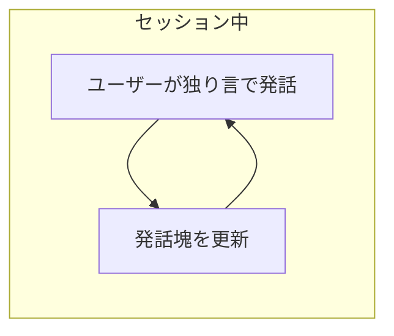
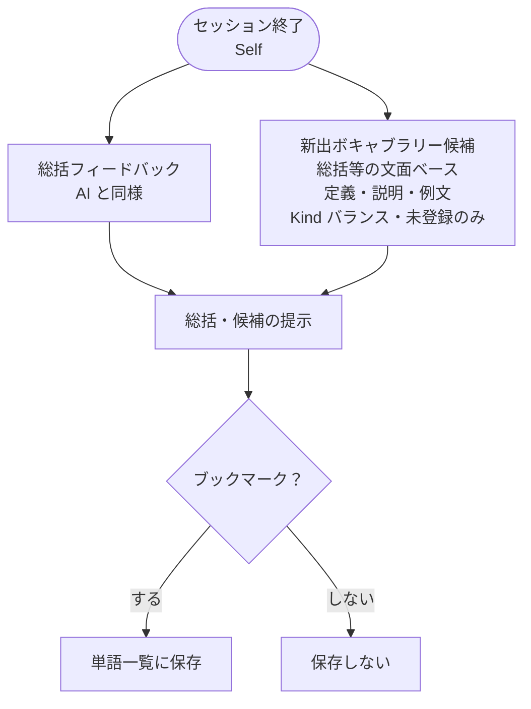
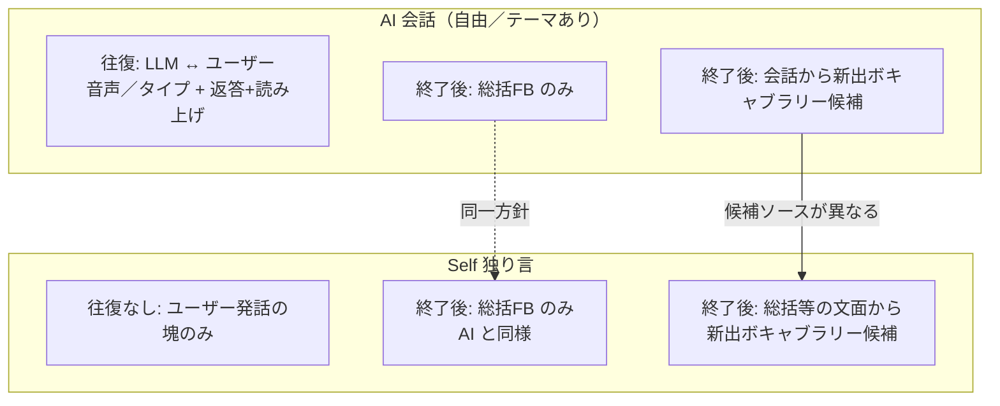

# 会話（Conversation）

[← 機能一覧に戻る](機能一覧.md) ／ [← README に戻る](../../README.md)

会話機能（**Self／AI**）の仕様と振る舞いを定める。**画面遷移・画面構成**は [画面一覧](画面一覧.md) を、**ペルソナ・読み上げ**は [会話-ペルソナとTTS](会話-ペルソナとTTS.md) を参照。

---

## 目的・ユーザー価値

- [学習サイクル](../概要/学習サイクル.md)（アウトプット → フィードバック → インプット）を、**会話の形**で回す。
- ユーザーの**自分の語彙を文として使える力**と、**場面に応じた表現の引き出し**を伸ばす。

## スコープ

| 含む | 含まない |
|------|---------|
| Self（独り言）／AI 自由テーマ／AI テーマあり／PDF 出力／セッション終了後の総括＋ボキャブラリ候補 | クイズ（後フェーズ。[初版スコープ](../ロードマップ/初版スコープ.md) 参照） |
| 入力は **A（テキスト）** および **B（ターン制音声）**（[音声入力フェーズ](../アーキテクチャ/音声入力フェーズ.md)） | **C（リアルタイム音声）**（[将来-リアルタイム音声](../ロードマップ/将来-リアルタイム音声.md)） |

---

## 1. 仕様（モード一覧）

| 中分類 | 小分類 | 内容 |
|--------|--------|------|
| **Self** | — | **英語**を**一人で話す**モード（**ペラペラ**・相手のターンなし。初版スコープ）。 |
| **AI** | 自由テーマ | **AI** と**往復**して会話。身につけた**単語・表現**で文を組み立てる。場面を**特に絞らない**。 |
| **AI** | テーマあり | 同上の会話形式で**テーマを指定**。例：旅行・ビジネス・スポーツなどの**プリセット**＋**カスタムテーマ**（自分で定義）。 |
| **Self／AI 共通** | セッション終了後のボキャブラリ候補 | **1セッション＝スレッド**単位で、会話・LLM 出力から**新出の語・おすすめ表現**を抽出し、**単語一覧に載せられるドラフト候補**まで自動生成する。**直登録しない**：候補は一度提示し、ユーザーが**必要なものだけを選んで**追加する**ワンクッション**を挟む。**AI 会話**では往復テキスト（ユーザ発話＋AI）を主なソースとする。**Self** では独白だけから無理に新出認定せず、**総括フィードバック**などセッション終了後に生成された LLM 文面に現れた語・表現を主ソースとする。 |
| **PDF 出力** | — | その日の**会話スクリプト**と、**総括フィードバックなど**を **PDF** で書き出す。 |
| **クイズ** | — | **後フェーズで追加予定**。仕様・UI は未定。 |

### 1.1 会話テーマの役割（AI・テーマあり）

- **目的**：ユーザーと AI の**会話の軸・舞台設定を決めやすくする**ものである（上表の「場面を絞る」と同じ意図）。
- **期待値**：テーマは**話題を機械的にロックする機能ではない**。テーマ名・説明をプロンプト（システム／開発者指示など）に載せることで、モデルの応答はその軸に**寄せやすくなる**が、ユーザーが別の話題へ振る場合など**軸から外れた会話もありうる**。LLM の性質上、**逸脱をゼロにすることは技術的に保証しない**。強く軸に張り付かせたい場合は、プロンプト文面や運用で調整する。

**前提・共通ルール**

- **初版**：会話の**主言語は英語**。
- **フィードバック**：文の**正しい／正しくない**／**雰囲気・文脈に合わない言い回し**への**替え**／**単語の提案**。
- **インプット**：**スレッド**で蓄積／**フィードバック**も同じスレッドに残す／**発言とフィードバック**を見返す／**同じスレッド**または**新規スレッド**で続行（**両モード共通**）。

---

## 2. AI 会話のフロー（自由テーマ／テーマあり共通）

往復中は **相手役の発話（LLM）** があり、セッション終了後に **フィードバック系**がまとめて処理される。

### セッション終了後の出力（AI モード）

コスト抑制のため、**発話ごとのフィードバックは出さない**（往復中の LLM 返答と、終了後の **総括のみ**でフィードバックを完結させる）。

| 種類 | 内容 |
|------|------|
| **総括フィードバック** | セッション全体の講評。評価軸は初版として次を含める（LLM 出力で明示的に区切れる形を想定）。**文法の正しさ**、**ボキャブラリー・表現力**。加えて**このセッションでユーザーが特に苦手だった部分**を、**文法**と**ボキャブラリー（表現）**の両面で述べ、それぞれについて **ポジティブな面**と **ネガティブな面** の両方を書く。 |
| **新出ボキャブラリー候補** | ユーザーの**単語一覧に未登録**の語・表現を候補化。各候補は **定義 + 説明 + 例文** をセットで返す。**件数は可能な限り多く**。**Kind**（Verb / Adjective / Adverb / Noun / Phrasing / Interjection）が**偏りなく**出るようにする。 |

### 永続化のルール（候補 → 単語帳）

- ユーザーが **ブックマーク（単語帳への追加）** した候補のみ、単語一覧に保存する（[インフラ-Supabase](../アーキテクチャ/インフラ-Supabase.md) でサーバー同期・端末キャッシュ）。
- **ブックマークしない候補**は保存しない（揮発でよい）。

---

## 3. Self（独り言）モードのフロー

セッション中は **LLM からの会話レスポンスはない**。ユーザーが途切れるまで **発話の塊**を更新し続ける。

### セッション終了後（Self モード）

- **総括フィードバック** … **AI モードと同じ評価軸**（文法・ボキャブラリー／表現力・苦手領域の文法／語彙それぞれの良い面と改善面）。**発話ごとのフィードバックは出さない**。
- **新出ボキャブラリー候補** … **総括フィードバックなど、セッション終了後に生成された LLM 文面**の中で扱った新語・新表現をピックアップして候補化する（独白本文からの直接抽出は主としない。必要なら実装で独白との照合を補助）。  
  候補の **定義・説明・例文セット**、**件数は可能な限り多く**、**Kind のまんべんなさ**、**ブックマークしたものだけ永続化**は **AI モードと同じルール**。

---

## 4. AI と Self の対応関係（要約）

---

## 5. データの保持・削除・長期記憶（RAG）

### 記憶の期待値

- ユーザーに約束するのは **話題の大枠がペルソナ側で繋がって見える**ことまでとする。**発話の一言一句の再現は求めない**（[コンセプト-人間らしい記憶](../概要/コンセプト-人間らしい記憶.md) と整合）。

### クラウド（サーバー）と端末の境界（製品の正）

**機種変更後にユーザーが学習を継続できる**ことを前提に、**「保護しつつサーバーで保管する」**方針を取る。**Phase 1（初版）と Phase 2 で同期範囲が変わる**点に注意。

| データ | 端末ローカル | Supabase（Phase 1） | Supabase（Phase 2） |
|--------|----------------|----------------------|----------------------|
| **セッション単位のメタ**（開始日時・終了日時・モード・ペルソナ ID 等） | キャッシュ可 | **保存する**（`sessions`） | 同左 |
| **総括フィードバック** | キャッシュ可 | **保存する**（`session_feedbacks`） | 同左 |
| **発話本文**（ユーザーまたは AI の 1 件ずつの発言の時系列・テーブル `session_utterances`） | **保持する**（既定） | **保存しない**（端末のみ） | **保存する** |
| **新出ボキャブラリー候補**（提示時のスナップショット） | **永続化しない**（メモリのみ。ブックマーク確定分は単語帳へ） | **保存しない** | **保存しない**（再表示要望時は AI 再生成で対応） |
| **記憶用セッション要約**（サニタイズ後・下記パイプライン） | キャッシュしてよい | **保存する**（RAG retrieve 用） | 同左 |
| **単語帳エントリ**（ブックマーク確定分） | キャッシュ | **保存する**（[インフラ-Supabase](../アーキテクチャ/インフラ-Supabase.md)） | 同左 |

**複数端末／機種変更**：

- **Phase 1 から**、**カレンダーで学習日が見える／総括フィードバックが新端末でも閲覧できる**状態は復元される（メタ・総括をサーバーで保管）。
- **Phase 2 で**、**会話本文も新端末で閲覧できる**ようになる。これにより「過去の自分の英語表現を読み返す」「AI が長期スパンの蓄積から英語力を判定する」などのユースケースが解放される。
- 詳細なテーブル設計は [データベース設計-サーバー §1.1](../アーキテクチャ/データベース設計-サーバー.md#11-クライアントサーバー境界再掲)・[データベース設計-クライアント §1.1](../アーキテクチャ/データベース設計-クライアント.md#11-サーバークライアント境界再掲) を参照。

**Phase 1 期間中の機種変更ギャップ（構造的制約）**：

- Phase 1 では発話本文がサーバーに同期しないため、**Phase 2 リリース前に旧端末を紛失・破損・売却・データ消去すると、その期間中の発話本文は永久に失われる**（カレンダー・総括・単語帳はサーバーから復元される）。
- Phase 2 リリース後は、**旧端末を一度起動するだけでバックフィルバッチが走り**、過去 Phase 1 セッションの発話本文も新端末で閲覧できるようになる（[データベース設計-クライアント §3.2](../アーキテクチャ/データベース設計-クライアント.md#32-cachedutterance--セッション内の発話-1-件phase-1-は端末のみphase-2-で双方向同期)）。
- ユーザーへの告知は **[設定とアカウント](設定とアカウント.md) のサインアウト／アプリ内データを消去の確認ダイアログ**で行う。Phase 2 リリース時に該当警告は撤去し、リリース告知で復元経路を案内する運用とする。

**新出ボキャブラリー候補の扱い**：候補スナップショットは **DB に永続化しない**方針。セッション終了直後の提示用にメモリのみで扱い、ユーザーがブックマーク確定したものだけが単語帳に残る。学習ログのセッション詳細で **後から候補一覧を再表示したい要望が出た場合は、その時点で AI に再生成させる**（コスト・複雑さに対して機能価値が低いと判断）。

**プライバシー方針**：

- **「サーバーに何も載せない」ではなく「保護しつつ保管する」**を採る。**RLS（[データベース設計-サーバー §1.2](../アーキテクチャ/データベース設計-サーバー.md#12-横断ルール)）** によるユーザー単位のデータ境界、**サーバー側 at-rest 暗号化**、**長期非ログイン時の自動削除**（[データベース設計-サーバー §1.4](../アーキテクチャ/データベース設計-サーバー.md#14-データ寿命ポリシー長期非ログイン時の自動削除)・実装は Phase 2 以降）で個人情報保護法・GDPR の「目的達成後は遅滞なく削除」原則と整合させる。
- **記憶用セッション要約の生成パイプライン**（下記）は **「RAG ベクトル化前のサニタイズ」**として引き続き運用する。RAG に載せる埋め込みは要約のみで、**発話原文をそのままベクトル化しない**方針は変えない。
- **注意**：往復中・終了後処理では **クラウド LLM** がテキストを処理する（[LLM-API方針](../アーキテクチャ/LLM-API方針.md)）。**単語帳の AI 一括ドラフト**（単語追加・編集）は **Apple Intelligence のオンデバイスモデル**が既定（同書の役割分担）。**サーバー DB の取り扱い**と **プロバイダ側の取り扱い**は別軸でプライバシーポリシーに書き分ける。

### 記憶用セッション要約の生成パイプライン（サーバー保存前）

サーバーに載せる要約は、次の順で **個人情報を極力落とす**。

1. **ルールベースのサニタイズ**（クライアントまたは BFF）：メールアドレス様式・電話・クレジットカード・住所らしいパターン等をマスクまたは削除。
2. **LLM による要約**：入力は 1 のあとのテキストに限定し、システム指示で **固有名詞・連絡先・特定可能な組織情報を書かない**こと等を明示する（総括用と記憶用は **別出力でもよい**）。
3. （任意）**保存直前の再スキャン**：正規表現等で要約文を再度チェックする。
4. **プロバイダのログ・データ保持**は Gemini／Vertex の設定・契約に従い、[LLM-API方針](../アーキテクチャ/LLM-API方針.md) とプライバシーポリシーでユーザーに示す。

**RAG に載せる埋め込み**は **この要約（およびチャンク分割時は各チャンク）のみ**を入力とする。**発話原文をそのままベクトル化しない**。

### セッション終了後に永続化する主なデータ（概略）

| 種類 | 役割 |
|------|------|
| **総括フィードバック** | 学習向け講評（既存の評価軸）。**端末で生成し、Phase 1 からサーバーに同期**（上表）。 |
| **記憶用セッション要約** | 当セッションで**何を話したかを 1 本に濃縮**。RAG retrieve 用。**サニタイズパイプライン経由でサーバー保存**。**ラリーごとの要約を個別にベクトル化する**方針は当面取らない（[コンセプト-人間らしい記憶](../概要/コンセプト-人間らしい記憶.md)）。総括と同一 LLM 呼び出しで兼用するか、別呼び出しにするかは実装で確定。 |
| **新出ボキャブラリー候補** | ユーザーがブックマークしたもののみ単語帳へ（既存ルール）。**スナップショット自体は永続化しない**（メモリのみで提示。再表示要望時は AI 再生成）。 |

### 発話（やりとり）本文の保持

- **Phase 1**：**各発話の本文は端末ローカルに保持する**。サーバーには同期しない（クライアントは `CachedUtterance`。サーバー側 `session_utterances` は Phase 2 で追加）。
- **Phase 2**：**端末ローカルの保持に加え、サーバーへ双方向同期**する（`session_utterances`）。**機種変更後の新端末でも会話本文を閲覧できる**ようになる。書き込みは **セッション終了時にバルク push**、読み込みは **セッション詳細を開いたタイミングで遅延 pull** が想定（[データベース設計-クライアント §1.3](../アーキテクチャ/データベース設計-クライアント.md#13-同期戦略)）。
- **暦月での自動削除ポリシーは採用しない**。**ストレージ上限・ユーザーによるセッション削除・アプリの「データを消去」**などは実装・設定で別途定義する。**長期非ログイン時のサーバー側自動削除**は別建てで [データベース設計-サーバー §1.4](../アーキテクチャ/データベース設計-サーバー.md#14-データ寿命ポリシー長期非ログイン時の自動削除) を参照（実装は Phase 2 以降）。
- **暦とタイムゾーン**（セッションがどの日に属するか）は [学習ログ](学習ログ.md) の「その日」の考え方に揃える。

### ベクトル化（長期記憶）

- **サーバー上に保存した記憶用セッション要約**（サニタイズ済み）を埋め込み、**ユーザー × ペルソナ**単位で論理分離したベクトルストアに保存する（[コンセプト-人間らしい記憶](../概要/コンセプト-人間らしい記憶.md)）。実装は **Supabase pgvector**／外部ベクトル DB 等は別途決定。
- 原則 **セッションあたり 1 ベクトル**。要約が長く単一埋め込みに不向きなときのみ、**意味のまとまりで 2〜3 チャンク**に分割してよい。
- **Phase 2 で発話本文がサーバーに載るが、ベクトル化対象は引き続き要約のみ**（発話原文をそのまま埋め込まない）。RAG のノイズを下げる目的（[コンセプト-人間らしい記憶](../概要/コンセプト-人間らしい記憶.md)）。
- **アカウント削除**時は、サーバー側の **メタ・総括・要約・ベクトル・単語帳**を CASCADE でまとめて消す（[データベース設計-サーバー §1.3](../アーキテクチャ/データベース設計-サーバー.md#13-アカウント削除フロー)）。端末上の **キャッシュ**は、アプリ削除またはアプリ内削除フローで扱う（[設定とアカウント](設定とアカウント.md) と整合）。

### 要約行とベクトルチャンクの分担（閲覧／RAG）

実装上は [データベース設計-サーバー](../アーキテクチャ/データベース設計-サーバー.md) の `session_memory_summaries` と `session_memory_chunks` に対応する。

- **要約行（Summaries）**：サニタイズ済みの記憶本文の **正**。**ユーザーがセッション履歴から要約を読む** UI を後から載せる想定では、**こちらを表示の源泉**とする。
- **ベクトルチャンク（Chunks）**：要約から作った **埋め込み用テキストとベクトル**。**現在の会話と意味が近い過去の記憶を引くための類似検索**に使う。**エンドユーザーにチャンク行そのものを見せる想定はしない**。
- **RAG の典型的な流れ**：チャンクで類似検索 → 得られたセッションに紐づく **要約（またはそこから組んだテキスト）** を LLM のコンテキストに載せる。

### RAG を省略するかどうかの判定とフォールバック（オンデバイス）

- **意図**（実装オプション）：往復ごとの負荷を抑えるため、端末の **Apple Intelligence（オンデバイスモデル）** で「**この発話のやりとりでは長期記憶（RAG）を引く必要があるか**」を先に判定し、不要と分かったときだけ **埋め込み・ベクトル検索をスキップ**する、という流れを載せることがある。
- **フォールバック（現方針）**：上記のオンデバイス判定が **使えない**場合（非対応端末・Apple Intelligence オフ・API 失敗など）は、**一旦 RAG の検索（類似チャンク retrieve）を実行する**。判定不能時に検索まで省略すると記憶参照を落としやすいため、**スキップより検索を優先**する。

### Self モード

- **サーバーに記憶用要約を載せない**ため、上記の **要約行／チャンクは対象外**。**ただしセッションメタ（`sessions`）と総括フィードバック（`session_feedbacks`）は AI モード同様に Phase 1 からサーバー保存**するため、**Self モードのセッションも機種変更後にカレンダーで日付ハイライトされ、総括も新端末で閲覧できる**。Self モードと AI モードで差が出るのは「記憶用要約の有無」だけ。
- **ペルソナが無い**ため、記憶ストアのキー（ユーザー単位のみ／Self 用ダミーなど）は実装で確定する。

---

## 6. 補足（実装・設計メモ）

- **学習言語と説明言語**：LLM への指示では、**初版は会話の主言語を英語に固定**し、**フィードバックや定義の説明に使う言語**（例：日本語など補助言語）を明示する想定。**ユーザーが対話中に日本語を挟む場合**は、[音声入力フェーズ](../アーキテクチャ/音声入力フェーズ.md) の **B（ターン制の音声）** と同様、**ユーザー発話の言語に合わせて応答言語も切り替える**などの運用も指示でカバーする（必要なら言語検出を併用）。将来、学習言語を選べるようになったときも同じ指示枠に載せ、エントリの定義 2 本（[単語帳](単語帳.md)）と揃える。
- **読み上げ**：LLM 返答に対し、テキストに加え **読み上げ用の出力**（または端末 TTS への入力テキスト）を想定。詳細は [会話-ペルソナとTTS](会話-ペルソナとTTS.md)。
- **Kind（enum）** の綴りは実装で確定（[単語帳](単語帳.md) と同じ前提）。
- **将来検討**：会話本文・セッション終了時の総括・学習ログなど、**フィードバックの材料になる情報**は利用に伴い蓄積されていく。初版は「終了直後の総括＋候補」に限定するが、**蓄積データを材料に、ユーザーが任意のタイミングで追加のフィードバックを求める**機能を後から足す余地がある（対象期間・スコープ、回数・課金、UI／LLM 呼び出し設計は未確定）。

---

## 7. 関連ドキュメント

- [画面一覧](画面一覧.md) … セッション画面・結果画面の遷移
- [会話-ペルソナとTTS](会話-ペルソナとTTS.md) … 相手役（6 ペルソナ）と読み上げ
- [音声入力フェーズ](../アーキテクチャ/音声入力フェーズ.md) … A／B／C の定義と今フェーズのスコープ
- [LLM-API方針](../アーキテクチャ/LLM-API方針.md) … 推論 API・モデルの選定方針
- [学習サイクル](../概要/学習サイクル.md) … アウトプット → フィードバック → インプット
- [単語帳](単語帳.md) … 候補の保存先と Kind 仕様
- [コンセプト-人間らしい記憶](../概要/コンセプト-人間らしい記憶.md) … 記憶の期待値・ペルソナ単位の RAG
