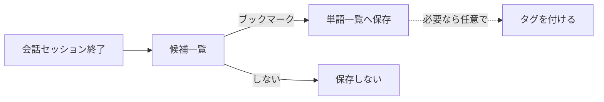

# 単語帳

[← 機能一覧に戻る](機能一覧.md) ／ [← README に戻る](../../README.md)

ボキャブラリーブック。**インプット**の中心となる、語・表現の蓄積と振り返り機能。

---

## 目的・ユーザー価値

- ユーザーが**身につけたい語・表現**を 1 か所に集める。
- [会話](会話.md) のセッション終了後に出てくる**ボキャブラリー候補**の**保存先**となる。
- 読み上げ機能で**インプット**にも使える（耳から入れる）。

## スコープ

| 含む | 含まない |
|------|---------|
| 単語一覧（リスト・詳細）／ブックマーク（候補→単語帳保存）／タグで整理／読み上げ | クイズ形式での出題（後フェーズ。[初版スコープ](../ロードマップ/初版スコープ.md) 参照） |

---

## 1. 仕様（中分類）

| 中分類 | 内容 | 備考 |
|--------|------|------|
| **一覧機能** | エントリを**リスト表示**し、詳細へ辿れる。 ・**見出し語**：**初版は英語**（英単語・フレーズ等）。将来の他言語は拡張で対応。 ・**定義（2 本）**：**英語版**と**説明・補助用の言語版**（例：日本語）、**表示切替**で補助。**ただし** `CachedVocabulary` が**プリセット辞典のレマ（`CachedLemma`）に結線されている**場合は、**定義 2 本は辞典側を正とし、ユーザーによる編集および AI による上書きを行わない**（アプリ上は**読み取り専用**）。レマに無い語の手入力登録（結線なし）では、従来どおりユーザーが定義を入力する。 ・**発音**：英語は **IPA** を**一覧・詳細で表示**。**ユーザーによる入力欄は設けない**。値は **Apple Intelligence のオンデバイスモデル**で見出し語等から生成し、クライアントは保存・表示する（詳細は §3）。**サーバー側での生成・キャッシュは行わない**。 ・**例文**：**用法（品詞タブ）ごと**に**複数**登録可。**1 用法あたり目安最大 5 つ**（英文＋和訳のペアを 1 件と数える）。追加・削除は編集 UI で行う（詳細は §4）。 | **エントリの持ち方**：単一テーブル（**分割なし**）。 **Kind（品詞）**：§1.1 を参照（`VocabularyKind` と一致）。 |
| **ブックマーク** | [会話](会話.md) 終了画面の**新出ボキャブラリ候補**から**単語帳に保存**するアクション。整理は**タグ**側で行う（フォルダは持たない）。 | 詳細は §2。 |
| **タグで整理** | 単語にタグを付けて整理する。**エントリ単位**で**複数タグ同時付与可**。**ユーザーが任意で命名**するのみ（**プリセットは持たない**）。**新規ユーザーの初期状態はタグ 0 件**で、必要になったときに本人が作る。**フォルダ機能は持たず、タグでフォルダ役を兼ねる**。 | `SCR-VOC-LIST` のフィルタ・並べ替え軸（タグ別／Kind 別／未タグ／見出し語検索／登録日順／アルファベット順）は [画面一覧](画面一覧.md) を参照。 |
| **リスニング（読み上げ）** | 読み上げでインプット。 ・**対象**：単語・意味・例文 ・**読む範囲**：単語のみ／単語と例文 など ・**スピード**可変 | 読み上げ技術の選定は [会話-ペルソナとTTS](会話-ペルソナとTTS.md) の TTS 節と共通。 |

### 1.1 Kind（品詞）一覧

ユーザー用法タブおよびオンデバイス AI の `kind`（`vocabulary_usages.kind` と一致）と、[辞典パック JSON](../アーキテクチャ/データベース設計-クライアント.md) の `pos` は、次の **`VocabularyKind.rawValue`** に揃える。

| 分類 | UI 表示 | `rawValue`（API／JSON） |
|------|---------|-------------------------|
| 名詞 n. | 名詞 | `noun` |
| 動詞 v. | 動詞 | `verb` |
| 形容詞 adj. | 形容詞 | `adjective` |
| 副詞 adv. | 副詞 | `adverb` |
| 前置詞 prep. | 前置詞 | `preposition` |
| 接続詞 conj. | 接続詞 | `conjunction` |
| 代名詞 pron. | 代名詞 | `pronoun` |
| 間投詞 int. / interj. | 間投詞 | `interjection` |
| 句動詞 phr. v. | 句動詞 | `phrasal_verb` |
| 熟語・慣用句 idm. / phr. | 熟語・慣用句 | `idiom` |

旧仕様の **`phrasing`** は廃止し、**句動詞は `phrasal_verb`、慣用句は `idiom`** に分ける。

### 1.2 単語の登録経路（辞典レマ結線あり／なし）

| 経路 | 説明 |
|------|------|
| **辞典から** | 見出し語でプリセット辞典を検索し、候補レマを選んでマイ単語帳に載せる。**定義はオーバーライド不可**（§1 一覧機能の表のとおり）。ユーザーが足せるのは主に**例文・タグ**など。発音は §3 に従い入力欄なし。 |
| **手入力（辞典に無い語）** | 辞典候補に無い場合のカスタム登録。**定義 2 本はユーザーが入力**。発音は §3 のとおり入力欄を置かず、生成・参照で補う。 |

#### 辞典パックの `usages[]` と各用法の `surfaces[].form_kind`（`LemmaSurfaceFormKind`）

- レマ（見出し）ごとに **`usages[]`** を持ち、マイ単語帳の **`CachedVocabulary` + `CachedVocabularyUsage`** と同様に **用法（品詞タブ）単位**で定義・IPA・表面形を載せる。同一レマ内の **`kind` は重複しない**（サーバー側の `vocabulary_usages` と同じ考え方）。
- **動詞／形容詞／名詞**：用法の `surfaces` に `verb_*` / `adj_*` / `noun_*`。
- **副詞**：比較変化がある場合は `adv_positive` / `adv_comparative` / `adv_superlative`（単形のみなら `lemma_base` でもよい）。
- **前置詞・接続詞・代名詞・間投詞・熟語**など代表形のみで足りる語：`lemma_base`（別綴りを載せる場合は `lemma_base` の行を複数でもよい）。句動詞は **`kind`: `phrasal_verb`** とし、`verb_*` を載せる。

##### 動詞＋分詞形容詞を同一見出しに載せる例（`allocate`）

- *allocated* の形容詞用法は **別 `stable_lemma_id` にせず**、見出し `allocate` の **`usages[]` に `verb` 用法と `adjective` 用法を並べる**。動詞用法には `verb_*` のみ、形容詞用法には `adj_*` と形容詞義の定義を載せる。
- **`CachedVocabulary` は `lemma` のみ**結線し、`adjunctLemma` は不要（他見出しで動詞義と名詞義など別レマが要る場合のみ従来どおり `adjunctLemma` を使う）。

#### 埋め込みスキャフォールドパック

- **`dictionary_scaffold_pack.json`**：`CachedLemma` 0 件時に同梱インポートする**単一の辞典データソース（SSOT）**。レマ本文・用法・活用・（任意で）IPA はここだけを増やす。各レマは `stable_lemma_id`, `lemma`, `language?`, **`usages[]`**。各用法は `kind`（`VocabularyKind.rawValue`）, `position`, 任意で `definition_target` / `definition_aux` / `ipa`, **`surfaces[]`**。レマ結線したマイ単語帳では、用法ごとに辞典側の定義を表示の正とする。
- **`dictionary_sample_pack.json`**：最小スキーマの**参照用テンプレ**（インポータの既定パスには使わない）。
- **学習見出し（`CachedVocabulary`）との結線**：インポート後に、`DictionaryScaffoldLemmaLinking.StableLemmaId` の UUID（JSON の `stable_lemma_id` と**同一**）で `CachedLemma` をフェッチして `lemma` をセットする。**同一見出しで別レマが要る場合のみ** `adjunctLemma` を使う。**シードとプレビューは Swift でレマ行を増やさず**、このパック＋フェッチのみで本番と同様の経路を踏む。

## 2. データの流れ（候補 → 永続化）

ユーザーが [会話](会話.md) のセッション終了後に提示される**新出ボキャブラリー候補**から**ブックマーク**したものだけが、ここに永続化される。**タグ付けは任意**で、ブックマーク時または後から単語詳細で行う（**フォルダは存在しない**）。

---

## 3. 発音（IPA）

- **役割**：補助表示。**入力 UX は置かず**、生成結果をフィールドとして同期する。
- **生成**：**Apple Intelligence のオンデバイス言語モデル**で生成する（[LLM-API方針](../アーキテクチャ/LLM-API方針.md) の役割分担）。**§5 の AI 一括ドラフト**と同じオンデバイス経路で見出し語（必要なら品詞・アクセント種別など）を渡し、**IPA 文字列（複数読みなら候補複数）**を返させる想定。**サーバー側での生成・キャッシュは行わず、横断キャッシュテーブルも持たない**。
- **保存**：用法単位（[データベース設計-サーバー §3.6](../アーキテクチャ/データベース設計-サーバー.md#36-vocabulary_usages--用法品詞タブ単位) の `vocabulary_usages.ipa`）にテキストで保持し、**端末で生成した結果をサーバーへ同期する**（自分の他端末でも同じ値が見える）。未取得時は空またはプレースホルダ表示し、**再生成**できるようにしてよい。
- **フォールバック**：**Phase 1 の最低 OS は iOS 26+** で揃える方針（[初版スコープ](../ロードマップ/初版スコープ.md)）のため、OS 起因の非対応はほぼ解消される。残るのは **A17 Pro／M1 未満のハードウェアで Apple Intelligence が動かない端末**のみで、その場合は **IPA を空のまま表示しない**運用を既定とする（クラウド LLM へ逃がさない）。詳細は [LLM-API方針](../アーキテクチャ/LLM-API方針.md) と整合。
- **一覧・追加・編集 UI**：IPA は**読み取り専用表示**のみとする。
- **読み上げ**：実際の音声は [会話-ペルソナとTTS](会話-ペルソナとTTS.md) の TTS に依存。IPA はあくまで画面上の参照。

---

## 4. 例文（複数登録）

- **単位**：**選択中の用法（品詞タブ）に属する例文**として保持する。タブを切り替えると、その用法に紐づく例文一覧だけが編集対象になる。
- **件数**：**1 用法あたり最大 5 件**（ペア数）を目安とする。実装で前後させる場合はここを更新する。
- **1 件の中身**：**英文**と**和訳**（補助語）をセットで 1 件とする。
- **UI**：**「例文を追加」**で入力ブロックを増やし、各ブロックに削除（またはスワイプ等）は実装で決める。これらは **保存まで DB に書かないローカル編集**のため、ボタンは **角丸四角かつ非ベタ塗り**（アウトライン等）。**保存**で初めて永続化する操作は **ベタ塗り**とする（詳細は [UI-ボタンとチップの区分](UI-ボタンとチップの区分.md) §A）。並び順は**登録順**または**並べ替え**を後フェーズで足してよい。
- **一覧・読み上げ**：一覧では必要なら件数や先頭例のみ省略表示し、詳細では全件。**読み上げ**は単語帳仕様の「読む範囲」に従い、例文が複数あるときは**順に／選択した範囲**など実装で決める。

---

## 5. AI 一括生成（単語追加・編集）

一覧からの**単語追加**および詳細から開く**編集**では、見出し語の入力欄**右側**に、やや小さめの **「AI生成」**ボタンを置く（ワイヤー上は `Button / AI generate draft`）。

- **辞典レマに結線している場合**（§1.2 の「辞典から」経由、または編集でレマ結線あり）：**全文をまとめて埋める「AI生成」は設けない**（定義への作用を禁止する）。必要なのは **例文のみを補う別操作**（例：用法ブロック内の「例文を AI 生成」）に限る。
- **手入力登録**または**レマ結線のない編集**：従来どおり、この節の **「AI生成」**で用法・定義・例文・タグ候補をまとめてドラフト反映してよい（§1 の定義編集ルールに従う）。

---

### 5.1 全文ドラフト（レマ結線なしのみ）

- **有効条件**：**見出し語に 1 文字以上入力されているときのみ**タップ可能（未入力時は無効表示）。
- **押下時の挙動**：その見出し語をキーに、**Apple Intelligence のオンデバイス言語モデル**（開発者向け API は実装時点の Apple 公式に従う）でドラフトを生成し、返却結果で画面上のドラフトを**まとめて埋める**。辞書 lookup やルールの前処理を載せるかは実装で選択してよいが、**クラウド LLM（Gemini API）への依存は原則置かない**（役割分担は [LLM-API方針](../アーキテクチャ/LLM-API方針.md)）。
  - **用法（品詞）**：該当する用法タブ／ブロックを必要なら複数追加し、それぞれに **Kind（品詞）** を設定する。
  - **意味**：各用法について **英語定義**および**補助語（例：日本語）側の説明**をセットする（既存の「定義 2 本」モデルに沿う）。
  - **例文**：用法ごとに**複数の例文ペア**（英文＋和訳）を生成して入力欄へ流し込む（§4 の上限・単位に従う）。
  - **IPA**：入力欄は置かず、オンデバイス生成結果に含めて読み取り専用フィールドへ反映するか、§3 の**サーバー／辞書経路**で別取得するかは実装で選択する（§3 のキャッシュ・API 設計と矛盾しないようにする）。
- **永続化**：このボタンは **編集中モデルのみ**更新する。**保存**するまで DB へは書き込まない。見た目・ルールは [UI-ボタンとチップの区分](UI-ボタンとチップの区分.md) の **角丸四角・非ベタ塗り（ローカル編集）**に合わせる。
- **端末・可用性**：**オープンモデルをアプリがダウンロードして載せる方式は取らず**、**Apple Intelligence が利用できる環境**でオンデバイス生成を行う。**Phase 1 の最低 OS は iOS 26+**（[初版スコープ](../ロードマップ/初版スコープ.md)）で揃えるため、OS 要件によるフォールバック分岐は基本的に発生しない。残るのは **A17 Pro／M1 未満のハードウェア**および**ユーザー設定で Apple Intelligence をオフにしているケース**のみで、その場合のフォールバック（**手入力のみ**を既定／**機能オフ**表示）は [LLM-API方針](../アーキテクチャ/LLM-API方針.md) に従い実装で確定する。英会話の従量課金とは別軸。

---

## 6. 補足

- 読み上げ（TTS）の技術選定（オンデバイス／クラウド）は [会話-ペルソナとTTS](会話-ペルソナとTTS.md) を参照。
- 多言語対応の将来拡張は [学習サイクル](../概要/学習サイクル.md) に方針を記載。

### 多端末で同じ単語を編集したときの挙動

複数端末から同じ単語帳を編集した場合、**同期は行（エントリ・用法・例文・タグ・タグリンクのそれぞれ 1 行）単位の Last-Write-Wins**で行う（[データベース設計-クライアント §1.3](../アーキテクチャ/データベース設計-クライアント.md#13-同期戦略)）。

- **多くのケースは衝突せず両立**する：
  - 端末 A で例文を 1 件追加、端末 B で別の例文を 1 件削除 → どちらも別行への操作なので**両方反映**される。
  - 端末 A で単語にタグを付け、端末 B で同じ単語に別のタグを付ける → タグリンクが別行のため**両方反映**される。
- **同じ 1 行を同時編集したときだけ末尾勝ち**：
  - 同じ例文の本文を端末 A・B で同時に書き換えた場合、**最後にサーバーへ届いた端末の内容が反映**される（もう片方の編集は失われる）。
  - 衝突は同一行を同時編集したケースに限られるため、通常の利用では起きにくい。

---

## 7. 関連ドキュメント

- [画面一覧](画面一覧.md) … 一覧・詳細・追加（`SCR-VOC-ADD`）の対応と遷移
- [UI-ボタンとチップの区分](UI-ボタンとチップの区分.md) … 形状・**ベタ塗り（DB 反映）／非ベタ塗り（編集中のみ）**・タグピルのルール
- [会話](会話.md) … 候補のソース
- [会話-ペルソナとTTS](会話-ペルソナとTTS.md) … 読み上げ技術の方針
