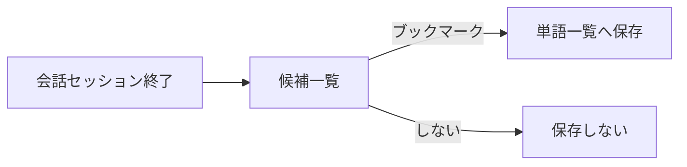

# 単語帳

[← 機能一覧に戻る](機能一覧.md) ／ [← README に戻る](../../README.md)

ボキャブラリーブック。**インプット**の中心となる、語・表現の蓄積と振り返り機能。

---

## 目的・ユーザー価値

- ユーザーが**身につけたい語・表現**を 1 か所に集める。
- [会話](会話.md) のセッション終了後に出てくる**ボキャブラリー候補**の**保存先**となる。
- 読み上げ機能で**インプット**にも使える（耳から入れる）。

## スコープ

| 含む | 含まない |
|------|---------|
| 単語一覧（リスト・詳細）／ブックマーク（フォルダ整理）／タグ付け／読み上げ | クイズ形式での出題（後フェーズ。[初版スコープ](../ロードマップ/初版スコープ.md) 参照） |

---

## 1. 仕様（中分類）

| 中分類 | 内容 | 備考 |
|--------|------|------|
| **一覧機能** | エントリを**リスト表示**し、詳細へ辿れる。 ・**見出し語**：**初版は英語**（英単語・フレーズ等）。将来の他言語は拡張で対応。 ・**定義（2 本）**：**英語版**と**説明・補助用の言語版**（例：日本語）、**表示切替**で補助。 ・**発音**：英語は **IPA** 等を想定（詳細は実装で確定）。 ・**例文**：複数、目安**最大 5 つ**。 | **エントリの持ち方**：単一テーブル（**分割なし**）。 **Kind（enum）**：Verb / Adjective / Adverb / Noun / Phrasing / Interjection（**コード上の綴りは実装で確定**）。 |
| **ブックマーク** | **フォルダ**で整理（**複数フォルダ**）。**Instagram の Saved** に近いイメージ。 | — |
| **タグ付け** | エントリにタグ（**エントリ単位**）。**プリセット**と**ユーザー定義**。 | — |
| **リスニング（読み上げ）** | 読み上げでインプット。 ・**対象**：単語・意味・例文 ・**読む範囲**：単語のみ／単語と例文 など ・**スピード**可変 | 読み上げ技術の選定は [会話-ペルソナとTTS](会話-ペルソナとTTS.md) の TTS 節と共通。 |

---

## 2. データの流れ（候補 → 永続化）

ユーザーが [会話](会話.md) のセッション終了後に提示される**新出ボキャブラリー候補**から**ブックマーク**したものだけが、ここに永続化される。

---

## 3. 補足

- 読み上げ（TTS）の技術選定（オンデバイス／クラウド）は [会話-ペルソナとTTS](会話-ペルソナとTTS.md) を参照。
- 多言語対応の将来拡張は [学習サイクル](../概要/学習サイクル.md) に方針を記載。

---

## 4. 関連ドキュメント

- [画面一覧](画面一覧.md) … 単語一覧画面に載る機能の組み合わせ
- [会話](会話.md) … 候補のソース
- [会話-ペルソナとTTS](会話-ペルソナとTTS.md) … 読み上げ技術の方針
