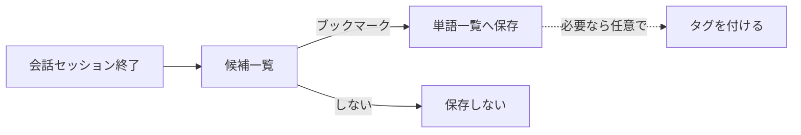

# 単語帳

[← 機能一覧に戻る](機能一覧.md) ／ [← README に戻る](../../README.md)

ボキャブラリーブック。**インプット**の中心となる、語・表現の蓄積と振り返り機能。

---

## 目的・ユーザー価値

- ユーザーが**身につけたい語・表現**を 1 か所に集める。
- [会話](会話.md) のセッション終了後に出てくる**ボキャブラリー候補**の**保存先**となる。
- 読み上げ機能で**インプット**にも使える（耳から入れる）。

## スコープ

| 含む | 含まない |
|------|---------|
| 単語一覧（リスト・詳細）／ブックマーク（候補→単語帳保存）／タグで整理／読み上げ | クイズ形式での出題（後フェーズ。[初版スコープ](../ロードマップ/初版スコープ.md) 参照） |

---

## 1. 仕様（中分類）

| 中分類 | 内容 | 備考 |
|--------|------|------|
| **一覧機能** | エントリを**リスト表示**し、詳細へ辿れる。 ・**見出し語**：**初版は英語**（英単語・フレーズ等）。将来の他言語は拡張で対応。 ・**定義（2 本）**：**英語版**と**説明・補助用の言語版**（例：日本語）、**表示切替**で補助。 ・**発音**：英語は **IPA** を**一覧・詳細で表示**。**ユーザーによる入力欄は設けない**。値は **Apple Intelligence のオンデバイスモデル**で見出し語等から生成し、クライアントは保存・表示する（詳細は §3）。**サーバー側での生成・キャッシュは行わない**。 ・**例文**：**用法（品詞タブ）ごと**に**複数**登録可。**1 用法あたり目安最大 5 つ**（英文＋和訳のペアを 1 件と数える）。追加・削除は編集 UI で行う（詳細は §4）。 | **エントリの持ち方**：単一テーブル（**分割なし**）。 **Kind（enum）**：Verb / Adjective / Adverb / Noun / Phrasing / Interjection（**コード上の綴りは実装で確定**）。 |
| **ブックマーク** | [会話](会話.md) 終了画面の**新出ボキャブラリ候補**から**単語帳に保存**するアクション。整理は**タグ**側で行う（フォルダは持たない）。 | 詳細は §2。 |
| **タグで整理** | 単語にタグを付けて整理する。**エントリ単位**で**複数タグ同時付与可**。**ユーザーが任意で命名**するのみ（**プリセットは持たない**）。**新規ユーザーの初期状態はタグ 0 件**で、必要になったときに本人が作る。**フォルダ機能は持たず、タグでフォルダ役を兼ねる**。 | `SCR-VOC-LIST` のフィルタ・並べ替え軸（タグ別／Kind 別／未タグ／見出し語検索／登録日順／アルファベット順）は [画面一覧](画面一覧.md) を参照。 |
| **リスニング（読み上げ）** | 読み上げでインプット。 ・**対象**：単語・意味・例文 ・**読む範囲**：単語のみ／単語と例文 など ・**スピード**可変 | 読み上げ技術の選定は [会話-ペルソナとTTS](会話-ペルソナとTTS.md) の TTS 節と共通。 |

---

## 2. データの流れ（候補 → 永続化）

ユーザーが [会話](会話.md) のセッション終了後に提示される**新出ボキャブラリー候補**から**ブックマーク**したものだけが、ここに永続化される。**タグ付けは任意**で、ブックマーク時または後から単語詳細で行う（**フォルダは存在しない**）。

---

## 3. 発音（IPA）

- **役割**：補助表示。**入力 UX は置かず**、生成結果をフィールドとして同期する。
- **生成**：**Apple Intelligence のオンデバイス言語モデル**で生成する（[LLM-API方針](../アーキテクチャ/LLM-API方針.md) の役割分担）。**§5 の AI 一括ドラフト**と同じオンデバイス経路で見出し語（必要なら品詞・アクセント種別など）を渡し、**IPA 文字列（複数読みなら候補複数）**を返させる想定。**サーバー側での生成・キャッシュは行わず、横断キャッシュテーブルも持たない**。
- **保存**：用法単位（[データベース設計](../アーキテクチャ/データベース設計.md) の `vocabulary_usages.ipa`）にテキストで保持し、**端末で生成した結果をサーバーへ同期する**（自分の他端末でも同じ値が見える）。未取得時は空またはプレースホルダ表示し、**再生成**できるようにしてよい。
- **フォールバック**：オンデバイス AI が利用できない端末・OS・設定では、**IPA を空のまま表示しない**運用を既定とする（クラウド LLM へ逃がさない）。詳細は [LLM-API方針](../アーキテクチャ/LLM-API方針.md) と整合。
- **一覧・追加・編集 UI**：IPA は**読み取り専用表示**のみとする。
- **読み上げ**：実際の音声は [会話-ペルソナとTTS](会話-ペルソナとTTS.md) の TTS に依存。IPA はあくまで画面上の参照。

---

## 4. 例文（複数登録）

- **単位**：**選択中の用法（品詞タブ）に属する例文**として保持する。タブを切り替えると、その用法に紐づく例文一覧だけが編集対象になる。
- **件数**：**1 用法あたり最大 5 件**（ペア数）を目安とする。実装で前後させる場合はここを更新する。
- **1 件の中身**：**英文**と**和訳**（補助語）をセットで 1 件とする。
- **UI**：**「例文を追加」**で入力ブロックを増やし、各ブロックに削除（またはスワイプ等）は実装で決める。これらは **保存まで DB に書かないローカル編集**のため、ボタンは **角丸四角かつ非ベタ塗り**（アウトライン等）。**保存**で初めて永続化する操作は **ベタ塗り**とする（詳細は [UI-ボタンとチップの区分](UI-ボタンとチップの区分.md) §A）。並び順は**登録順**または**並べ替え**を後フェーズで足してよい。
- **一覧・読み上げ**：一覧では必要なら件数や先頭例のみ省略表示し、詳細では全件。**読み上げ**は単語帳仕様の「読む範囲」に従い、例文が複数あるときは**順に／選択した範囲**など実装で決める。

---

## 5. AI 一括生成（単語追加・編集）

一覧からの**単語追加**および詳細から開く**編集**では、見出し語の入力欄**右側**に、やや小さめの **「AI生成」**ボタンを置く（ワイヤー上は `Button / AI generate draft`）。

- **有効条件**：**見出し語に 1 文字以上入力されているときのみ**タップ可能（未入力時は無効表示）。
- **押下時の挙動**：その見出し語をキーに、**Apple Intelligence のオンデバイス言語モデル**（開発者向け API は実装時点の Apple 公式に従う）でドラフトを生成し、返却結果で画面上のドラフトを**まとめて埋める**。辞書 lookup やルールの前処理を載せるかは実装で選択してよいが、**クラウド LLM（Gemini API）への依存は原則置かない**（役割分担は [LLM-API方針](../アーキテクチャ/LLM-API方針.md)）。
  - **用法（品詞）**：該当する用法タブ／ブロックを必要なら複数追加し、それぞれに **Kind（品詞）** を設定する。
  - **意味**：各用法について **英語定義**および**補助語（例：日本語）側の説明**をセットする（既存の「定義 2 本」モデルに沿う）。
  - **例文**：用法ごとに**複数の例文ペア**（英文＋和訳）を生成して入力欄へ流し込む（§4 の上限・単位に従う）。
  - **IPA**：入力欄は置かず、オンデバイス生成結果に含めて読み取り専用フィールドへ反映するか、§3 の**サーバー／辞書経路**で別取得するかは実装で選択する（§3 のキャッシュ・API 設計と矛盾しないようにする）。
- **永続化**：このボタンは **編集中モデルのみ**更新する。**保存**するまで DB へは書き込まない。見た目・ルールは [UI-ボタンとチップの区分](UI-ボタンとチップの区分.md) の **角丸四角・非ベタ塗り（ローカル編集）**に合わせる。
- **端末・可用性**：**オープンモデルをアプリがダウンロードして載せる方式は取らず**、**Apple Intelligence が利用できる環境**でオンデバイス生成を行う。**対応機種・OS・ユーザー設定**により利用できない場合のフォールバック（クラウド限定／機能オフ／手入力のみ等）は [LLM-API方針](../アーキテクチャ/LLM-API方針.md) に従い実装で確定する。英会話の従量課金とは別軸。

---

## 6. 補足

- 読み上げ（TTS）の技術選定（オンデバイス／クラウド）は [会話-ペルソナとTTS](会話-ペルソナとTTS.md) を参照。
- 多言語対応の将来拡張は [学習サイクル](../概要/学習サイクル.md) に方針を記載。

---

## 7. 関連ドキュメント

- [画面一覧](画面一覧.md) … 一覧・詳細・追加（`SCR-VOC-ADD`）の対応と遷移
- [UI-ボタンとチップの区分](UI-ボタンとチップの区分.md) … 形状・**ベタ塗り（DB 反映）／非ベタ塗り（編集中のみ）**・タグピルのルール
- [会話](会話.md) … 候補のソース
- [会話-ペルソナとTTS](会話-ペルソナとTTS.md) … 読み上げ技術の方針
