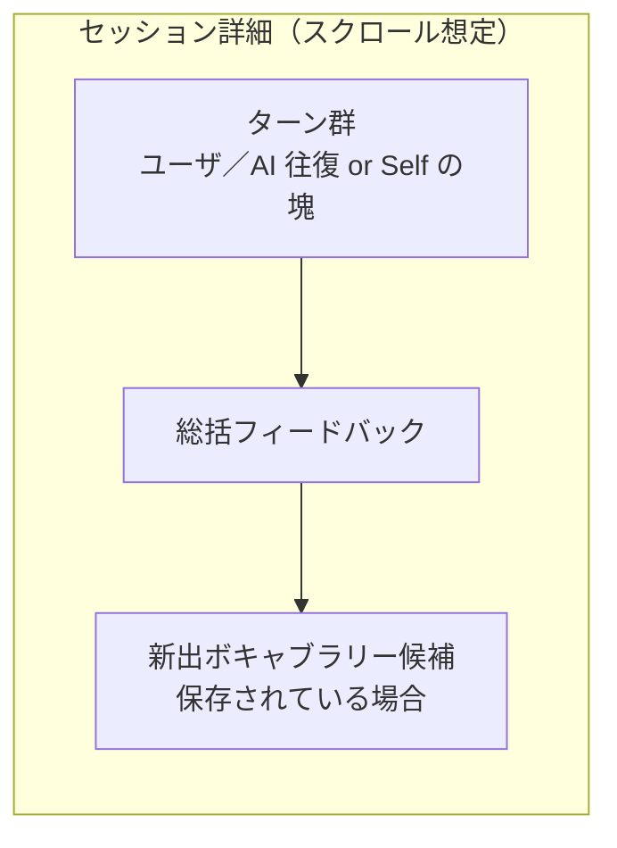

# 学習ログ

[← 機能一覧に戻る](機能一覧.md) ／ [← README に戻る](../../README.md)

学習の**記録を振り返る**機能。**画面遷移・カレンダー UI の見た目**は [画面一覧](画面一覧.md) を参照。会話セッションの**中身**（ターン・総括・候補の並び）は [会話](会話.md) と**同一データモデル**を前提とするが、**ターン本文と総括は端末ローカル**、サーバーには **記憶用要約と単語帳**のみ同期する境界は [会話](会話.md) §5 が正とする。

---

## 目的・ユーザー価値

- 過去の**会話セッション**と、終了後の**総括フィードバック・ボキャブラリ候補**を**読み取り専用**で振り返れる。
- 学習の継続を視覚化（カレンダーで「学習した日」を強調）し、モチベーションを支える。

## スコープ

| 含む | 含まない |
|------|---------|
| カレンダー上での学習日ハイライト／日付別セッション一覧／セッション詳細（会話＋総括＋候補）の閲覧 | セッション本文・フィードバックの**編集・再実行**（必要なら別タスク） |

---

## 1. 仕様

学習ログは**カレンダー → 日付詳細 → セッション詳細**の 3 階層で構成される。

| 階層 | 表示内容 | 動作 |
|------|---------|------|
| **カレンダー（月単位）** | その月のカレンダー。**学習を行った日**を**色付け・ハイライト**などで視覚的に区別。 | **日付をタップ**で日付詳細へ。 |
| **日付詳細** | その日付に紐づく**会話セッション**を**時系列一覧**で表示。**1セッション＝1スレッド**（[会話](会話.md) のデータ単位と整合）。 | **セッションをタップ**でセッション詳細へ。 |
| **セッション詳細** | 当該セッション内の**会話（発言の並び）**＋**セッション終了後に生成された総括フィードバック・ボキャブラリ候補**を**閲覧のみ**で並べる。 | 読み取り専用。 |

**データの所在**：カレンダー・セッション一覧・ターン並び・総括・（保存されていれば）候補スナップショットは **この端末にローカル保存されているデータ**から読む。**別端末では自動では再現されない**（[会話](会話.md) §5）。サーバー上の **記憶用要約**は RAG 用であり、学習ログの一覧 UI の必須ソースではない。

> 画面遷移・遷移先の画面 ID は [画面一覧](画面一覧.md) を参照。

---

## 2. 「その日」の定義（暦日とセッションの対応）

| 項目 | 方針 |
|------|------|
| **暦日の基準** | 原則、端末（またはユーザー設定）の**ローカルタイムゾーン**で「0:00〜23:59:59」を 1 日とする。 |
| **セッションが属する日** | セッションに**開始日時**（推奨）を保持する場合は、その**暦日**で当日一覧に載せる。**終了が日付をまたぐ**場合も、**開始日の日**に含める形を既定とする（別案：終了日基準は将来の設定で切替可能、などは実装で確定）。 |
| **セッションなしの日** | カレンダー上は**ハイライトしない**。タップした場合は**空の一覧**または**短い案内**を出すかは UX で確定。 |

---

## 3. セッション詳細で閲覧するデータ（会話との対応）

[会話](会話.md) でセッション終了後に生成される出力と**整合**させ、学習ログでは**保存済みのもの**を**読み取り専用**で並べる。

| 種類 | ログでの見せ方（想定） |
|------|------------------------|
| **会話ターン（AI モード）** | ユーザ発話 →（必要に応じて）AI 返答 → … の**時系列**。読み上げ用テキストなど**付随メタ**を載せるかは任意。 |
| **会話ターン（Self）** | セッション中の**ユーザー発話の塊**（またはターン相当の区切り）を**時系列**で表示。 |
| **総括フィードバック** | セッション**終了後ブロック**としてまとめて表示（文法・表現力・苦手領域の良い面／改善面など、[会話](会話.md) の評価軸に整合）。位置は「先頭／末尾」のどちらか。既定は**末尾**想定。 |
| **記憶用セッション要約** | サーバーに同期されるが **主用途は RAG**（[会話](会話.md)）。学習ログで補足表示するかは任意。 |
| **新出ボキャブラリー候補** | セッション終了時に**提示された候補一覧**が永続化されている場合は**参照可能**とする。**ブックマーク済みかどうか**の表示はデータがあれば併記（単語一覧への**再ジャンプ**は別導線でよい）。 |

**注意**：上記ブロックの**厳密な順序**（例：候補を総括の前にする等）は、会話画面の「終了後提示」と**見た目を揃える**のが望ましいが、確定は実装フェーズでよい。

---

## 4. 補足（実装・設計メモ）

- **データモデル**の正規化（セッション ID、ターン ID、フィードバックの外部キー等）は実装で確定する。本ドキュメントは**機能の責務とデータの対応**の合意用。
- **プライバシー／所在**：**ターン・総括・セッション一覧はローカル**が正（[会話](会話.md) §5）。複数端末やクラウドバックアップの方針は [設定とアカウント](設定とアカウント.md) に揃える。
- **エクスポート**：[会話](会話.md) の **PDF 出力**と**データの出所**が重なるため、文言・対象範囲は将来、**一方に寄せる**か**相互リンク**するかを整理する。

---

## 5. 関連ドキュメント

- [画面一覧](画面一覧.md) … カレンダー → 日付 → セッション詳細の遷移
- [会話](会話.md) … セッションのデータ構造・終了後出力
- [単語帳](単語帳.md) … ブックマーク済み候補の保存先
