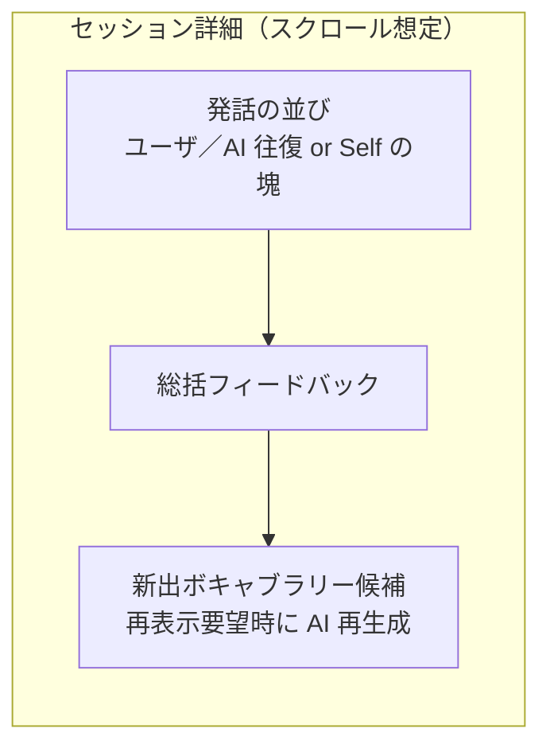

# 学習ログ

[← 機能一覧に戻る](機能一覧.md) ／ [← README に戻る](../../README.md)

学習の**記録を振り返る**機能。**画面遷移・カレンダー UI の見た目**は [画面一覧](画面一覧.md) を参照。会話セッションの**中身**（発話・総括の並び）は [会話](会話.md) と**同一データモデル**を前提とする。**Phase 1 ではセッションメタ・総括フィードバックがサーバー保存される**（機種変更後もカレンダーと総括が復元される）。**発話本文は Phase 2 でサーバー保存**に切り替わり、**過去の会話本文も新端末で読み返せる**ようになる。**新出ボキャブラリ候補スナップショットは永続化せず**、再表示要望時は AI 再生成で対応する。境界は [会話 §5](会話.md#5-データの保持削除長期記憶rag) が正とする。

---

## 目的・ユーザー価値

- 過去の**会話セッション**と、終了後の**総括フィードバック・ボキャブラリ候補**を**読み取り専用**で振り返れる。
- 学習の継続を視覚化（カレンダーで「学習した日」を強調）し、モチベーションを支える。

## スコープ

| 含む | 含まない |
|------|---------|
| カレンダー上での学習日ハイライト／日付別セッション一覧／セッション詳細（会話＋総括＋候補）の閲覧 | セッション本文・フィードバックの**編集・再実行**（必要なら別タスク） |

---

## 1. 仕様

学習ログは**カレンダー → 日付詳細 → セッション詳細**の 3 階層で構成される。

| 階層 | 表示内容 | 動作 |
|------|---------|------|
| **カレンダー（月単位）** | その月のカレンダー。**学習を行った日**を**色付け・ハイライト**などで視覚的に区別。 | **日付をタップ**で日付詳細へ。 |
| **日付詳細** | その日付に紐づく**会話セッション**を**時系列一覧**で表示。**1セッション＝1スレッド**（[会話](会話.md) のデータ単位と整合）。 | **セッションをタップ**でセッション詳細へ。 |
| **セッション詳細** | 当該セッション内の**会話（発言の並び）**＋**セッション終了後に生成された総括フィードバック・ボキャブラリ候補**を**閲覧のみ**で並べる。 | 読み取り専用。 |

**データの所在**（[データベース設計-クライアント §3](../アーキテクチャ/データベース設計-クライアント.md#3-エンティティ定義) のエンティティ名）：

| データ | Phase 1 | Phase 2 |
|--------|---------|---------|
| **カレンダー（学習日ハイライト）** | `CachedSession.startedAt`（**Phase 1 からサーバー同期**。新端末でも復元される） | 同左 |
| **日付詳細（セッション一覧）** | `CachedSession`（**サーバー同期**） | 同左 |
| **セッション詳細：発話の並び** | `CachedUtterance`（**端末のみ**。新端末では空） | `CachedUtterance`（**サーバー同期**。新端末でも復元される） |
| **セッション詳細：総括フィードバック** | `CachedSessionFeedback`（**サーバー同期**。新端末でも復元される） | 同左 |
| **セッション詳細：候補一覧** | **永続化なし**。再表示要望時のみ AI 再生成 | 同左 |
| **記憶用要約**（補足表示する場合） | `CachedSessionMemorySummary`（サーバーから pull・読み取り専用） | 同左 |

**新端末での挙動（Phase 1）**：機種変更後の初回ログインで **カレンダーの日付ハイライトと総括フィードバックは新端末でも見えるが、発話本文は見えない**（その期間のセッション詳細を開くと「会話本文はこの端末にはありません」のような案内になる想定）。Phase 2 で発話本文も pull できるようになると、**過去の会話を遡って読み返せる**ようになる。**候補一覧の再表示**はそもそも保存していないため、必要時のみ AI に再生成を依頼する形になる。

> 画面遷移・遷移先の画面 ID は [画面一覧](画面一覧.md) を参照。

---

## 2. 「その日」の定義（暦日とセッションの対応）

| 項目 | 方針 |
|------|------|
| **暦日の基準** | 原則、端末（またはユーザー設定）の**ローカルタイムゾーン**で「0:00〜23:59:59」を 1 日とする。 |
| **セッションが属する日** | セッションに**開始日時**（推奨）を保持する場合は、その**暦日**で当日一覧に載せる。**終了が日付をまたぐ**場合も、**開始日の日**に含める形を既定とする（別案：終了日基準は将来の設定で切替可能、などは実装で確定）。 |
| **セッションなしの日** | カレンダー上は**ハイライトしない**。タップした場合は**空の一覧**または**短い案内**を出すかは UX で確定。 |

---

## 3. セッション詳細で閲覧するデータ（会話との対応）

[会話](会話.md) でセッション終了後に生成される出力と**整合**させ、学習ログでは**保存済みのもの**を**読み取り専用**で並べる。

| 種類 | ログでの見せ方（想定） |
|------|------------------------|
| **会話の発話（AI モード）** | ユーザ発話 →（必要に応じて）AI 返答 → … の**時系列**（`CachedUtterance`／サーバーは Phase 2 から `session_utterances`）。読み上げ用テキストなど**付随メタ**を載せるかは任意。 |
| **会話の発話（Self）** | セッション中の**ユーザー発話のみの時系列**（Self における `CachedUtterance`。AI 返答行は基本なし）。 |
| **総括フィードバック** | セッション**終了後ブロック**としてまとめて表示（文法・表現力・苦手領域の良い面／改善面など、[会話](会話.md) の評価軸に整合）。位置は「先頭／末尾」のどちらか。既定は**末尾**想定。 |
| **記憶用セッション要約** | サーバーに同期されるが **主用途は RAG**（[会話](会話.md)）。学習ログで補足表示するかは任意。 |
| **新出ボキャブラリー候補** | セッション終了時に**提示された候補一覧は永続化しない**。**閲覧時にユーザーが要求したら AI 再生成**で当時の発話本文（Phase 1 は端末のみ／Phase 2 はサーバーから取得）を入力に再度候補を作る運用。**ブックマーク済みのものは単語帳から確認**可能（単語一覧への**再ジャンプ**は別導線）。 |

**注意**：上記ブロックの**厳密な順序**（例：候補を総括の前にする等）は、会話画面の「終了後提示」と**見た目を揃える**のが望ましいが、確定は実装フェーズでよい。

---

## 4. 補足（実装・設計メモ）

- **データモデル**の正規化（セッション ID、発話 ID、フィードバックの外部キー等）は [データベース設計-クライアント](../アーキテクチャ/データベース設計-クライアント.md)・[データベース設計-サーバー](../アーキテクチャ/データベース設計-サーバー.md) を正とする。
- **プライバシー／所在**：**Phase 1 ではメタ・総括をサーバー保管**、**発話本文は Phase 2 でサーバー保管**、**候補スナップショットは永続化しない**（[会話 §5](会話.md#5-データの保持削除長期記憶rag) が正）。複数端末やクラウドバックアップの方針は [設定とアカウント](設定とアカウント.md) に揃える。
- **エクスポート**：[会話](会話.md) の **PDF 出力**と**データの出所**が重なるため、文言・対象範囲は将来、**一方に寄せる**か**相互リンク**するかを整理する。

---

## 5. 関連ドキュメント

- [画面一覧](画面一覧.md) … カレンダー → 日付 → セッション詳細の遷移
- [会話](会話.md) … セッションのデータ構造・終了後出力
- [単語帳](単語帳.md) … ブックマーク済み候補の保存先
