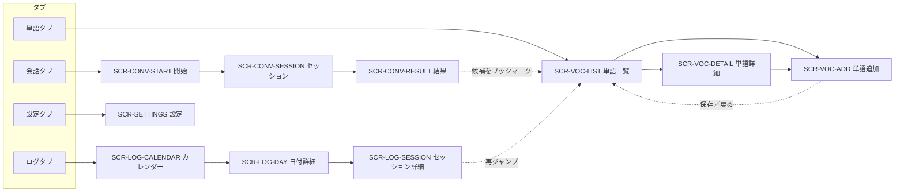
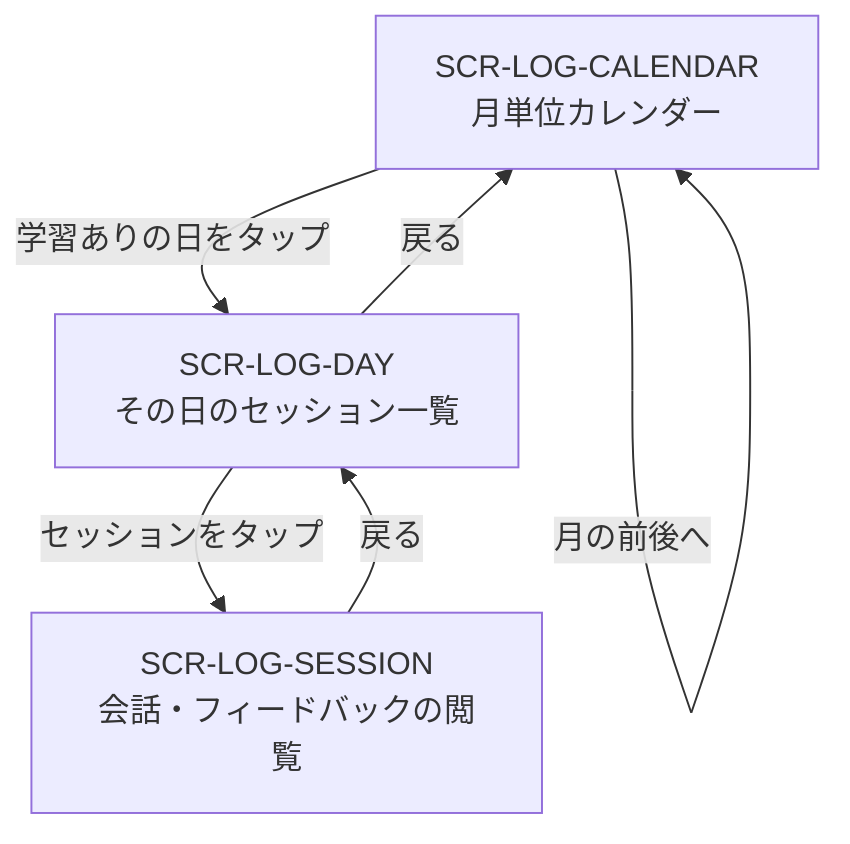
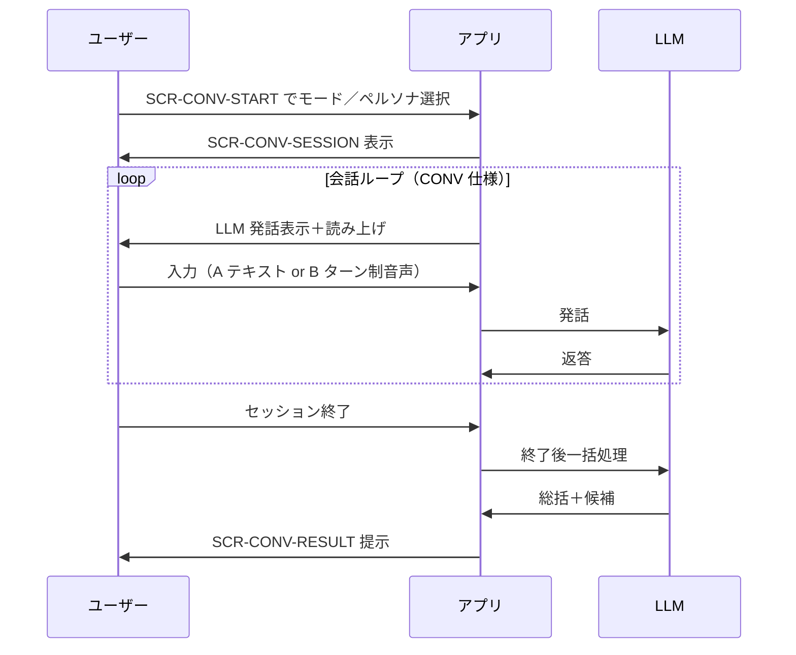

# 画面一覧

[← README に戻る](../../README.md)

[機能一覧](機能一覧.md) と**対をなす**ドキュメント。**機能を横において、画面（情報設計）単位**でまとめる。**1 画面に M 機能が乗る**／**1 機能が N 画面に現れる**という N:N の関係を、画面側からの視点で破綻なく扱う。

- **`画面ID`**：`SCR-` プレフィックスで安定 ID を持つ。
- **`載る機能`**：[機能一覧](機能一覧.md) の機能 ID を**集合**として記述。

> 個別機能の振る舞い・ビジネスルールは**ここには書かない**。各機能ファイルへリンクで参照する。

**UI の見た目（ボタンとチップの形状など）**は横断ルールとして [UI-ボタンとチップの区分](UI-ボタンとチップの区分.md) を参照する。

---

## 1. 画面カタログ

| 画面ID | 画面名 | 役割 | 主な遷移元 → 先 | 載る機能（ID） |
|--------|--------|------|------------------|----------------|
| `SCR-VOC-LIST` | 単語一覧 | 単語の一覧表示と詳細への入口。**フィルタ**：タグ別／Kind（品詞）別／未タグ絞り込み／見出し語の部分一致検索。**並べ替え**：登録日順／アルファベット順。**フォルダは持たない**（タグで整理） | タブ → 単語詳細／単語追加 | `VOC-LIST` `VOC-TAG` `VOC-LISTEN` |
| `SCR-VOC-DETAIL` | 単語詳細 | 1 エントリの定義 2 本・例文・**IPA（読取・オンデバイス AI 生成）**を表示 | 単語一覧 → | `VOC-LIST` `VOC-LISTEN` `VOC-TAG` |
| `SCR-VOC-ADD` | 単語追加・編集 | 見出し語・用法タブ・意味・例文のドラフト編集。**見出し語入力後の AI生成**は **Apple Intelligence のオンデバイスモデル**で品詞／定義／例文を一括ドラフトし画面へ流し込む（保存で永続化）。詳細は [単語帳](単語帳.md) §5、[LLM-API方針](../アーキテクチャ/LLM-API方針.md) | 一覧メニュー「単語を追加」／詳細の編集 | `VOC-LIST` |
| `SCR-CONV-START` | 会話開始（モード／ペルソナ選択） | Self／AI、ペルソナ、テーマを選んでセッションを開始 | タブ → セッション | `CONV` `PERSONA` |
| `SCR-CONV-SESSION` | 会話セッション | 往復ループ（A/B 入力 ＋ 表示＋読み上げ） | 開始画面 → 結果画面 | `CONV` `PERSONA` |
| `SCR-CONV-RESULT` | 会話結果（終了後） | 総括フィードバック＋新出ボキャブラリ候補の提示・ブックマーク操作 | セッション → 単語一覧 / ログ | `CONV` `VOC-BOOKMARK` `PDF` |
| `SCR-LOG-CALENDAR` | 学習ログ・カレンダー | 月単位カレンダー、学習日のハイライト | タブ → 日付詳細 | `LOG` |
| `SCR-LOG-DAY` | 日付詳細 | その日のセッション一覧（時系列） | カレンダー → セッション詳細 | `LOG` |
| `SCR-LOG-SESSION` | セッション詳細 | **この端末に保存された**過去セッションの**発話の並び**＋総括＋候補を読み取り専用で閲覧（**別端末では自動では同一履歴にならない**。詳細は [会話](会話.md) §5） | 日付詳細 → 単語一覧（再ジャンプ任意） | `LOG` `CONV`（読取） `VOC-BOOKMARK`（再ジャンプ） |
| `SCR-SETTINGS` | 設定 | アカウント／プラン／外観／規約／レビュー | タブ | `SET` |

---

## 2. 画面遷移図

### 2.1 全体（タブ構成と主要遷移）

### 2.2 学習ログのドリルダウン

### 2.3 会話セッションの状態遷移（参照用）

> 会話ループの**詳細な振る舞い**（評価軸・候補の Kind バランス・永続化ルール）は [会話](会話.md) を参照。

---

## 3. 編集ルール

- 機能の追加・削除があったら、**まず [機能一覧](機能一覧.md) を更新**し、続いて**該当画面の「載る機能」列**を更新する。
- 画面の追加・削除があったら、本ファイルを更新し、機能側の本文には**画面 ID でリンク参照**するに留める（画面詳細はここに集約）。
- 画面遷移の図は本ファイルにのみ持ち、各機能ファイルでは「[画面一覧](画面一覧.md) を参照」で済ませる。

---

## 4. 初回起動・データ未到着時の表示

**新規ユーザー／機種変更直後**は端末ローカルの `Cached*` がすべて空の状態で起動する。サーバー pull は段階的に進むため、**画面側で「データ未到着」を破綻なく扱う**ことを共通要件とする（詳細は [データベース設計-クライアント §1.3 起動フロー](../アーキテクチャ/データベース設計-クライアント.md#13-同期戦略)）。

| 画面 | 起動直後（初回 pull 未完了時）の表示 |
|------|--------------------------------------|
| `SCR-CONV-START` | **ペルソナ 6 体はバンドル同梱の seed JSON で即時描画**（[会話-ペルソナとTTS §4](会話-ペルソナとTTS.md)）。**テーマプリセットは同梱せず**サーバー pull のみで描画するため、**未取得時はテーマあり選択肢を一時的に隠す or スケルトン表示**。Self／自由テーマで会話開始できる経路は常に確保する。 |
| `SCR-LOG-CALENDAR` ／ `SCR-LOG-DAY` ／ `SCR-LOG-SESSION` | `CachedSession` / `CachedSessionFeedback` の pull が未完了の間は**スケルトン表示**。pull 完了で実データに差し替え。 |
| `SCR-VOC-LIST` ／ `SCR-VOC-DETAIL` | `CachedVocabulary` 系の pull 未完了の間は**スケルトン表示**。検索・フィルタ UI 自体は触れる（結果は順次更新）。 |
| `SCR-SETTINGS` | `CachedProfile` / `CachedSubscription` の pull 未完了の間は**スケルトン表示**。サインアウト・規約等の静的項目は常時操作可。 |

**共通方針**：

- 画面描画は **`Cached*` が空でもクラッシュしない**こと。空配列・nil をハンドルする。
- スピナーで全画面ブロックする UI は採用しない（オフラインで詰むため）。
- 初回 pull の失敗時は [データベース設計-クライアント §3.14 `SyncMeta`](../アーキテクチャ/データベース設計-クライアント.md#314-syncmeta--同期メタカテゴリごと-1-行) の指数バックオフでリトライし、UI には**控えめなインライン警告**を出す（モーダルでは止めない）。

---

## 5. 関連

- [機能一覧](機能一覧.md) … screen-agnostic な機能カタログ
- [会話](会話.md) ／ [学習ログ](学習ログ.md) ／ [単語帳](単語帳.md) ／ [設定とアカウント](設定とアカウント.md)
